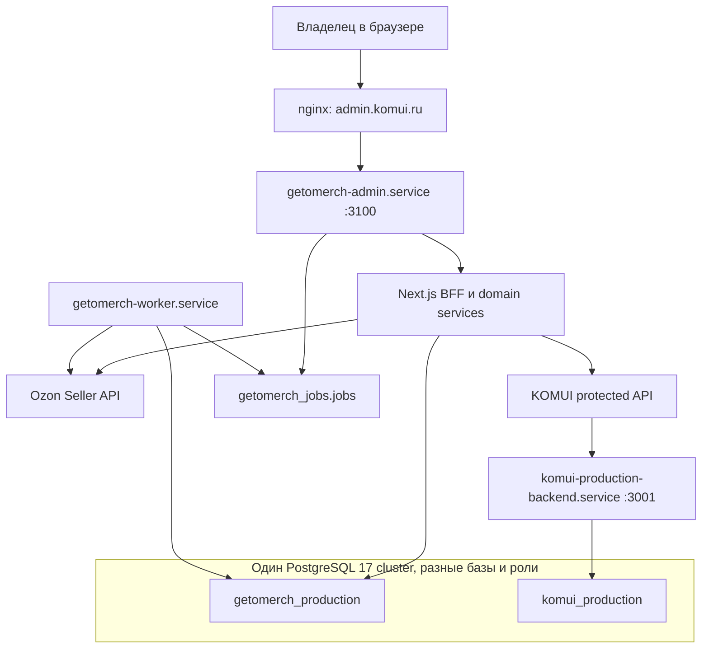

# План полного переноса GetoMerch Admin с Supabase на сервер

Дата подготовки: 16 июля 2026 года.

Актуализировано: 16 июля 2026 года с учетом целевой двухбазовой архитектуры
GetoMerch/KOMUI.

Статус документа: архитектурный и поэтапный план. Этот документ сам по себе не
меняет production, базы данных, конфигурацию сервера или приложение.

Оперативный статус реализации, результаты проверок, блокеры и следующий шаг
ведутся отдельно в `docs/ADMIN_FULL_SERVER_MIGRATION_STATUS.md`. После каждого
этапа обновляется status-документ; этот файл остается основной спецификацией
последовательности и критериев приемки.

Общая целевая модель двух баз, каталога, заказов KOMUI, fulfillment и Ozon FBO
зафиксирована в `docs/GETOMERCH_KOMUI_SERVER_DATA_ARCHITECTURE.md`. Этот план
является первым инфраструктурным этапом той архитектуры: он переносит текущий
рабочий контур GetoMerch в `getomerch_production`, не смешивая перенос БД с
одновременной переделкой каталога и заказов. Все решения ниже должны быть
совместимы с последующими этапами общего архитектурного документа.

## 1. Цель

Полностью убрать runtime-зависимость GetoMerch Admin от Supabase и разместить
весь рабочий контур админки на сервере `89.111.152.112`:

- Next.js UI и BFF/backend;
- PostgreSQL с рабочими данными админки;
- операции Ozon, склад, производство, расходы и импорт;
- фоновые задания;
- backup, восстановление, monitoring и deploy;
- server-side секреты и авторизацию.

После завершения переноса браузер и backend админки не должны обращаться к
`*.supabase.co`. Supabase остается только временным источником для миграции и
страховочной копией на период стабилизации, после чего его ключи удаляются из
runtime-конфигурации админки.

## 2. Граница именно этого переноса

В одно production-окно с переносом Supabase нельзя включать изменение
бизнес-модели двух проектов. После стабилизации локальной БД отдельными
релизами выполняются:

- введение `merch_catalog_products`, media assets и versioned size charts;
- добавление source IDs/version/hash в витринные карточки KOMUI;
- односторонняя публикация каталога GetoMerch -> KOMUI;
- outbox/inbox для заказов KOMUI -> GetoMerch;
- общий fulfillment для Ozon FBS и оплаченных заказов KOMUI;
- общая аналитика Ozon FBS, Ozon FBO и KOMUI;
- универсальный слой Честного знака;
- dependency audit и удаление legacy-копий внутренних таблиц KOMUI;
- перенос или переработка checkout, оплаты Т-Банк и СДЭК магазина;
- разворачивание полного self-hosted Supabase из Docker-контейнеров.

Это не отказ от перечисленных частей целевой архитектуры, а управление риском:
сначала переносится текущая система без потери данных, затем на уже локальном
PostgreSQL добавляются новые таблицы и контракты обычными версионированными
миграциями. Перенос обязан сохранить UUID, SKU, Ozon SKU и историю, чтобы
последующий backfill каталога и fulfillment не требовал повторной идентификации
товаров.

Полный self-hosted Supabase не нужен: GetoMerch Admin не использует Supabase
Auth, Storage или Realtime. Для текущей задачи достаточно обычного PostgreSQL и
существующего Next.js backend.

## 3. Проверенный baseline

### 3.1. Сервер

На 16 июля 2026 года подтверждено:

| Параметр | Фактическое состояние |
|---|---|
| Сервер | `89.111.152.112`, Ubuntu 24.04 LTS |
| CPU/RAM | 2 vCPU, 3.8 GiB RAM, 2 GiB swap |
| Диск | 20 GiB, при последней проверке занято около 64%, доступно около 6.9 GiB |
| PostgreSQL | 17.10, слушает только `127.0.0.1:5432` и `::1:5432` |
| `max_connections` | 40 |
| `archive_mode` | `off` |
| Медленные запросы | логируются от 1000 мс |
| PgBouncer | не установлен и сейчас не требуется |

Активные базы PostgreSQL:

- `komui_production`;
- `komui_staging`;
- архивная `komui_production_prev_20260630163957`;
- служебная `postgres`.

Активные сервисы магазина и админки:

- `nginx`;
- `postgresql`;
- `komui-production-backend.service`;
- `komui-backend.service`;
- `getomerch-admin.service`;
- backup и healthcheck timers KOMUI;
- отдельный `getomerch-backup.timer`.

GetoMerch Admin уже изолирован от магазина на уровне кода и runtime:

```text
/opt/getomerch
/etc/getomerch
/var/lib/getomerch
/var/log/getomerch
systemd: getomerch-admin.service
127.0.0.1:3100
nginx: admin.komui.ru
```

Эту границу необходимо сохранить.

### 3.2. Supabase

Текущий проект: `bkxpzfnglihxpbnhtjjq`.

Подтверждено:

- PostgreSQL 17.6;
- размер всей базы около 29 MB;
- Supabase Auth: 0 пользователей;
- Supabase Storage: 0 buckets и 0 объектов;
- Realtime для `merch_*` не используется;
- в проекте есть 6 Edge Functions магазина, но GetoMerch Admin от них не
  зависит;
- в Git нет полного исторического набора миграций действующей базы, поэтому
  нельзя строить новую базу только повторным запуском файлов из
  `supabase/migrations`.

### 3.3. Рабочие таблицы GetoMerch Admin

Приложение фактически обращается к следующим 20 таблицам. Число строк указано
по состоянию на 16 июля 2026 года и служит baseline, а не постоянной нормой.

| Таблица | Строк | Домен |
|---|---:|---|
| `merch_warehouses` | 2 | склады |
| `merch_product_categories` | 3 | справочник |
| `merch_fabric_types` | 2 | справочник |
| `merch_colors` | 5 | справочник |
| `merch_sizes` | 6 | справочник |
| `merch_designs` | 23 | дизайны |
| `merch_decoration_types` | 2 | справочник |
| `merch_products` | 199 | SKU |
| `merch_inventory` | 132 | остатки |
| `merch_print_inventory` | 12 | принты |
| `merch_transactions` | 660 | движения |
| `merch_workshop_orders` | 32 | цех |
| `merch_workshop_order_items` | 32 | цех |
| `merch_ozon_orders` | 675 | Ozon |
| `merch_ozon_order_items` | 682 | Ozon |
| `merch_ozon_finance_operations` | 2047 | финансы Ozon |
| `merch_expense_categories` | 1 | расходы |
| `merch_expenses` | 0 | расходы |
| `merch_ozon_import_runs` | 13 | импорт Ozon |
| `merch_ozon_import_items` | 2015 | импорт Ozon |

Ориентировочный размер этих данных вместе с индексами сейчас около 15 MB.
Размер небольшой, поэтому для финального переноса предпочтительнее короткое
окно записи и полный повторный dump, а не сложная logical replication.

### 3.4. Критическое пересечение с `komui_production`

В `komui_production` уже существуют таблицы с такими же именами. Они были
созданы при переносе магазина с Supabase и теперь принадлежат контуру KOMUI.
При этом данные уже разошлись:

| Таблица | Supabase GetoMerch | `komui_production` |
|---|---:|---:|
| `merch_products` | 199 | 151 |
| `merch_inventory` | 132 | 101 |
| `merch_transactions` | 660 | 353 |
| `merch_ozon_orders` | 675 | 502 |
| `merch_ozon_finance_operations` | 2047 | 1450 |
| `merch_workshop_orders` | 32 | 18 |

Поэтому запрещено:

- импортировать свежий Supabase dump поверх `komui_production`;
- делать `TRUNCATE`, массовый upsert или schema restore в базе магазина;
- подключать админку к `komui_production` под ролью магазина;
- считать одинаковое имя таблицы доказательством одинакового владельца данных.

## 4. Основные архитектурные решения

### 4.1. Отдельная база админки

Целевая рабочая база:

```text
getomerch_production
```

Для репетиций:

```text
getomerch_rehearsal
```

При необходимости постоянного тестового контура:

```text
getomerch_staging
```

Все базы могут работать в существующем PostgreSQL-кластере 17.10, но должны
иметь отдельных владельцев и пользователей. Это дает общую эксплуатационную
платформу без смешивания данных и прав приложения.

### 4.2. Next.js остается backend админки

Не нужно создавать новый Fastify/Nest/backend только ради переноса БД.
Существующие Next.js Route Handlers уже выполняют роль BFF:

```text
Browser
  -> nginx admin.komui.ru
  -> Next.js getomerch-admin.service :3100
  -> server-side service/repository layer
  -> PostgreSQL getomerch_production
```

Клиентский контракт `/api/admin/*` и страницы сохраняются. Меняется внутренняя
реализация доступа к данным: Supabase REST заменяется параметризованным SQL.

### 4.3. Магазин остается отдельным контуром

GetoMerch Admin не получает прямой SQL-доступ к `komui_production`. Во время
переноса работа с товарами и заказами сайта продолжает идти через существующие
защищенные API. После добавления целевых интеграционных контрактов на одном
сервере предпочтителен loopback, но аутентификация остается обязательной:

```text
GetoMerch Admin BFF
  -> protected KOMUI API
  -> http://127.0.0.1:3001/api/internal/... (целевая схема)
  -> komui-production-backend.service
  -> komui_production
```

Это сохраняет владельца бизнес-логики магазина в проекте KOMUI и позволяет
деплоить или откатывать админку независимо.

### 4.4. Supabase-компоненты, которые не нужно переносить

| Компонент | Решение | Причина |
|---|---|---|
| Supabase Auth | не переносить | 0 пользователей; у админки собственная signed-cookie auth |
| Supabase Storage | не переносить | 0 buckets и объектов |
| Supabase Realtime | не переносить | не используется |
| PostgREST | не разворачивать | API уже реализован Next.js BFF |
| Supabase Studio | не разворачивать | администрирование через `psql` и миграции |
| Edge Functions | не переносить в GetoMerch | относятся к checkout/Т-Банк/СДЭК магазина |
| RLS Supabase | не копировать механически | локальная БД не публикуется через Data API |

URL изображений и другие media references переносятся как обычные поля таблиц.
Так как Supabase Storage пуст, файлового export нет. Перед cutover нужно
проверить доступность используемых Ozon/CDN URL; локальное архивирование медиа,
если оно потребуется, является отдельной задачей и не должно блокировать
перенос БД.

### 4.5. Целевая схема на сервере



Общими остаются только операционная система, PostgreSQL cluster, nginx и
backup-инфраструктура. Базы, роли, env, systemd units, releases и deploy
registry разделены.

Будущая связь баз также не меняет эту границу: приложения обмениваются
версионированными API/events через outbox/inbox, но ни одна runtime-role не
получает SQL-доступ ко второй БД и cross-DB foreign keys не создаются.

## 5. Владение данными после переноса

### 5.1. `getomerch_production` — источник истины

В момент первоначального cutover в эту базу переносятся 20 рабочих таблиц из
раздела 3.3:

- справочники, дизайны и SKU админки;
- остатки, принты и журнал движений;
- производство и заказы в цех;
- заказы и финансы Ozon;
- расходы;
- история импорта Ozon.

UUID всех строк, `merch_products.sku`, непустые `ozon_sku`, Ozon posting/
operation IDs и timestamps переносятся без генерации новых значений. После
cutover `getomerch_production` становится единственным владельцем этих данных;
возврат к Supabase возможен только через отдельную data rollback-процедуру.

### 5.2. `komui_production` — источник истины магазина

В базе магазина остаются и не импортируются из Supabase админки:

- `merch_storefront_products` и slug redirects;
- `merch_customer_orders` и позиции заказов;
- payment attempts/events;
- CDEK shipments/events;
- promo codes/redemptions;
- `merch_admin_import_previews` и `merch_admin_jobs` backend магазина.

Существующие в `komui_production` копии внутренних `merch_products`,
`merch_inventory`, Ozon и производственных таблиц не удаляются в рамках этой
миграции, но и не синхронизируются с GetoMerch. После dependency audit активный
код KOMUI переводится на storefront projection/API, legacy-копии замораживаются
и затем архивируются или удаляются отдельной миграцией.

Целевая связь не является зеркалом таблиц:

- GetoMerch публикует в KOMUI каталог, варианты, размеры и базовые медиа;
- KOMUI сохраняет собственные title/SEO/slug/price/publication overrides;
- KOMUI передает в GetoMerch события заказов и оплаты;
- внутренние остатки GetoMerch никогда не публикуются как доступность сайта;
- сайт считает опубликованные варианты доступными независимо от внутреннего
  склада.

### 5.3. Архивные таблицы Supabase

`merch_products_backup_20260622` и `merch_products_backup_v2` не нужны runtime.
Их следует включить в финальный зашифрованный архив Supabase, но не создавать в
`getomerch_production`. Это уменьшит риск случайного использования устаревших
данных.

### 5.4. Расширение схемы версионированными миграциями

Новые таблицы целевой архитектуры не входят в data dump 20 существующих таблиц.
Они создаются только отдельными версионированными миграциями, а не появляются
из Supabase dump:

```text
catalog/media:
  merch_catalog_products
  merch_media_assets
  merch_catalog_product_media
  merch_size_charts
  merch_catalog_publications

integration/jobs:
  merch_integration_outbox
  merch_integration_inbox
  getomerch_jobs.jobs
  getomerch_jobs.job_events

KOMUI mirror/fulfillment:
  merch_komui_orders
  merch_komui_order_items
  merch_fulfillment_orders
  merch_fulfillment_order_items
  merch_fulfillment_requirements
  merch_stock_allocations
  merch_fulfillment_events

analytics/marking:
  merch_sales_facts
  merch_sales_item_facts
  merch_analytics_sync_state
  merch_marking_codes
  merch_marking_assignments
  merch_marking_events
  merch_marking_documents
```

Порядок их внедрения и владение полями определяет общий архитектурный документ.
`getomerch_jobs.jobs` и `getomerch_jobs.job_events` добавлены до cutover в
Release D, поскольку они нужны для переноса долгих Ozon sync/import из HTTP-
процесса. Они находятся в отдельной приватной схеме и не расширяют allowlist
из 20 переносимых business tables.
Catalog, integration, KOMUI mirror, fulfillment, analytics и marking tables
добавляются после стабилизации в последовательности общей архитектуры.

В baseline нельзя заранее создавать приблизительные версии будущих domain
tables: каждая схема должна появляться из reviewed migration с constraints и
tests в релизе, который действительно начинает ее использовать.

## 6. Роли PostgreSQL и доступ

Рекомендуемые роли:

| Роль | LOGIN | Назначение |
|---|---:|---|
| `getomerch_owner` | нет | владелец БД, схемы и объектов |
| `getomerch_migrator` | да | применение версионированных миграций |
| `getomerch_app` | да | runtime CRUD без DDL и управления ролями |
| `getomerch_backup` | да | только чтение для dump |

Обязательные ограничения:

- не использовать `postgres` из приложения;
- не давать `getomerch_app` права `CREATEDB`, `CREATEROLE`, `SUPERUSER` или
  ownership таблиц;
- отозвать лишние права от `PUBLIC`;
- PostgreSQL оставить доступным только локально;
- использовать SCRAM-пароли;
- задать `application_name=getomerch-admin`;
- установить для runtime-роли `statement_timeout`, `lock_timeout` и
  `idle_in_transaction_session_timeout`;
- начать с web pool max 3–4, затем менять только по метрикам.

Новый runtime URL должен называться нейтрально:

```env
GETOMERCH_DATABASE_URL=postgresql://getomerch_app:<secret>@127.0.0.1:5432/getomerch_production
GETOMERCH_DATABASE_SSL=false
GETOMERCH_DATABASE_POOL_MAX=4
```

Старое имя `GETOMERCH_SUPABASE_DATABASE_URL` нельзя оставлять главным после
cutover: оно будет вводить в заблуждение и затруднит удаление Supabase.

Секрет хранится в `/etc/getomerch/admin-production.env` либо в отдельном
`/etc/getomerch/database.env`, владелец `root:root`, права `600`. Значение не
попадает в `NEXT_PUBLIC_*`, client bundle, deploy registry или логи.

## 7. Требования к диску до начала работ

После выполненной владельцем очистки на корневом разделе доступно около
6.9 GiB, использование — 64%. При текущем размере Supabase около 29 MB этого
достаточно для export, временного restore drill и создания локальной БД без
дополнительного удаления файлов.

Расширение системного диска минимум до 40 GiB, предпочтительно до 60 GiB,
остается рекомендуемым инфраструктурным улучшением, но не блокирует этапы 0–4
при текущем объеме. Оно становится обязательным до включения WAL/PITR,
массовой миграции media, тяжелых analytics workers либо раньше, если capacity
forecast показывает падение свободного места ниже 4 GiB.

Минимальный gate перед export/restore и созданием локальной БД:

- использование `/` ниже warning 75%;
- не менее 4 GiB свободного места до и после drill;
- расчетный peak временных dump/restore помещается без пересечения critical
  threshold;
- release retention действительно удаляет старые build-артефакты;
- внешний encrypted backup доступен независимо от VPS;
- настроен warning при 75% и critical при 85% заполнения;
- отдельный alert контролирует свободный резерв 4 GiB.

## 8. Поэтапный план внедрения

### Этап 0. Зафиксировать границы и потребителей

**Статус на 2026-07-16: выполнен.** Allowlist, consumer audit и cutover gates
зафиксированы в `docs/ADMIN_MIGRATION_STAGE_0_1_REPORT_2026-07-16.md`.

#### Работы

1. Зафиксировать 20 таблиц GetoMerch как migration allowlist.
2. Повторно просканировать репозитории, серверные cron и env по:
   - project ref Supabase;
   - `supabase.co`;
   - `GETOMERCH_SUPABASE_*`;
   - именам 20 таблиц.
3. Для каждого потребителя указать владельца, тип доступа, частоту и новый
   интерфейс.
4. Подтвердить, что GetoMerchV4 и старые SKU-скрипты не пишут в Supabase во
   время cutover. Неиспользуемые клиенты архивировать или лишить ключей.
5. Зафиксировать source-of-truth matrix из раздела 5 и общего архитектурного
   документа.
6. Зафиксировать три обязательных правила будущей интеграции:
   - KOMUI не читает внутренние остатки для storefront availability;
   - только Ozon FBS участвует в внутреннем резервировании/производстве;
   - Ozon FBO сохраняется для аналитики и не создает fulfillment.

#### Результат

Нет неизвестного клиента, который продолжит записывать в Supabase после
переключения админки.

### Этап 1. Подготовить емкость и восстановление

**Статус на 2026-07-16: выполнен для migration scope из 20 таблиц.** Daily
encrypted off-site backup и restore drill работают. Отдельный forensic archive
покрывает все 31 таблицу `public`, полный catalog, OpenAPI и Auth users; это не
замена managed backup внутренних схем Supabase.

#### Работы

1. Проверить capacity gate из раздела 7; очищать или расширять диск только если
   фактические значения не проходят gate.
2. Создать свежий логический export 20 таблиц Supabase.
3. Создать отдельный forensic archive прикладной части Supabase-проекта на
   случай расследования: все таблицы `public`, DDL catalog, функции, policies,
   архивные таблицы, OpenAPI и Auth users. Внутренние managed-схемы Supabase не
   импортировать в локальную БД и не считать этот архив физическим backup
   платформы.
4. Проверить текущий `getomerch-backup.timer` и добавить явный результат
   database dump в manifest.
5. Выполнить restore drill в временную БД, а не просто проверить наличие файла.
6. Записать фактические RPO/RTO:
   - первый целевой RPO: не более 24 часов за счет daily dump;
   - целевой RTO: до 2 часов;
   - улучшенный RPO после WAL archiving: до 5 минут.

#### Критерий завершения

- есть свежий off-site backup;
- restore завершился без ошибок;
- проверены counts и ключевые business invariants;
- disk gate пройден.

### Этап 2. Ввести воспроизводимую baseline-схему и migration runner

**Статус на 2026-07-16: выполнен.** Reviewed baseline и migration runner
добавлены в `db/`; чистая `getomerch_rehearsal` построена на PostgreSQL 17 из
файлов репозитория, повторный запуск идемпотентен. Подробности зафиксированы в
`docs/ADMIN_MIGRATION_STAGE_2_REPORT_2026-07-16.md`.

#### Почему это отдельный этап

Текущая папка `supabase/migrations` не содержит полный путь построения
действующей схемы. Копировать production schema без очистки тоже нельзя: dump
содержит Supabase roles, grants и RLS policies, которые не нужны локальному
PostgreSQL.

#### Работы

1. Снять schema-only dump ровно 20 таблиц с действующей Supabase DB.
2. Отдельно снять и проверить:
   - колонки и default expressions;
   - primary/foreign keys;
   - unique и check constraints;
   - indexes, включая partial indexes;
   - sequences и их ownership;
   - функции и triggers, реально используемые этими таблицами.
3. Удалить из целевой схемы:
   - Supabase-specific roles и grants;
   - permissive RLS policies;
   - зависимости от `auth`, `storage`, `realtime`, `vault`, `pg_net`;
   - storefront deploy trigger;
   - неиспользуемые backup-таблицы.
4. Создать reviewed baseline migration в новой директории, например:

```text
db/
  migrations/
    0001_getomerch_baseline.sql
  seeds/
  scripts/
  checks/
```

5. Добавить migration ledger с checksum и блокировкой параллельного запуска.
6. Запретить автоматическое применение миграций при каждом старте приложения.
   Миграции выполняются отдельной deploy-командой под `getomerch_migrator`.
7. Добавить команды `status`, `up`, `verify` и документированный rollback для
   каждой новой миграции либо forward-fix, если DDL необратим.
8. Проверить, что migration runner поддерживает последующее безопасное
   добавление таблиц из раздела 5.4 без пересборки baseline и без доступа к
   `komui_production`.

#### Критерий завершения

Пустая `getomerch_rehearsal` полностью строится из Git без доступа к Supabase.

### Этап 3. Создать изолированный PostgreSQL-контур

**Статус на 2026-07-16: выполнен.** Созданы раздельные роли, постоянная
`getomerch_rehearsal` с baseline `0001`, пустая `getomerch_production`,
локальные HBA-правила, root-only env и DB healthcheck. Production runtime не
переключался. Фактические проверки описаны в
`docs/ADMIN_MIGRATION_STAGE_3_REPORT_2026-07-16.md`.

#### Работы

1. Создать роли из раздела 6.
2. Создать `getomerch_rehearsal` и применить baseline migration.
3. После успешной репетиции создать пустую `getomerch_production`.
4. Настроить `pg_hba.conf` так, чтобы app/migrator/backup подключались только
   локально и только к нужной БД.
5. Добавить отдельный env и проверить, что deploy не выводит URL в лог.
6. Добавить DB healthcheck `SELECT 1` и проверку версии миграции.
7. Не перезапускать и не менять роли `komui_*`.

#### Критерий завершения

- приложение с тестовым env подключается только к `getomerch_rehearsal`;
- `getomerch_app` не может выполнить DDL;
- `getomerch_app` не имеет доступа к `komui_production`;
- `komui_app` не имеет доступа к `getomerch_production`.

На этапе 3 первый критерий проверяется server-side healthcheck-процессом под
`getomerch_app`: текущий Next.js database layer до этапа 5 еще не читает
`GETOMERCH_DATABASE_URL`. Полноценный запуск приложения против rehearsal
становится обязательным exit criterion этапов 5, 6 и 9; подключать этот env к
production unit на этапе 3 запрещено.

### Этап 4. Провести первую репетицию миграции данных

**Статус на 2026-07-16: выполнен.** Стабильный allowlist snapshot из 20 таблиц
импортирован через rollback-safe candidate DB в `getomerch_rehearsal`: 6 621
строка, 20/20 fingerprints, 164/164 data-integrity checks и 18/18 schema checks
совпали без необъясненных расхождений. Production runtime и пустая
`getomerch_production` не менялись. Подробности:
`docs/ADMIN_MIGRATION_STAGE_4_REPORT_2026-07-16.md`.

#### Экспорт

Для dump использовать direct connection или Supabase session pooler `:5432`.
Transaction pooler `:6543`, используемый текущим runtime read-path, не подходит
для `pg_dump` и migration sessions.

На первой фактической репетиции надежный direct/session dump-маршрут был
недоступен, поэтому использован allowlist REST export. Для обнаружения
параллельных изменений он выполняет два полных keyset-прохода и сравнивает
exact counts и SHA-256 row streams. Перед production cutover REST double-read
не заменяет transaction snapshot: требуется writer freeze либо восстановленный
direct/session-pooler dump.

Экспорт должен быть allowlist-based: только 20 таблиц. Нельзя делать restore
всей схемы `public` в новую базу.

#### Импорт

1. Построить отдельную candidate БД и только после всех проверок заменить ею
   `getomerch_rehearsal`, сохраняя предыдущую БД для rollback до healthcheck.
2. Применить baseline schema.
3. Загрузить данные через PostgreSQL `COPY`/data-only dump с сохранением UUID.
4. Восстановить корректные значения sequences, если они есть.
5. Применить post-data indexes, foreign keys и triggers.
6. Выполнить `ANALYZE`.
7. Сохранить лог export/import и checksum артефакта без секретов.

#### Автоматические проверки

Для каждой таблицы сравнить:

- точное число строк;
- `min/max(created_at)` и `min/max(updated_at)`, где поля есть;
- набор primary keys или агрегированный checksum, отсортированный по PK;
- nullability обязательных полей;
- отсутствие orphan FK;
- состояние sequences.

Дополнительно проверить бизнес-инварианты:

- нет отрицательных `merch_inventory.quantity`;
- нет отрицательных `merch_print_inventory.quantity`;
- уникальны `merch_products.sku` и непустые `ozon_sku`;
- уникальны `merch_ozon_orders.posting_number`;
- уникальны finance `operation_id`;
- сумма item quantities по заказам совпадает с source;
- число unmatched Ozon items совпадает с source;
- связи workshop order/items не потеряны;
- финансовые суммы по месяцам совпадают;
- количество товаров по дизайну, размеру, ткани и цвету совпадает.

#### Критерий завершения

Все проверки дают нулевое необъясненное расхождение.

### Этап 5. Создать независимый database/service layer в приложении

**Статус на 2026-07-16: выполнен.** Добавлены нейтральные config, pool,
transaction, repository и service contracts, Supabase/PostgreSQL adapters,
strict shadow compare и contract tests. Отдельная build запущена против
`getomerch_rehearsal` на `127.0.0.1:3101`; ответы каталога и товаров совпали с
Supabase, production runtime не переключался. Подробности:
`docs/ADMIN_MIGRATION_STAGE_5_REPORT_2026-07-16.md`.

#### Цель

Отвязать бизнес-логику от синтаксиса Supabase/PostgREST и сохранить текущий
HTTP-контракт UI.

#### Рекомендуемая структура

```text
src/lib/db/
  pool.ts
  transaction.ts
  migrations.ts
  repositories/
    catalog.ts
    products.ts
    inventory.ts
    transactions.ts
    workshop.ts
    ozon-orders.ts
    ozon-finance.ts
    expenses.ts
    ozon-import.ts
  services/
    inventory-service.ts
    production-service.ts
    workshop-service.ts
    ozon-order-service.ts
```

#### Правила реализации

- только параметризованные SQL-запросы;
- явный список колонок, без `SELECT *` на тяжелых таблицах;
- pagination на уровне SQL, а не загрузка всего каталога в память;
- repository отвечает за SQL и mapping;
- service отвечает за бизнес-операцию и транзакцию;
- Route Handler отвечает за auth, validation, HTTP status и response contract;
- browser не получает DB credentials;
- SQL-ошибки и персональные данные не выводятся клиенту или в обычный log.

#### Совместимость

На переходный период допустимы feature flags:

```env
GETOMERCH_DB_READ_SOURCE=supabase|server
GETOMERCH_DB_WRITE_SOURCE=supabase|server
GETOMERCH_DB_SHADOW_COMPARE=false|true
```

Flags удаляются после стабилизации. Они не должны превращаться в постоянный
двухисточниковый режим.

#### Критерий завершения

Repository integration tests проходят на `getomerch_rehearsal`, а client UI не
потребовал изменения формата данных.

### Этап 6. Перевести read-path и сравнить результаты

#### Порядок

1. Справочники и каталог.
2. Товары и дизайны.
3. Остатки и inventory matrix.
4. Журнал движений.
5. Заказы в цех.
6. Ozon orders/items.
7. Финансы, расходы и import history.

Для каждого раздела:

1. Реализовать SQL repository.
2. Сохранить current API response.
3. Запустить одинаковый запрос в Supabase и rehearsal DB.
4. Нормализовать только ожидаемые различия порядка/формата дат.
5. Сравнить результат и записать метрики расхождений.
6. Проверить `EXPLAIN (ANALYZE, BUFFERS)` на representative queries.
7. Добавлять индекс только под доказанный query pattern.

#### Особое внимание

- список Ozon orders не должен читать тяжелый `raw jsonb`, если UI его не
  использует;
- orders/items загружаются страницами и батчами;
- inventory matrix должна агрегироваться SQL-запросом, а не сотнями запросов;
- products гидрируются справочниками server-side без широких JSON join;
- запросы должны иметь deterministic order и cursor/offset contract.

#### Критерий завершения

Все страницы читают rehearsal DB, не зависают, а p95 ключевых API остается в
целевом диапазоне до 1 секунды для обычных списков и до 3 секунд для тяжелых
агрегаций.

### Этап 7. Перевести mutation-path и сделать операции транзакционными

**Статус:** выполнен `2026-07-17` без production cutover. Отчёт:
`docs/ADMIN_MIGRATION_STAGE_7_REPORT_2026-07-17.md`.

Это самый важный этап с точки зрения сохранности данных.

#### Операции, которые должны выполняться одной SQL-транзакцией

- приемка товара и запись движения;
- перемещение между складами;
- продажа/списание и запись движения;
- корректировка остатка;
- производство: списание заготовки, списание принта, приход готового товара и
  запись всех движений;
- создание/получение заказа в цех;
- отгрузка Ozon FBS и списание собственных остатков;
- fulfillment Ozon FBS через производство или цех;
- sync Ozon order: upsert заказа и атомарная замена его items;
- apply Ozon import и фиксация run/items.

Ozon FBO не входит в складские composite operations: продажа FBO обновляет
source/analytics data, но не списывает `merch_inventory`, не резервирует
заготовки/принты и не создает workshop order. Если позже появится учет поставок
на склад Ozon, движение собственного склада фиксируется в момент поставки, а
не при каждой FBO-продаже.

#### Защита от гонок

- остаток блокировать через `SELECT ... FOR UPDATE`;
- изменение количества выполнять внутри транзакции;
- проверку `quantity >= 0` оставить на уровне CHECK constraint;
- использовать unique constraints для идемпотентности;
- повторять только serialization/deadlock failures с ограниченным backoff;
- не повторять автоматически произвольную бизнес-операцию без idempotency key.

#### Audit

Для опасных операций должен оставаться доменный журнал:

- кто/какой session инициировал;
- тип операции;
- entity/id;
- request ID/idempotency key;
- до/после для критических полей;
- timestamp и результат;
- без cookie, паролей, Ozon API key и DB URL.

#### Критерий завершения

Fault-injection tests подтверждают: ошибка в середине composite operation не
оставляет частично измененные остатки.

### Этап 8. Перевести Ozon sync/import и фоновые задания

**Фактический статус на 2026-07-17: выполнен без production cutover.**
Реализованы migration `0003_background_jobs`, server-side Ozon services,
durable queue, worker, service-token boundary, полная pagination, bounded retry,
stale/cancelled refresh, dry-run и прозрачный polling из UI. На disposable
candidate пройдены 10 групп queue/integration tests и реальный Ozon dry-run;
постоянная rehearsal обновлена до `0003`. Production остается на синхронном
Supabase fallback, а production worker не устанавливался. Подробности:
`docs/ADMIN_MIGRATION_STAGE_8_REPORT_2026-07-17.md`.

#### Синхронизации

После cutover все Ozon routes должны писать только в `getomerch_production`
через service layer. До cutover тот же путь проверяется на disposable candidate,
а текущий Supabase production сохраняет прежнюю ветку. Для каждой операции
нужны:

- admin session или внутренний service token;
- timeout и AbortSignal для Ozon API;
- pagination до конца набора;
- retry только для временных сетевых/5xx ошибок;
- idempotent upsert;
- per-run log и summary;
- distributed/advisory lock, запрещающий два одинаковых sync одновременно;
- сохранение stale/cancelled order refresh, а не только active list;
- dry-run там, где это возможно.

Order sync обязан сохранять и проверять source `fbs`/`fbo`. До внедрения общего
fulfillment существующий производственный/складской код вызывается только для
FBS. После внедрения `merch_fulfillment_orders` это дополнительно защищается
constraint `source IN ('ozon_fbs', 'komui')`; `ozon_fbo` не является допустимым
источником fulfillment.

#### Долгие задания

Короткие запросы могут остаться в Next.js Route Handlers. Полную синхронизацию
и большой Ozon import лучше перевести на очередь в PostgreSQL и отдельный
worker:

```text
getomerch_jobs.jobs
  -> getomerch-worker.service
  -> retry/backoff/progress/result
  -> UI polls /api/admin/jobs/<id>
```

Worker запускается от пользователя `getomerch`, использует тот же restricted
DB role и отдельный небольшой pool. Job claim выполняется через
`FOR UPDATE SKIP LOCKED`. У job должны быть:

- status `queued/running/succeeded/failed/cancelled`;
- attempt count и max attempts;
- idempotency key;
- progress и heartbeat;
- error code без секретов;
- timestamps;
- retention завершенных jobs.

#### Автоматизация

После ручной приемки можно добавить systemd timers:

- active Ozon orders — часто, например каждые 5–10 минут;
- full order refresh — реже;
- finance — ежедневно и с повторным перекрывающимся периодом;
- prices — только если бизнес-процесс действительно требует автоматизации.

Расписание утверждается отдельно. Автоматизацию нельзя включать одновременно с
непроверенной ручной синхронизацией.

#### Критерий завершения

Повторный запуск sync не создает дублей, cancelled orders обновляются, прогресс
не зависит от жизни одного HTTP-соединения.

### Этап 9. Полная pre-production репетиция

**Фактический статус на 2026-07-17: выполнен без production cutover.** Два
последовательных цикла прошли по одному runbook: свежий encrypted Supabase
backup и off-site upload, candidate import/fingerprints, schema/data checks,
read/UI/auth/KOMUI/load regression, disposable mutation/jobs/Ozon tests,
native PostgreSQL backup/restore и временный rollback-runtime на Supabase.
Source fingerprints обоих циклов совпали; все disposable DB/HBA/unit/process
artifacts удалены. Подробности:
`docs/ADMIN_MIGRATION_STAGE_9_REPORT_2026-07-17.md`.

#### Работы

1. Развернуть candidate release админки с server DB adapter.
2. Повторить свежий полный export Supabase в чистую rehearsal DB.
3. Пройти все автоматические data checks.
4. Пройти ручной regression:
   - dashboard;
   - products/designs/settings;
   - inventory и matrix;
   - movements и production;
   - workshop;
   - Ozon orders, partial/full sync, finance и import;
   - раздельное поведение Ozon FBS/FBO: FBO не меняет внутренний склад;
   - expenses;
   - KOMUI prod/stage API sections.
5. Проверить login/logout, истечение cookie и `401` API.
6. Провести load smoke с ограниченной параллельностью.
7. Выполнить backup новой БД и восстановить его в еще одну временную БД.
8. Провести пробный rollback приложения обратно на Supabase без записей.

#### Критерий завершения

Две последовательные репетиции проходят одинаково, а runbook не содержит
ручных недокументированных шагов.

### Этап 10. Production cutover

**Операционные параметры согласованы 2026-07-17:**

- окно обслуживания — `60 минут`, ожидаемая недоступность записи `15–30 минут`;
- первый RPO локальной БД — не более `60 минут` за счет отдельного hourly
  encrypted `pg_dump` с обязательным off-site upload;
- Supabase сохраняется без изменений минимум `30 дней`;
- простой rollback на Supabase разрешен только до первого write в
  `getomerch_production`;
- worker запускается только после отдельного Go;
- автоматические Ozon sync timers остаются выключенными первые `24 часа`;
- расширение диска и cluster-wide WAL/PITR выполняются отдельным этапом после
  стабилизации и не входят в первое окно cutover.

Подготовительный Release E реализует управляемые команды:

```text
getomerch-cutover preflight
getomerch-cutover prepare --confirm-maintenance
getomerch-cutover go --confirm-writes
getomerch-cutover abort --confirm-abort
getomerch-cutover status
```

`prepare` не открывает запись: он включает `read_only`, делает финальные
Supabase/KOMUI backup, строит production candidate, переключает read-only
runtime, выполняет smoke, первый local backup и restore drill. Только отдельный
`go --confirm-writes` снимает maintenance, фиксирует необратимую границу и
запускает worker. `abort` программно запрещен после этой отметки.

#### Подготовка

1. Назначить короткое окно обслуживания, предпочтительно в период без ручной
   работы в админке.
2. Убедиться, что магазин `komui.ru` продолжит работать независимо.
3. Сделать свежие backup:
   - `komui_production`;
   - текущего GetoMerch/Supabase;
   - конфигов `/etc/getomerch`.
4. Подготовить предыдущий рабочий release админки для rollback.
5. Зафиксировать start time, ответственного и критерии abort.

#### Последовательность cutover

1. Включить maintenance/read-only mode только в GetoMerch Admin.
2. Запретить mutation routes, остановить worker/timers и дождаться завершения
   активных Ozon jobs.
3. Зафиксировать source row counts и контрольные агрегаты.
4. Снять финальный полный data dump 20 таблиц.
5. Создать чистую candidate DB или очистить только заранее выделенную пустую
   `getomerch_production`.
6. Применить migration baseline и загрузить финальные данные.
7. Выполнить все автоматические data checks и `ANALYZE`.
8. Переключить `GETOMERCH_DATABASE_URL` на local PostgreSQL.
9. Активировать candidate release и перезапустить только
   `getomerch-admin.service`.
10. Выполнить read-only smoke всех ключевых API.
11. Выполнить transaction self-test с обязательным `ROLLBACK`.
12. Выполнить Ozon dry-run/preview без записи.
13. Проверить `komui.ru`, `stage.komui.ru` и их backend services.
14. Принять решение Go/No-Go.
15. Только после Go снять maintenance mode и включить mutation routes.
16. Worker/timers включать последовательно, наблюдая метрики и logs.

#### Критерии остановки

Cutover прерывается до открытия записей, если:

- есть необъясненное расхождение counts/checksum;
- нарушен FK или business invariant;
- любой основной раздел возвращает 5xx;
- API заметно медленнее согласованного порога;
- затронут магазин KOMUI;
- backup/restore status неизвестен;
- свободный диск опускается ниже безопасного порога.

### Этап 11. Стабилизация и удаление Supabase runtime

#### Первые 24 часа

- повышенный monitoring ошибок, latency, connections и disk;
- ручная проверка Ozon order statuses после sync;
- сверка финансовых агрегатов;
- backup сразу после первого рабочего дня;
- запрет schema changes, не связанных с инцидентом.

#### Первые 14 дней

- ежедневный count/invariant report;
- контроль backup age и тест одного restore;
- проверка slow query log;
- настройка индексов только по фактическим запросам;
- сохранение Supabase в неизмененном состоянии как архивного источника.

#### После периода стабилизации

1. Повторно просканировать runtime и browser bundle на `supabase.co` и ключи.
2. Удалить Supabase fallback code.
3. Удалить `@supabase/supabase-js`, если он больше нигде не нужен.
4. Удалить `NEXT_PUBLIC_SUPABASE_*`, `GETOMERCH_SUPABASE_*` и старый database
   URL из production env.
5. Ротировать/отозвать Supabase service/secret keys после consumer audit всех
   репозиториев, серверных сервисов, cron и старых scripts. Наличие на сервере
   отдельной `komui_production` не является достаточным доказательством, что
   старый ключ нигде не используется.
6. Создать финальный encrypted archive Supabase и проверить восстановление.
7. Не удалять Supabase project сразу. Решение о pause/delete принимается
   отдельно после consumer audit магазина и минимум 30 дней стабильной работы.

## 9. Стратегия rollback

### 9.1. Rollback до открытия записей

Это простой и безопасный сценарий:

1. Вернуть предыдущий release/env админки.
2. Перезапустить `getomerch-admin.service`.
3. Убедиться, что приложение снова читает Supabase.
4. Снять maintenance mode.

Так как mutations были заблокированы, данные не расходятся.

### 9.2. Rollback после появления записей в server DB

После снятия maintenance mode нельзя просто вернуть старый env: новые
движения склада, заказы, Ozon statuses или расходы будут потеряны.

Нужен отдельный data rollback:

1. Снова включить maintenance mode.
2. Остановить worker/timers.
3. Снять dump `getomerch_production` и выделить audit/jobs/outbox-события,
   появившиеся после cutover, если соответствующие таблицы уже внедрены.
4. Определить affected tables/rows.
5. Перенести server changes обратно в Supabase в rehearsal-процедуре.
6. Сравнить counts/invariants.
7. Только после этого переключить приложение обратно.

Поэтому основной rollback gate находится до открытия записей. После Go
приоритетом должен быть forward-fix на server DB, а не мгновенный возврат к
Supabase.

Dual-write в Supabase на период стабилизации по умолчанию не рекомендуется:
он создает новые гонки, сложные partial failures и ложное ощущение надежности.

## 10. Backup и восстановление

### 10.1. Обязательный первый уровень

Отдельный hourly logical backup для принятого первого RPO:

```text
pg_dump -Fc getomerch_production
-> checksum + manifest
-> шифрование
-> /var/backups/getomerch/database
-> Yandex Object Storage, отдельный prefix getomerch/database
```

Backup должен включать:

- custom-format DB dump;
- schema migration version;
- row-count manifest;
- active application commit/release;
- checksums;
- PostgreSQL version;
- конфиги systemd/nginx без раскрытия секретов;
- дату последнего успешного restore drill.

Локальный retention: не менее 72 hourly, 14 daily, 6 weekly и 6 monthly.
Off-site prefix отделен от backup магазина и финального Supabase-архива:
`getomerch/database/hourly`. Для этого prefix на стороне Object Storage
настраивается lifecycle, не затрагивающий объекты KOMUI.

### 10.2. PITR

Сейчас `archive_mode=off`. Для RPO меньше суток нужен WAL archiving через
pgBackRest или WAL-G в object storage.

Важный нюанс: PostgreSQL-кластер общий для KOMUI и GetoMerch. Включение
`archive_mode` требует изменения cluster config и restart PostgreSQL, то есть
затрагивает магазин. Этот шаг выполняется отдельным согласованным maintenance
окном после успешного logical backup/restore.

PITR восстанавливает кластер целиком. Для восстановления только GetoMerch нужно
поднять временный PostgreSQL-кластер на нужную точку времени, сделать logical
dump `getomerch_production` и импортировать его в рабочий кластер. Этот сценарий
обязательно репетируется.

PITR нельзя считать рабочим только по `archive_mode=on`. Нужны monitoring
`pg_wal`/`archive_command`, ограниченный локальный spool, warning/critical
пороги 75%/85%, резерв не менее 4 GiB и проверенный emergency runbook на случай
недоступности Object Storage.

### 10.3. Restore drills

- ежемесячно: restore последнего logical dump во временную БД;
- ежеквартально: полный disaster recovery drill;
- после включения WAL: PITR в отдельный временный cluster;
- проверять не только успешный exit code, но и data invariants и запуск API.

## 11. Performance и connection management

Начальная конфигурация приложения:

- один `pg.Pool` на Next.js process;
- max 3–4 connections для admin service;
- отдельный pool max 1–2 для worker;
- connection timeout 5 секунд;
- statement timeout 15–20 секунд;
- query timeout немного выше statement timeout;
- idle timeout 30 секунд;
- application name для каждого процесса.

При `max_connections=40` нужно заранее зарезервировать подключения для
`komui-production-backend`, staging, backup, migration и ручной диагностики.
Суммарный configured pool max не должен равняться 40.

PgBouncer не нужен на первом этапе: оба backend работают как постоянные
systemd-процессы, а БД локальная. Его добавляют только если метрики покажут
connection pressure.

После импорта:

- `ANALYZE` всех таблиц;
- проверка autovacuum;
- контроль table/index bloat;
- review slow queries;
- индексы для фильтров status/source/created_at/posting_number/sku и FK только
  после проверки существующих индексов и query plans;
- не хранить бесконечно тяжелые `raw jsonb` и import payload без retention.

## 12. Security

### База

- PostgreSQL остается на loopback;
- firewall не открывает 5432 наружу;
- отдельные роли и least privilege;
- `ssl=false` допустим только для loopback; при выносе БД нужен TLS;
- секреты только в root-owned env;
- backup шифруется до отправки;
- SQL logs не содержат bind values с персональными данными;
- миграции запускаются не под runtime role.

### Backend

- `requireAdminSession()` на каждом admin route;
- mutation validation через allowlist schema;
- CSRF-защита для cookie-auth mutations;
- rate limit на login и опасные операции;
- request body limits;
- idempotency keys;
- audit опасных изменений;
- Ozon, KOMUI и DB secrets никогда не передаются в browser.

### Systemd

Сохранить отдельного пользователя `getomerch` и усилить units:

- `NoNewPrivileges=true`;
- `PrivateTmp=true`;
- `ProtectSystem=strict/full` после проверки;
- `ProtectHome=true`;
- `PrivateDevices=true`;
- ограниченные `ReadWritePaths`;
- `UMask=0077`;
- Memory/Tasks limits с запасом;
- worker и web service не запускаются от root.

## 13. Monitoring и алерты

### Приложение

- `/login` доступен;
- неавторизованный API возвращает `401`;
- authenticated health проверяет DB `SELECT 1` и migration version;
- количество 5xx и p95/p99 latency;
- Ozon API errors и rate limits;
- возраст последнего успешного sync;
- очередь jobs, failed jobs и stale heartbeats.

### PostgreSQL

- число connections и ожидания locks;
- long-running/idle-in-transaction queries;
- deadlocks;
- slow queries;
- database size и рост таблиц;
- autovacuum/analyze freshness;
- disk utilization и inode usage;
- backup age;
- после PITR: WAL archive failures и lag.

### Бизнес-проверки

- отрицательные остатки;
- orphan records;
- дубли SKU/posting/operation IDs;
- Ozon active orders, не обновлявшиеся дольше порога;
- FBO orders, вызвавшие складское движение, производство или workshop order;
- sync runs с `failed/unmatched` выше нормального уровня;
- расхождение inventory и transaction ledger, где его можно вычислить.

После внедрения общего fulfillment добавляются отдельные проверки:

- paid KOMUI order без operational mirror/fulfillment;
- два fulfillment для одного source order;
- active allocations для отмененного fulfillment;
- `source='ozon_fbo'` в `merch_fulfillment_orders` — критическая ошибка;
- stale catalog outbox/inbox и расхождение catalog version/hash.

Алерты должны указывать компонент `GetoMerch Admin`, чтобы их нельзя было
перепутать с магазином.

## 14. Тестирование

### Unit

- mapping DB rows в domain types;
- SKU construction;
- validation;
- business rules inventory/production/workshop;
- retry classification и idempotency.

### Integration с PostgreSQL

- CRUD всех 20 таблиц;
- unique/check/FK constraints;
- rollback composite transactions;
- concurrent inventory deductions;
- Ozon upsert + replace items;
- FBS вызывает допустимый складской flow, FBO не изменяет inventory/workshop;
- import apply;
- pagination и filters;
- migration from empty DB.

### End-to-end

- login/logout;
- products/designs/settings;
- inventory receive/transfer/produce/writeoff;
- workshop lifecycle;
- Ozon active/full sync и cancelled order refresh;
- Ozon FBS/FBO отображаются корректно и не смешиваются в очереди отправки;
- finance sync;
- Ozon import preview/apply;
- KOMUI sections продолжают работать через API;
- backup and restore smoke.

### Нагрузочный smoke

Нагрузка должна быть небольшой и реалистичной для 2 vCPU/4 GB:

- параллельное открытие основных страниц;
- sync и чтение orders одновременно;
- inventory matrix на текущем и увеличенном наборе данных;
- контроль, что магазин не теряет latency из-за admin query.

## 15. Разбиение на релизы

### Release A — инфраструктура и schema

- disk/backup gate;
- роли и rehearsal DB;
- воспроизводимая baseline migration текущих 20 таблиц;
- migration/verification scripts.

### Release B — DB abstraction и read-path

- pool/repositories;
- shadow comparison;
- перевод всех read endpoints;
- query plans и pagination.

### Release C — mutations и транзакции

- service layer;
- inventory/workshop/Ozon transactions;
- validation, audit и idempotency;
- integration tests.

### Release D — jobs и эксплуатация

- Ozon import/sync через server DB;
- worker/job model для долгих задач;
- monitoring и backup новой БД.

### Release E — cutover candidate

- полный rehearsal;
- maintenance mode;
- cutover/rollback scripts;
- production switch.

### Release F — cleanup

- удаление Supabase runtime/fallback;
- удаление устаревших env/dependencies;
- финальная документация и restore drill.

Каждый release должен быть deployable и rollbackable отдельно. Нельзя
объединять schema migration, полный rewrite backend и production cutover в один
релиз.

### После Release F — переход к общей архитектуре

Release F завершает только отказ GetoMerch runtime от Supabase. Затем работа
продолжается фазами из
`docs/GETOMERCH_KOMUI_SERVER_DATA_ARCHITECTURE.md`:

1. Канонические товарные группы, media assets и size charts с backfill по
   сохраненным UUID/SKU, stable asset IDs/checksums и media exclusions.
2. Односторонняя публикация каталога в KOMUI через outbox/inbox, draft/
   readiness и single-writer cutover.
3. Общий fulfillment/allocations для Ozon FBS.
4. Mirror оплаченных заказов KOMUI, независимые state machines и подключение к
   тому же fulfillment.
5. Единые sales facts с раздельными источниками Ozon FBS/FBO/KOMUI.
6. Generic marking layer для Честного знака.
7. Dependency audit и удаление legacy operational tables из KOMUI.

Каждая фаза является отдельным совместимым релизом. Прямой SQL между базами,
двусторонняя синхронизация каталога и публикация внутренних остатков на сайт не
используются ни на одном этапе.

## 16. Основные риски и меры защиты

| Риск | Последствие | Мера защиты |
|---|---|---|
| Случайный импорт в `komui_production` | повреждение магазина | отдельные DB names/roles, allowlist и проверка target DB в каждом migration script |
| Одинаковые имена таблиц | работа не с тем источником | явная source-of-truth matrix, разные connection strings и `application_name` |
| Неизвестный старый клиент Supabase | расхождение данных после cutover | consumer audit, отключение старых keys только после наблюдения |
| Неполная история миграций в Git | неполная или неверная схема | reviewed baseline из live schema и построение пустой rehearsal DB |
| Общий PostgreSQL cluster | тяжелая админская задача замедляет магазин | маленькие pools, timeouts, query plans, load smoke и monitoring по `application_name` |
| Заполнение диска | остановка PostgreSQL и обоих проектов | disk gate, расширение диска, retention и alerts |
| Частичный сбой composite operation | неверные остатки/журнал | SQL transactions, row locks, constraints и fault-injection tests |
| Долгий Ozon sync в HTTP request | timeout и неизвестный результат | durable jobs, worker, heartbeat, idempotency и progress |
| Простой env rollback после новых записей | потеря server-side изменений | отдельный data rollback; главный Go/No-Go до открытия mutations |
| Backup существует, но не восстанавливается | ложная защищенность | регулярный restore drill с data/API checks |
| Утечка DB/Ozon/KOMUI secrets | компрометация контуров | root-owned env, bundle scan, masked logs и ротация |
| Изменение схемы во время миграции | несовместимый dump/candidate | change freeze от финальной репетиции до завершения cutover |
| Попытка одновременно перенести БД и внедрить новый каталог/fulfillment | большой blast radius и неясный rollback | сначала Releases A–F, затем отдельные совместимые фазы общей архитектуры |
| Использование legacy-таблиц KOMUI как второй истины | расхождение каталога и остатков | запрет двусторонней синхронизации, field ownership, projection и dependency audit |
| Продажа Ozon FBO списывает собственный склад | ложные остатки и производство | source classification, FBS-only service flow, constraint/tests общего fulfillment |

Отдельная БД защищает данные и права проектов, но не изолирует CPU, RAM, диск и
сам PostgreSQL process. Поэтому нагрузочные ограничения и общий cluster
monitoring являются обязательной частью переноса.

## 17. Критерии окончательной готовности

Перенос завершен только если одновременно выполнено следующее:

- все 20 рабочих таблиц находятся в `getomerch_production`;
- counts, checksums и business invariants подтверждены;
- исходные UUID, SKU, Ozon SKU и внешние order/operation IDs сохранены;
- browser и backend админки не обращаются к Supabase;
- в runtime env нет Supabase URL/service keys админки;
- `@supabase/supabase-js` удален либо документировано другое реальное
  использование;
- все reads, mutations, Ozon sync и import работают через local PostgreSQL;
- composite operations транзакционны;
- приложение использует restricted DB role;
- `komui_production` не изменен миграцией админки;
- app roles не имеют cross-DB доступа;
- legacy-таблицы KOMUI не объявлены вторым источником и не синхронизируются;
- Ozon FBO не меняет внутренние остатки и не запускает производство;
- migration runner готов добавлять таблицы общей архитектуры после cutover;
- магазин и админка деплоятся и откатываются независимо;
- daily encrypted off-site backup работает;
- restore drill успешно поднимает рабочую копию;
- monitoring различает проблемы магазина и админки;
- rollback до открытия записей проверен;
- data rollback после записей документирован и отрепетирован;
- Supabase остается только архивной страховкой на согласованный срок;
- README, ARCHITECTURE, DATABASE и server runbooks обновлены по факту.

## 18. Принятые операционные решения

Владелец подтвердил рекомендуемый набор `2026-07-17`:

1. Текущих `5.8 GiB` достаточно для первого cutover; диск расширяется до
   включения WAL/PITR или существенного роста данных.
2. Окно обслуживания — `60 минут`.
3. Supabase хранится минимум `30 дней` после Go.
4. Постоянная `getomerch_rehearsal` достаточна; отдельный staging сейчас не
   создается.
5. Первый RPO — `60 минут` через hourly encrypted logical backup с off-site
   copy; WAL/PITR вводится отдельно.
6. Worker включается после Go, Ozon automation timers — не раньше чем через
   `24 часа` стабильной работы.
7. Dual-write не используется; до первого server write доступен простой
   Supabase abort, после него приоритет — forward-fix и контролируемый replay.

## 19. Ссылки и связанные документы

Локальная документация:

- `README.md`;
- `ARCHITECTURE.md`;
- `DATABASE.md`;
- `docs/ADMIN_SERVER_DEPLOYMENT_PLAN.md`;
- `docs/ADMIN_SERVER_REVIEW_REMEDIATION_PLAN.md`;
- `docs/ADMIN_SERVER_BASELINE_2026-07-14.md`;
- `docs/GETOMERCH_KOMUI_SERVER_DATA_ARCHITECTURE.md`;
- `docs/GETOMERCH_KOMUI_SERVER_DATA_ARCHITECTURE_REVIEW.md`;
- `docs/ADMIN_MIGRATION_STAGE_8_REPORT_2026-07-17.md`;
- `docs/ADMIN_MIGRATION_STAGE_9_REPORT_2026-07-17.md`;
- KOMUI: `docs/server-migration/CONSUMER_MATRIX.md`;
- KOMUI: `docs/server-migration/SERVER_PROJECT_OVERVIEW.md`.

Внешняя документация:

- [Supabase: restore platform project to self-hosted](https://supabase.com/docs/guides/self-hosting/restore-from-platform);
- [Supabase: database backups](https://supabase.com/docs/guides/platform/backups);
- [PostgreSQL: pg_dump](https://www.postgresql.org/docs/current/app-pgdump.html);
- [PostgreSQL: pg_restore](https://www.postgresql.org/docs/current/app-pgrestore.html);
- [PostgreSQL: roles and privileges](https://www.postgresql.org/docs/current/user-manag.html);
- [PostgreSQL: continuous archiving and PITR](https://www.postgresql.org/docs/current/continuous-archiving.html).
