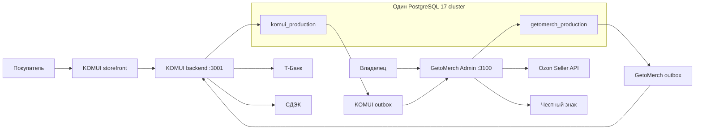

# Целевая архитектура данных GetoMerch Admin и KOMUI на сервере

Дата: 16 июля 2026 года.

Статус: целевая архитектура и общий технический контракт двух проектов.
Документ не выполняет миграции и не изменяет production.

Этот документ является основным источником решений о том:

- какие базы данных должны работать на сервере;
- какие данные принадлежат GetoMerch, а какие KOMUI;
- какие данные являются общими по смыслу;
- как публикуется каталог из админки на сайт;
- как заказы KOMUI попадают в производственный процесс GetoMerch;
- как разделяются Ozon FBS и Ozon FBO;
- как устроены резервы, производство, аналитика и маркировка;
- как обеспечиваются идемпотентность, безопасность, backup и восстановление.

Операционный план переноса Supabase на сервер остается в
`docs/ADMIN_FULL_SERVER_MIGRATION_PLAN.md`. Этот документ уточняет конечную
архитектуру после переноса и интеграцию с KOMUI.

## 1. Краткое итоговое решение

На сервере остаются две отдельные production-базы:

```text
getomerch_production  — внутренний учет, каталог-источник, склад,
                        производство, Ozon, fulfillment, аналитика,
                        Честный знак.

komui_production      — витрина сайта, цены сайта, SEO, корзина, заказы,
                        платежи, промокоды, СДЭК и клиентские данные.
```

Общих физических таблиц между базами нет. PostgreSQL не поддерживает обычные
foreign keys между базами, и они здесь не нужны.

Связь строится через два направленных контракта:

```text
GetoMerch -> KOMUI
  публикация каталога, вариантов, размеров и базовых медиа;

KOMUI -> GetoMerch
  события заказов и платежных статусов для резервирования и производства.
```

Направления не являются зеркальной двусторонней синхронизацией таблиц. У
каждого поля и процесса есть один владелец.

## 2. Ключевые бизнес-правила

1. GetoMerch является источником истины по дизайнам, SKU, вариантам, размерам,
   внутренним остаткам, производству, Ozon и маркировке.
2. KOMUI является источником истины по витринной карточке, цене сайта, SEO,
   публикации, клиентскому заказу, оплате, промокоду и доставке СДЭК.
3. Остатки GetoMerch не ограничивают доступность товара на сайте KOMUI.
4. Все опубликованные товары и размеры на сайте считаются доступными для
   заказа независимо от внутреннего остатка.
5. Если после оплаты заказа KOMUI материалов не хватает, заказ не отменяется:
   GetoMerch создает внутренний дефицит и задачу на пополнение/производство.
6. Ozon FBS участвует в общем fulfillment-процессе и может резервировать
   готовые изделия, заготовки и принты.
7. Заказ KOMUI после подтвержденной оплаты участвует в том же
   fulfillment-процессе, что Ozon FBS.
8. Ozon FBO никогда не создает резерв, производство или складское списание в
   момент продажи. Он хранится для аналитики, финансов и статистики.
9. Заказ, платеж, доставка, fulfillment и физический возврат имеют отдельные
   статусы. Один статус не должен неявно менять другой.
10. Все межсервисные события доставляются как минимум один раз. Защита от
    повторной обработки обеспечивается idempotency/inbox, а не надеждой на
    единственную доставку.

## 3. Текущее состояние сервера

На 16 июля 2026 года подтверждено:

| Параметр | Состояние |
|---|---|
| Сервер | `89.111.152.112`, Ubuntu 24.04 LTS |
| Ресурсы | 2 vCPU, 3.8 GiB RAM, 2 GiB swap |
| Диск | 20 GiB, при последней проверке занято около 64%, доступно около 6.9 GiB |
| PostgreSQL | 17.10, только loopback `:5432` |
| Nginx | обслуживает `komui.ru`, `stage.komui.ru`, `admin.komui.ru` |
| GetoMerch | `getomerch-admin.service`, `127.0.0.1:3100` |
| KOMUI prod | `komui-production-backend.service`, `127.0.0.1:3001` |
| KOMUI stage | `komui-backend.service` |

Действующие серверные базы:

- `komui_production`;
- `komui_staging`;
- архивная копия production;
- служебная `postgres`.

GetoMerch Admin пока использует Supabase-проект
`bkxpzfnglihxpbnhtjjq`. После миграции добавляются:

- `getomerch_production`;
- временная `getomerch_rehearsal`;
- при необходимости `getomerch_staging`.

Загрузка диска является оперативной метрикой и может изменяться; значения в
этом разделе — baseline на дату документа, а не постоянная гарантия емкости.

## 4. Почему базы должны быть раздельными

### 4.1. У них разные источники истины

KOMUI не является складской системой. Внутренние остатки нужны владельцу для
учета материалов и производства, но не должны влиять на checkout сайта.

Если объединить остатки и витрину в одну модель, возникнут ложные зависимости:

- нулевой внутренний остаток сможет скрыть товар на сайте;
- checkout будет зависеть от производственного учета;
- ошибка тяжелого складского запроса может повлиять на оплату;
- станет сложнее независимо откатывать магазин и админку.

### 4.2. Общие данные не требуют общей таблицы

Дизайн, размер и фотография являются общими по смыслу, но используются в
разных моделях:

- GetoMerch хранит каноническое описание товара и его вариантов;
- KOMUI хранит подготовленную витринную карточку и снимок опубликованных
  вариантов.

KOMUI получает версионированную проекцию каталога. Это не второй
редактируемый источник истины.

### 4.3. Нет двусторонней синхронизации одинаковых таблиц

Нельзя поддерживать две свободно редактируемые копии `merch_products` или
`merch_inventory`. Это потребовало бы разрешения конфликтов, distributed
transactions и сложного rollback.

Вместо этого:

- каталог редактируется в GetoMerch;
- витринные поля редактируются в KOMUI;
- заказы создаются в KOMUI;
- производство и резервы выполняются в GetoMerch;
- интеграция передает только утвержденные snapshots и события.

## 5. Целевая схема системы



Общими являются сервер и PostgreSQL cluster. Базы, роли, env, миграции,
backup manifests, application pools и владельцы данных разделены.

## 6. Владение доменами

| Домен | Источник истины | Получатель/проекция |
|---|---|---|
| Дизайны принтов и вышивок | GetoMerch | KOMUI |
| Группы товаров и SKU-варианты | GetoMerch | KOMUI |
| Категории, ткани, цвета, размеры | GetoMerch | KOMUI |
| Базовая галерея и размерная сетка | GetoMerch | KOMUI |
| Остатки готовых изделий | GetoMerch | не передаются на сайт |
| Заготовки, принты, производство | GetoMerch | не передаются на сайт |
| Ozon FBS/FBO и финансы | GetoMerch | dashboard GetoMerch |
| Название карточки сайта | KOMUI | может отображаться в админке через API |
| SEO, slug, badges, sort order | KOMUI | не записываются назад в каталог |
| Цена на сайте | KOMUI | snapshot в заказе GetoMerch |
| Публикация карточки | KOMUI | статус публикации возвращается GetoMerch |
| Заказы покупателей | KOMUI | operational mirror в GetoMerch |
| Оплаты и refunds | KOMUI | события и analytics snapshot |
| СДЭК и клиентские данные | KOMUI | GetoMerch читает через защищенный API |
| Резервы и fulfillment | GetoMerch | краткий статус можно вернуть в KOMUI |
| Маркировка | GetoMerch | source-specific передача в Ozon/KOMUI |

## 7. Идентичность товара

Нужно различать четыре разных понятия.

### 7.1. Дизайн

`merch_designs` представляет творческую единицу:

```text
Принт Язык Сукуны
Вышивка ...
```

Основные поля:

- `id` — стабильный UUID;
- `code` — существующий человекочитаемый код вида `D1`, `D2` и т. п.; в
  текущей схеме он nullable и не уникален, поэтому не должен использоваться как
  межсистемный идентификатор;
- `name` — нормальное название дизайна;
- `type` — `print` или `embroidery`;
- `description`, `image_url` — текущие описание и ссылка на изображение;
- timestamps.

Один дизайн может использоваться в нескольких товарных группах.
Каноническим ключом дизайна остаётся `merch_designs.id`, а уникальный стабильный
код товарной группы вводится отдельно как `merch_catalog_products.catalog_code`.

### 7.2. Товарная группа каталога

Новая `merch_catalog_products` описывает одну общую карточку/семейство до
размера. Например:

```text
D17-TSH-PRT-WBLU
```

Рекомендуемые поля:

| Поле | Назначение |
|---|---|
| `id uuid` | стабильный `catalog_product_id` |
| `catalog_code text unique` | артикул без размера |
| `design_id uuid` | дизайн |
| `category_id uuid` | футболка/худи и т.д. |
| `fabric_id uuid` | обычная/варенка |
| `color_id uuid` | базовый цвет |
| `decoration_type_id uuid` | принт/вышивка |
| `design_version text` | V01/V02 при необходимости |
| `hoodie_fit text` | REG/CRP и другие варианты |
| `hoodie_fabric text` | FLC/NF и другие варианты |
| `default_name text` | базовое название каталога |
| `status text` | draft/active/archived |
| `catalog_version bigint` | монотонная версия публикации |
| `size_chart_id uuid` | общая размерная сетка |
| `created_at/updated_at` | аудит |

Уникальность не следует строить только на названии. Основная идентичность —
UUID и `catalog_code`.

### 7.3. SKU-вариант

Существующая `merch_products` остается единицей конкретного размера:

```text
D17-TSH-PRT-WBLU-S
D17-TSH-PRT-WBLU-M
...
```

В нее добавляется `catalog_product_id`, ссылающийся на
`merch_catalog_products.id`.

Стабильный UUID `merch_products.id` становится `catalog_variant_id` для
межсервисных контрактов. Размер, SKU и технические признаки записываются в
snapshot заказа.

### 7.4. Витринная карточка KOMUI

`komui_production.public.merch_storefront_products` остается карточкой сайта.
Она не является складским SKU и не обязана иметь отношение один к одному с
дизайном.

В нее добавляются:

| Поле | Назначение |
|---|---|
| `source_catalog_product_id uuid` | связь с GetoMerch без cross-DB FK |
| `source_catalog_code text` | диагностический код |
| `source_catalog_version bigint` | примененная версия каталога |
| `source_payload_hash text` | контроль проекции |
| `source_updated_at timestamptz` | время изменения источника |
| `catalog_synced_at timestamptz` | время применения в KOMUI |

`source_catalog_product_id` должен быть уникальным для обычной связи 1:1. Если
один товар намеренно представлен несколькими витринными карточками, связь
выносится в отдельную mapping-таблицу, а не ослабляется без контроля.

## 8. Количество уникальных товаров

Термин «количество товаров» неоднозначен. В интерфейсе и аналитике нужно
показывать отдельные показатели:

| Метрика | Таблица/правило |
|---|---|
| Уникальные дизайны | `count(merch_designs)` |
| Принты | designs с `type='print'` |
| Вышивки | designs с `type='embroidery'` |
| Товарные группы | `count(merch_catalog_products)` |
| SKU-варианты | `count(merch_products)` |
| Активные карточки сайта | active `merch_storefront_products` |
| Опубликованные размеры | активные variants в projection |

Числа могут намеренно различаться. Например, один дизайн может иметь черную и
белую карточку, а каждая карточка — пять SKU-размеров.

## 9. Медиа и размерные сетки

### 9.1. Общая модель медиа

В GetoMerch добавляются:

```text
merch_media_assets
merch_catalog_product_media
```

`merch_media_assets`:

| Поле | Назначение |
|---|---|
| `id uuid` | стабильный asset ID |
| `source text` | upload/ozon/generated/import |
| `source_url text` | исходный URL |
| `storage_key text` | ключ собственного object storage |
| `public_url text` | стабильный публичный URL |
| `mime_type text` | MIME |
| `checksum text` | защита от дублей |
| `width/height integer` | размеры |
| `status text` | pending/ready/failed/archived |
| `created_at/updated_at` | аудит |

`id` является основной идентичностью изображения. URL не является
идентичностью: он может измениться при переносе между CDN/Object Storage или
повторной оптимизации файла. `checksum` хранится в формате `sha256:<hex>` и
используется для поиска идентичного бинарного файла при повторном импорте.
Импортер должен по возможности переиспользовать существующий asset, а не
создавать видимый дубль с новым URL.

`merch_catalog_product_media`:

- `catalog_product_id`;
- `media_asset_id`;
- `position`;
- `role`: `primary`, `gallery`, `size_chart`, `care`, `warning`;
- `is_default`;
- optional variant/color scope.

Рекомендуемое долгосрочное хранилище — отдельный prefix в Yandex Object
Storage. База хранит metadata и URL, но не бинарные файлы.

В catalog snapshot каждое изображение передается как объект, а не как строка
URL:

```json
{
  "assetId": "uuid",
  "checksum": "sha256:...",
  "role": "primary",
  "position": 1,
  "publicUrl": "https://...",
  "width": 1200,
  "height": 1600,
  "mimeType": "image/webp",
  "sourceUpdatedAt": "2026-07-16T10:00:00Z"
}
```

Assets со статусом `pending` или `failed` не публикуются как готовые.

### 9.2. Витринные overrides

GetoMerch передает базовую галерею и порядок. KOMUI может хранить:

- `hidden_source_asset_ids` — скрытые source assets;
- `storefront_media_order` — витринный порядок по стабильным asset IDs;
- `storefront_primary_asset_id` — отдельную главную фотографию;
- `local_storefront_assets` — локальные media KOMUI и crop/path.

Такие overrides принадлежат KOMUI и не записываются назад в GetoMerch.

Правила merge:

- скрытый source asset не возвращается после следующей публикации;
- смена URL при том же `assetId` не сбрасывает exclusion;
- идентичный checksum не создает новый видимый дубль;
- новое source media отображается в preview/diff как добавленное;
- удаление source asset не удаляет локальный storefront asset;
- физическое удаление объекта разрешено только после проверки ссылок и
  истечения retention period.

Изменение набора, порядка, role или checksum source media увеличивает
`catalog_version` затронутого товара. Смена только URL при неизменных
`assetId`/checksum обновляет projection metadata, но не должна сбрасывать
витринный порядок.

### 9.3. Размерные сетки

Размерная сетка является частью общего каталога, а не остатка.

Рекомендуемая таблица `merch_size_charts`:

- `id`;
- `name`;
- `category_id`;
- `fabric_id` nullable;
- `version`;
- `content_json` с schema validation;
- `is_active`;
- timestamps.

KOMUI получает snapshot `size_chart_json`. Изменение сетки не должно
автоматически менять исторические заказы.

Изменение активной размерной сетки увеличивает версии всех затронутых catalog
products либо формирует эквивалентные versioned snapshot events. Иначе KOMUI
не сможет определить, что его projection устарела.

## 10. Владение полями витринной карточки

| Поле | Владелец | Поведение при публикации |
|---|---|---|
| `source_catalog_product_id` | GetoMerch | всегда обновляется |
| design/category/fabric/color | GetoMerch | обновляется из каталога |
| набор размеров | GetoMerch | добавляется/обновляется независимо от остатков |
| variant IDs и SKU | GetoMerch | обновляются |
| базовые media URLs | GetoMerch | обновляются с учетом KOMUI override |
| размерная сетка | GetoMerch | обновляется |
| название сайта | KOMUI | не перезаписывается без explicit option |
| описание сайта | KOMUI | не перезаписывается |
| SEO/slug/tags | KOMUI | не перезаписываются |
| цена сайта | KOMUI | не берется из Ozon автоматически |
| compare-at price | KOMUI | не перезаписывается |
| badges/sort order | KOMUI | не перезаписываются |
| `source_status` | GetoMerch | `active/archived` |
| `storefront_status` | KOMUI | `draft/ready/published/hidden/archived` |

У payload публикации должны быть отдельные секции `sourceFields` и
`storefrontDefaults`, чтобы новый importer не мог случайно перезаписать
магазинные поля.

## 11. Публикация каталога GetoMerch -> KOMUI

### 11.1. Событие публикации

Изменение каталога в одной транзакции записывает outbox event:

```text
catalog.product.created.v1
catalog.product.updated.v1
catalog.product.archived.v1
```

Событие содержит:

- `event_id`;
- `event_type`;
- `schema_version`;
- `catalog_product_id`;
- `catalog_version`;
- `occurred_at`;
- полный publishable snapshot;
- payload hash.

### 11.2. Полный snapshot вместо патча

Для текущего объема каталога лучше передавать полную публикуемую карточку, а
не набор JSON Patch операций. Полный snapshot:

- проще повторять;
- проще сравнивать;
- не зависит от пропущенного предыдущего события;
- безопаснее при восстановлении.

### 11.3. Применение в KOMUI

KOMUI выполняет atomic upsert по `source_catalog_product_id`:

1. Проверяет signature и `event_id`.
2. Применяет decision table версии/hash из раздела 22.
3. Обновляет только поля, принадлежащие GetoMerch.
4. Сохраняет storefront overrides.
5. Новую карточку всегда создает со `storefront_status='draft'`.
6. Записывает inbox event и результат в той же транзакции.
7. Возвращает applied version и storefront product ID.

Catalog event сам по себе никогда не публикует новую карточку. Переход
`draft -> ready -> published` принадлежит KOMUI и разрешается только после
readiness validation:

- есть source catalog mapping;
- есть хотя бы один активный variant;
- SKU/size snapshot валиден;
- цена больше нуля;
- slug уникален и валиден;
- заполнено storefront title и обязательное описание;
- выбрано primary media;
- category/product type валидны;
- preview не содержит критических конфликтов.

Добавление нового размера к уже опубликованной карточке может применяться
автоматически после валидации. Новое source media показывается в diff с учетом
exclusions. Некритическое обновление source-owned полей не сбрасывает
`published`. Ошибка одной карточки не блокирует независимые события, но
остается видимой в publication job.

### 11.4. Удаление и архивирование

Физическое удаление товара GetoMerch не удаляет карточку сайта. Событие
`archived` переводит projection в состояние `source_archived=true`. Решение
снять карточку с публикации выполняется отдельно и журналируется.

### 11.5. Сверка

Кроме событий нужна периодическая reconciliation:

- GetoMerch публикует manifest `catalog_product_id/version/hash`;
- KOMUI сравнивает manifest со своей projection;
- пропущенные/устаревшие карточки переотправляются;
- неизвестные карточки показываются как manual/legacy, но не удаляются.

### 11.6. Single-writer cutover

Для каждого поля в каждый момент времени существует ровно один writer. После
включения GetoMerch publication:

- design/category/fabric/color/variants/SKU/base media/size chart изменяются
  только событиями GetoMerch;
- соответствующие KOMUI endpoints становятся read-only или emergency-only;
- legacy Ozon importer KOMUI может строить preview, но не применять
  source-owned изменения;
- title/description/slug/SEO/price/badges/sort order продолжает изменять только
  KOMUI;
- rollback переключает writer feature flag, но не включает одновременный
  dual-write.

Порядок переключения:

1. Добавить source IDs/version/hash в KOMUI без смены writer.
2. Развернуть consumer catalog events выключенным.
3. Выполнить dry-run reconciliation и backfill mapping.
4. Включить небольшой canary-набор карточек и проверить overrides.
5. Включить публикацию всего каталога.
6. В том же change window отключить legacy apply source-owned полей.
7. Оставить legacy importer только для preview на ограниченный срок.
8. После наблюдения удалить legacy write-path.

### 11.7. Feature flags каталога

```text
GETOMERCH_CATALOG_PUBLICATION_ENABLED
KOMUI_CATALOG_EVENT_CONSUMER_ENABLED
KOMUI_LEGACY_SOURCE_FIELDS_WRITE_ENABLED
KOMUI_CATALOG_RECONCILIATION_ENABLED
```

Конфигурация, одновременно разрешающая новый и legacy writer для
source-owned полей, является недопустимой и должна блокировать startup или
mutation request.

## 12. База `komui_production`

### 12.1. Данные, которые остаются только в KOMUI

| Таблица | Назначение |
|---|---|
| `merch_storefront_products` | карточки сайта и проекция каталога |
| `merch_storefront_product_slug_redirects` | история URL |
| `merch_customer_orders` | заказ клиента и платежный статус |
| `merch_customer_order_items` | immutable item snapshots |
| `merch_payment_attempts` | запросы/ответы Т-Банк |
| `merch_payment_events` | подписанные webhook events |
| `merch_cdek_shipments` | отправления СДЭК |
| `merch_cdek_events` | история СДЭК |
| `merch_promo_codes` | промокоды сайта |
| `merch_promo_redemptions` | применение промокодов |
| `merch_admin_import_previews` | временные preview магазина |
| `merch_admin_jobs` | внутренние jobs backend KOMUI |

Основные отношения внутри `komui_production` остаются локальными этой базе:

- `merch_customer_orders` владеет immutable-позициями
  `merch_customer_order_items`;
- payment attempts и подписанные payment events относятся к заказу, но не
  подменяют его fulfillment status;
- CDEK shipment/events относятся к заказу и остаются зоной ответственности
  KOMUI;
- promo redemption связывает заказ с примененным промокодом;
- order item хранит snapshot витринной карточки/offer на момент покупки, а не
  читает изменяемую карточку при каждом открытии заказа;
- `source_catalog_product_id` и `source_catalog_variant_id` являются внешними
  идентификаторами без FK в другую БД.

Это означает, что восстановленный исторический заказ остается читаемым, даже
если карточка после покупки была переименована, переопубликована или
архивирована.

### 12.2. Новые интеграционные таблицы KOMUI

#### `merch_integration_outbox`

Хранит события для GetoMerch:

| Поле | Назначение |
|---|---|
| `id uuid` | event ID |
| `aggregate_type text` | `customer_order` |
| `aggregate_id text` | order UUID/number |
| `event_type text` | `order.paid.v1` и т.д. |
| `aggregate_version bigint` | порядок событий заказа |
| `payload jsonb` | минимальный snapshot |
| `status text` | pending/processing/delivered/failed/dead |
| `attempts integer` | число попыток |
| `available_at timestamptz` | backoff |
| `locked_at/worker_id` | claim |
| `last_error text` | безопасная ошибка |
| timestamps | аудит |

Индекс очереди должен быть partial по `status='pending'` и `available_at`.

#### `merch_integration_inbox`

Хранит примененные события каталога GetoMerch:

- `event_id` primary key;
- `event_type`;
- `aggregate_id`;
- `aggregate_version`;
- `payload_hash`;
- `status`;
- `processed_at`;
- безопасная ошибка.

#### `merch_catalog_sync_state`

Опциональная диагностическая таблица:

- source catalog product;
- applied version/hash;
- storefront product;
- last success/error;
- timestamps.

### 12.3. Изменения order items

В `merch_customer_order_items` нужно явно хранить:

- `source_catalog_product_id`;
- `source_catalog_variant_id`;
- `sku`;
- `design_id` или design code snapshot;
- `size`;
- category/fabric/color snapshot;
- image snapshot;
- price snapshot.

На первом этапе эти поля могут находиться в `product_snapshot`, но для ключей
интеграции лучше добавить отдельные индексируемые колонки.

### 12.4. Что не должно находиться в KOMUI

KOMUI не должен быть источником истины по:

- внутреннему количеству готовых изделий;
- заготовкам;
- print inventory;
- складским движениям;
- Ozon orders/finance;
- workshop orders;
- Честному знаку.

Существующие одноименные копии этих таблиц являются наследием миграции. Их
нельзя удалять до dependency audit. Целевое состояние — перевести активный код
KOMUI на storefront projection/API и затем архивировать или удалить ненужные
операционные копии отдельной миграцией.

## 13. База `getomerch_production`

### 13.1. Переносимые рабочие таблицы

Из Supabase переносятся:

```text
merch_warehouses
merch_product_categories
merch_fabric_types
merch_colors
merch_sizes
merch_designs
merch_decoration_types
merch_products
merch_inventory
merch_print_inventory
merch_transactions
merch_workshop_orders
merch_workshop_order_items
merch_ozon_orders
merch_ozon_order_items
merch_ozon_finance_operations
merch_expense_categories
merch_expenses
merch_ozon_import_runs
merch_ozon_import_items
```

Ключевые существующие отношения, которые сохраняются при переносе данных:

- справочники category/fabric/color/size/decoration ссылаются на
  `merch_products`;
- `merch_products` связывает конкретный SKU с дизайном и техническими
  атрибутами;
- `merch_inventory` уникален по `(product_id, warehouse_id)`;
- `merch_print_inventory` уникален по `(design_id, warehouse_id)`;
- `merch_transactions` является журналом движений и сохраняет ссылки на товар,
  дизайн, исходный материал, склады и заказ цеха;
- workshop order владеет workshop items, а item хранит заготовку, дизайн,
  способ нанесения и итоговый SKU;
- Ozon order владеет Ozon items, item сопоставляется с `merch_products` по
  стабильному product ID после matching SKU/Ozon SKU;
- Ozon finance operations остаются отдельным финансовым источником и не
  смешиваются с order rows;
- import run владеет результатами анализа/import items и хранит аудит
  примененных решений.

Обязательные инварианты существующей модели переносятся как database
constraints, а не только как проверки UI:

- `merch_products.sku` уникален;
- непустой `merch_products.ozon_sku` уникален;
- остатки `merch_inventory` и `merch_print_inventory` неотрицательны;
- складская строка для одной пары subject/warehouse не дублируется;
- `posting_number`, Ozon finance `operation_id`, workshop `order_number`
  сохраняют текущую идемпотентность;
- заготовка не имеет design/decoration, готовый SKU имеет оба значения.

Текущие данные сначала мигрируются с совместимыми FK. На этапе канонического
каталога политика удаления ужесточается: design, catalog product и variant не
удаляются каскадно из рабочей истории, а архивируются. FK новых fulfillment,
sales facts и marking records используют `RESTRICT`/`SET NULL` и snapshots в
зависимости от назначения. Существующий `CASCADE` от design к SKU нельзя
переносить в новую модель как механизм обычного удаления через UI.

### 13.2. Новые таблицы каталога

```text
merch_catalog_products
merch_media_assets
merch_catalog_product_media
merch_size_charts
merch_catalog_publications
```

### 13.3. Mirror заказов KOMUI

#### `merch_komui_orders`

Минимальный operational mirror без избыточных персональных данных:

| Поле | Назначение |
|---|---|
| `id uuid` | локальный ID |
| `external_order_id uuid unique` | ID `merch_customer_orders` |
| `order_number text unique` | `KOM-...` |
| `source_order_status text` | общий lifecycle заказа KOMUI |
| `payment_status text` | состояние оплаты |
| `shipment_status text` | состояние доставки/накладной KOMUI |
| `refund_status text` | состояние денежного возврата |
| `return_status text` | состояние физического возврата |
| `event_version bigint` | защита от старых событий |
| `paid_at/created_at/source_updated_at` | source timestamps |
| `total_amount/currency` | analytics snapshot |
| `last_synced_at` | наблюдаемость |
| `raw_snapshot jsonb` | ограниченный технический snapshot |

ФИО, телефон и адрес не копируются без необходимости. Для упаковки/доставки
админка получает их по защищенному KOMUI API, а СДЭК остается в KOMUI.

#### `merch_komui_order_items`

- local ID;
- `komui_order_id` FK;
- `external_item_id`;
- source catalog product/variant IDs;
- mapped `product_id` GetoMerch;
- SKU, design, size и другие snapshots;
- quantity;
- unit/line price amounts;
- item version/hash;
- timestamps.

Уникальность: `(komui_order_id, external_item_id)`.

### 13.4. Общий fulfillment

```text
merch_fulfillment_orders
merch_fulfillment_order_items
merch_fulfillment_requirements
merch_stock_allocations
merch_fulfillment_events
```

#### `merch_fulfillment_orders`

| Поле | Назначение |
|---|---|
| `id uuid` | внутренний order ID |
| `source text` | только `ozon_fbs` или `komui` |
| `source_order_key text` | posting number/KOMUI order ID |
| `status text` | internal fulfillment state |
| `reservation_status text` | pending/reserved/partial/shortage/released |
| `priority integer` | ручной приоритет |
| `ordered_at/paid_at` | очередь |
| `ship_by timestamptz` | SLA/Ozon deadline |
| `warehouse_id` | основной склад обработки |
| `source_version bigint` | защита от старого source event |
| `created_at/updated_at` | аудит |

Ограничения:

```text
CHECK source IN ('ozon_fbs', 'komui')
UNIQUE (source, source_order_key)
```

`ozon_fbo` запрещен constraint и никогда не создается в этой таблице.

#### `merch_fulfillment_order_items`

- fulfillment order FK;
- source item key;
- mapped finished `product_id`;
- design/category/fabric/color/size snapshot;
- quantity;
- cost snapshot;
- marking requirement;
- item fulfillment status;
- unique `(fulfillment_order_id, source_item_key)`.

#### `merch_fulfillment_requirements`

Описывает потребность, а не фактический остаток:

| Поле | Пример |
|---|---|
| `requirement_type` | finished_product/blank_product/print/embroidery_service |
| `product_id` | готовое изделие или заготовка |
| `design_id` | принт/вышивка |
| `required_quantity` | сколько нужно |
| `allocated_quantity` | derived/cache: сколько выделено allocations |
| `status` | pending/partial/allocated/consumed/released |
| `strategy` | finished_first/produce/force_workshop |

Отрицательный остаток не используется для обозначения дефицита. Дефицит:

```text
required_quantity - allocated_quantity
```

Единственным источником факта резерва являются строки
`merch_stock_allocations`. `allocated_quantity` либо вычисляется как сумма
active/consumed allocations, либо является денормализованным cache, который
обновляется только той же транзакционной функцией и регулярно сверяется.
Независимое изменение обоих представлений запрещено.

#### `merch_stock_allocations`

Фиксирует фактический резерв:

- requirement ID;
- `product_inventory_id` nullable FK -> `merch_inventory(id)`;
- `print_inventory_id` nullable FK -> `merch_print_inventory(id)`;
- constraint: ровно одна из двух FK заполнена;
- quantity;
- status `active`, `consumed`, `released`;
- уникальный idempotency key;
- allocated/consumed/released timestamps;
- release reason.

Warehouse определяется связанной inventory row, поэтому отдельное свободно
редактируемое `warehouse_id` в allocation не требуется. Полиморфная пара
`subject_type + subject_id` не используется: она не обеспечивает FK и допускает
резерв несуществующего ресурса.

Обязательные инварианты:

```text
inventory.on_hand >= 0
allocation.quantity > 0
active_allocated >= 0
active_allocated <= inventory.on_hand
requirement.allocated <= requirement.required
```

`active_allocated <= on_hand` является межстрочным инвариантом: он
обеспечивается единым transaction path с блокировкой inventory row и
подтверждается reconciliation. Уменьшение on-hand ниже активного резерва,
release consumed allocation, consume released allocation и повторный release
запрещены. Ручная корректировка проходит через те же row locks.

### 13.5. Интеграционные и фоновые таблицы

```text
merch_integration_outbox
merch_integration_inbox
merch_jobs
merch_job_attempts
```

Outbox используется для публикации каталога и обратных статусов заказа.
Inbox — для событий KOMUI. Jobs — для Ozon sync, catalog publication,
reconciliation, allocation и marking.

### 13.6. Аналитические проекции

Рекомендуемые производные таблицы:

```text
merch_sales_facts
merch_sales_item_facts
merch_analytics_sync_state
```

Они не являются источником истины и полностью перестраиваются из source data.

### 13.7. Маркировка

Честный знак должен связываться не с Ozon-specific item, а с общим
fulfillment item:

```text
merch_marking_codes
merch_marking_assignments
merch_marking_events
merch_marking_documents
```

Это позволяет использовать один процесс для Ozon FBS и KOMUI.

## 14. Поток заказа KOMUI

### 14.1. Создание

1. KOMUI проверяет active storefront card, опубликованный размер и цену.
2. KOMUI не проверяет GetoMerch inventory.
3. Заказ и immutable items создаются транзакционно в `komui_production`.
4. В той же транзакции записывается `order.created.v1` в KOMUI outbox.
5. GetoMerch сохраняет mirror заказа, но не резервирует материалы.

### 14.2. Оплата

1. Т-Банк webhook подтверждает платеж.
2. KOMUI транзакционно меняет payment status и пишет `order.paid.v1`.
3. GetoMerch inbox принимает событие один раз.
4. Создается/активируется fulfillment order `source='komui'`.
5. Создаются requirements и запускается allocator.

Резерв до подтвержденной оплаты по умолчанию не создается.

### 14.3. Производство

Allocator выбирает один из сценариев:

1. Резерв готового изделия.
2. Резерв заготовки и принта.
3. Резерв заготовки и создание workshop requirement для вышивки.
4. Частичный резерв и shortage.

Сайт продолжает показывать товар в наличии независимо от результата.

### 14.4. Отправка

Когда изделие готово:

1. GetoMerch назначает маркировку, если требуется.
2. GetoMerch отмечает внутренний fulfillment как `ready`.
3. Через KOMUI API обновляется только projection `production_status` с
   монотонной source version.
4. СДЭК shipment, `shipment_status` и клиентские уведомления выполняет KOMUI
   backend независимо от production status.
5. После фактического принятия отправления KOMUI присылает shipment event;
   только после него GetoMerch может отметить внутренний fulfillment `shipped`.

GetoMerch не пишет SQL напрямую в `komui_production`.

## 15. Поток Ozon

### 15.1. Ozon FBS

1. Source posting сохраняется в `merch_ozon_orders/items`.
2. Только FBS adapter создает `merch_fulfillment_orders`.
3. Выполняется тот же allocator, что для KOMUI.
4. Source-specific шаги Ozon: маркировка, label/status, shipment confirmation.

### 15.2. Ozon FBO

FBO сохраняется в source-таблицах и аналитике, но для него запрещено:

- создавать fulfillment order;
- резервировать готовое изделие;
- резервировать заготовку или принт;
- создавать производство/цех;
- списывать собственный склад при каждой FBO-продаже;
- показывать его в очереди «нужно отправить».

Если будет учет поставок на склад Ozon, собственный склад изменяется в момент
передачи поставки, а не в момент FBO-продажи.

### 15.3. Возвращенный FBS становится FBO

Если покупатель отказался от FBS, а Ozon оставил товар у себя:

- исходный FBS fulfillment закрывается как returned/transferred_to_ozon;
- резерв не создается повторно;
- последующая продажа FBO попадает только в analytics;
- маркировочная история сохраняется отдельными marking events.

## 16. Резервирование и производство

### 16.1. Понятия остатков

```text
on_hand    — фактически учтено на складе;
allocated  — активные резервы;
available  — on_hand - allocated;
required   — полная потребность заказов;
shortage   — required - allocated.
```

KOMUI не читает ни одно из этих чисел для доступности товара.

### 16.2. Транзакция allocation

1. Claim fulfillment job через `FOR UPDATE SKIP LOCKED`.
2. Загрузить requirements.
3. Найти inventory rows.
4. Заблокировать их `FOR UPDATE` в стабильном порядке по ID.
5. Посчитать active allocations внутри транзакции.
6. Создать allocation не больше доступного количества.
7. Обновить requirement и fulfillment state.
8. Записать append-only fulfillment event.
9. Commit.

Внешние HTTP-вызовы нельзя выполнять внутри этой транзакции.

### 16.3. Параллельные заказы

- inventory rows блокируются в одинаковом порядке;
- worker jobs забираются через `FOR UPDATE SKIP LOCKED`;
- allocation имеет idempotency key;
- constraint не разрешает отрицательный on-hand;
- deadlock/serialization retry ограничен и журналируется;
- приоритет по умолчанию: ближайший `ship_by`, затем `paid_at`.

### 16.4. Производство принта

При производстве:

1. allocation заготовки и принта переводится в `consumed`;
2. создается готовый SKU или учитывается произведенная единица;
3. готовая единица привязывается к fulfillment item;
4. записываются складские transactions;
5. все изменения выполняются одной DB-транзакцией.

### 16.5. Вышивка

Для вышивки:

- резервируется заготовка;
- создается workshop order/item;
- fulfillment item связывается с workshop item;
- получение из цеха завершает производство;
- отмена не должна дважды освобождать уже переданную заготовку.

### 16.6. Транзакционный gate

Общий fulfillment запрещено начинать поверх последовательных Supabase REST
mutations. До этапа D должны быть переведены на server PostgreSQL и одну
транзакцию:

- приемка товара/принта вместе с ledger entry;
- перемещение, корректировка и списание;
- `blank + print -> finished`;
- передача в цех и приемка результата;
- создание requirements;
- allocation, consumption и release;
- подтверждение и отмена FBS-отправки;
- catalog entity и catalog outbox event;
- входное событие и inbox result.

Route Handler/worker вызывает domain service, который использует один
`pg` client от `BEGIN` до `COMMIT`. Внешние Ozon/KOMUI/Telegram/СДЭК вызовы
выполняются после commit. Admin UI не изменяет inventory tables напрямую.
Deployment gate закрывается только после fault-injection, concurrency tests и
inventory/ledger reconciliation без необъясненных расхождений.

### 16.7. Reconciliation резервов

Периодическая проверка выявляет:

- сумму allocations больше on-hand;
- active allocation у отмененного fulfillment;
- расхождение requirement quantity и allocation sum;
- consumed/released timestamp, не соответствующий status;
- сверхрезерв одного ресурса;
- fulfillment `reserved` без полного allocation.

Расхождение создает alert и блокирует опасную автоматическую операцию. Оно не
исправляется молча.

## 17. Статусы

Статусы заказа, оплаты, производства, отправления, денежного refund и
физического возврата являются независимыми state machine. Одно поле не может
одновременно описывать производство и доставку.

### 17.1. `order_status` KOMUI

Общий lifecycle клиентского заказа:

```text
open
completed
canceled
```

Он не дублирует детальные состояния оплаты или доставки.

### 17.2. `payment_status` KOMUI

```text
not_started
pending
authorized
paid
review
partially_refunded
refunded
```

Ошибка отдельной попытки хранится в `merch_payment_attempts` и не делает заказ
необратимо неоплачиваемым. Поздний failed webhook старой попытки не может
понизить уже подтвержденный `paid`.

### 17.3. `production_status`

Владелец — GetoMerch. KOMUI хранит только projection и
`production_source_version`:

```text
not_required
pending
reserved
partial
shortage
in_production
ready
canceled
```

Production callback не изменяет shipment или order status.

### 17.4. `shipment_status` KOMUI

```text
not_created
creating
created
accepted
in_transit
delivered
delivery_failed
canceled
returned
```

Владелец — KOMUI. Статусы СДЭК преобразуются отдельным adapter/mapping, а не
распространяются по коду как необработанные строки.

### 17.5. `refund_status` KOMUI

```text
none
pending
partial
full
failed
```

Денежный refund не подтверждает физический возврат изделия.

### 17.6. `return_status` KOMUI

```text
none
requested
in_transit
received
accepted
rejected
```

Единственный writer этого статуса — KOMUI. СДЭК и KOMUI admin создают source
events. После складской проверки GetoMerch отправляет versioned
`return.inspection.completed` с результатом, а transition применяет KOMUI.
GetoMerch отдельно хранит внутреннее fulfillment/складское событие и не пишет
поле `return_status` напрямую.

### 17.7. Internal fulfillment GetoMerch

```text
new
reservation_pending
reserved_finished
reserved_materials
partial
shortage
in_production
ready
shipped
cancelled
returned
transferred_to_ozon
```

### 17.8. Владение статусами

| Статус | Владелец | Допустимый источник входа |
|---|---|---|
| `order_status` | KOMUI | KOMUI backend/admin |
| `payment_status` | KOMUI | Т-Банк через KOMUI webhook handler |
| `production_status` | GetoMerch | GetoMerch fulfillment worker |
| `shipment_status` | KOMUI | СДЭК adapter/KOMUI admin |
| `refund_status` | KOMUI | Т-Банк/KOMUI admin |
| `return_status` | KOMUI | СДЭК/admin/GetoMerch inspection event |

### 17.9. Transition matrix

Для каждой state machine до реализации создается полная transition matrix,
используемая кодом и tests. Минимальные обязательные случаи:

| Текущее состояние | Событие | Новое состояние | Результат/побочный эффект |
|---|---|---|---|
| payment `pending` | подтвержденный webhook | `paid` | записать `order.paid.v1` |
| payment `paid` | late failed старой попытки | `paid` | stale/no-op, сохранить event |
| production `ready` | shipment created | `ready` | меняется только shipment |
| shipment `delivered` | refund | `delivered` | меняется только refund |
| return `received` | inspection accepted | `accepted` | отдельное складское решение |

Повторная платежная попытка не требует нового заказа. Для каждого разрешенного
и запрещенного перехода нужен unit или integration test.

## 18. Отмена и возврат

### До allocation

- fulfillment закрывается;
- requirements переводятся в released;
- inventory не меняется.

### После allocation, до consumption

- active allocations освобождаются;
- доступный внутренний остаток увеличивается;
- причина release журналируется.

### После consumption, до отправки

- материал нельзя «вернуть» автоматическим откатом;
- произведенное изделие приходуется как готовый SKU;
- заказ закрывается, товар остается доступен для другого fulfillment.

### После отправки

- refund и physical return обрабатываются раздельно;
- возврат приходуется только после фактического получения и проверки;
- marking state меняется по отдельному процессу Честного знака.

## 19. Аналитика

### 19.1. Источники

| Источник | Продажи/выручка | Fulfillment |
|---|---:|---:|
| Ozon FBS | да | да |
| Ozon FBO | да | нет |
| KOMUI | да | да после `paid` |

### 19.2. Source of truth по деньгам

- Ozon revenue/commissions/refunds: Finance API;
- Ozon orders/items: количество единиц и product mapping;
- KOMUI revenue: подтвержденные payments/orders;
- KOMUI refunds: payment events/status;
- COGS: cost snapshot по SKU на момент формирования sale fact.

Нельзя складывать Ozon order amount и Finance API credit как две выручки.

### 19.3. Производные facts

`merch_sales_facts`:

- source;
- external order key;
- sale/refund status;
- occurred date;
- gross/net amounts;
- commission/delivery/other costs;
- tax basis;
- currency;
- source version.

`merch_sales_item_facts`:

- sale fact FK;
- source item key;
- mapped product/design/size;
- quantity;
- revenue allocation;
- cost snapshot;
- gross profit.

Facts обновляются идемпотентно и могут быть перестроены.

### 19.4. Dashboard

Отдельно показываются:

- Ozon FBS;
- Ozon FBO;
- KOMUI;
- итого продажи/выручка/прибыль;
- очередь обработки только Ozon FBS + KOMUI;
- shortages и production workload;
- FBO никогда не попадает в производственную очередь.

## 20. Честный знак

### 20.1. Общая привязка

Маркировочный код назначается `merch_fulfillment_order_item`, поэтому один
workflow подходит для Ozon FBS и KOMUI.

### 20.2. Разделение source adapter

- Ozon FBS: код передается в Ozon по соответствующему API;
- KOMUI: код связывается с внутренней позицией и документами продажи/вывода;
- Ozon FBO: маркировка решается на уровне поставки на склад Ozon, а не продажи
  FBO fulfillment order.

### 20.3. Необходимые статусы

```text
available
assigned
printed
applied
reported
withdrawn
returned
invalid
```

Каждая смена состояния записывается append-only event. Код нельзя хранить в
обычных application logs.

## 21. Межсервисные API

### 21.1. Внутренний транспорт

На одном сервере предпочтителен loopback:

```text
GetoMerch -> http://127.0.0.1:3001/api/internal/...
KOMUI     -> http://127.0.0.1:3100/api/internal/...
```

Loopback не отменяет аутентификацию. Для каждого направления используется
отдельный secret/token. Публичные admin tokens не переиспользуются.

### 21.2. Каталог

Рекомендуемые endpoints KOMUI:

```text
PUT  /api/internal/catalog/products/:catalogProductId
GET  /api/internal/catalog/sync-state/:catalogProductId
POST /api/internal/catalog/reconcile
```

### 21.3. События заказов

Endpoint GetoMerch:

```text
POST /api/internal/integrations/komui/events
```

Дополнительный pull/reconciliation API KOMUI:

```text
GET /api/internal/orders/changes?cursor=<cursor>&limit=<n>
GET /api/internal/orders/:id
```

### 21.4. Обратный статус

GetoMerch не меняет payment status. Он может передать:

```text
POST /api/internal/orders/:id/production-status
POST /api/internal/orders/:id/return-inspection
```

KOMUI применяет только разрешенный transition соответствующей state machine.
Production callback не может пометить заказ отправленным: shipment остается
зоной KOMUI/СДЭК.

## 22. Формат события и защита

Минимальный envelope:

```json
{
  "eventId": "uuid",
  "eventType": "order.paid.v1",
  "schemaVersion": 1,
  "aggregateId": "uuid-or-source-key",
  "aggregateVersion": 3,
  "occurredAt": "2026-07-16T10:00:00Z",
  "payload": {}
}
```

Headers:

```text
X-Event-Id
X-Event-Timestamp
X-Event-Key-Id
X-Event-Signature
```

Canonical signing string:

```text
v1\n<X-Event-Timestamp>\n<X-Event-Id>\n<SHA256(raw-body)>
```

`X-Event-Signature` — HMAC-SHA256 canonical string. Body hash считается от
исходных байтов до JSON parsing. `X-Event-Key-Id` позволяет одновременно
принимать текущий и предыдущий secret во время ротации. Для направлений
GetoMerch -> KOMUI и KOMUI -> GetoMerch используются разные secrets.

Проверки:

- delivery timestamp создается заново для каждой HTTP-попытки и входит в
  короткое replay window;
- `occurredAt` не используется как delivery timestamp;
- signature сравнивается constant-time;
- `event_id` и payload hash проверяются по decision table;
- body ограничен по размеру;
- schema version поддерживается;
- PII минимизированы;
- ошибки не содержат payload/secrets.

### 22.1. Idempotency/version decision table

| Условие | Результат consumer |
|---|---|
| Новый `event_id`, версия новее | применить domain change и inbox в одной транзакции |
| Тот же `event_id`, тот же hash | success/no-op |
| Тот же `event_id`, другой hash | security conflict, не применять |
| Версия меньше примененной | stale/no-op с диагностическим inbox result |
| Версия равна, hash совпадает | duplicate/no-op |
| Версия равна, hash отличается | `409`, manual review/reconciliation |
| Gap полного catalog snapshot | применить новейший snapshot и поставить reconciliation job |
| Gap transition-based order event | не применять вслепую; запросить current aggregate |

Эта таблица заменяет неоднозначное правило «версия не меньше примененной».
Применение domain state и запись inbox result атомарны.

### 22.2. Версии агрегатов и hash

- `catalog_version` относится к одному catalog product и увеличивается в той
  же транзакции, что publishable change/outbox event;
- media order, source assets и связанная size chart увеличивают версии всех
  затронутых products либо создают эквивалентные snapshot events;
- order aggregate version увеличивается в транзакции изменения заказа;
- hash строится по canonical JSON с детерминированным порядком ключей;
- hash не включает delivery timestamp, временный signed URL и другие
  нестабильные поля.

### 22.3. HTTP-семантика

| Ответ | Действие producer |
|---|---|
| `200/204` | applied или безопасный duplicate/no-op |
| `202` | принято в локальную очередь; ожидать async result/reconciliation |
| `400/422` | schema error, автоматический retry не нужен |
| `401/403` | auth/signature error, остановить бесконечный retry и alert |
| `409` | version/hash conflict, manual review/reconciliation |
| `429` | retry с учетом `Retry-After` |
| `5xx/network timeout` | exponential retry with jitter |

Producer не считает любой `4xx` временной ошибкой.

## 23. Outbox, inbox и доставка

### Producer transaction

Изменение domain entity и запись outbox event происходят в одной локальной
DB-транзакции. Это предотвращает ситуацию «данные изменились, событие не
создалось».

### Worker claim

Worker забирает события через atomic update с
`FOR UPDATE SKIP LOCKED`. Внешний HTTP-вызов выполняется после короткого claim,
не удерживая domain locks.

### Retry

- exponential backoff с jitter;
- отдельный лимит попыток;
- `400/401/403/409/422` не повторяются как обычная сеть и создают
  соответствующий alert/manual action;
- network/429/5xx повторяются, для `429` учитывается `Retry-After`;
- каждая HTTP-попытка получает новый delivery timestamp/signature при том же
  неизменном event body;
- dead-letter событие остается видимым и может быть переотправлено вручную.

### Exactly once

Exactly-once доставка между двумя БД не гарантируется. Гарантируется:

- at-least-once delivery;
- idempotent consumer;
- monotonic aggregate version;
- reconciliation как страховка.

## 24. Роли PostgreSQL

### GetoMerch

```text
getomerch_owner     NOLOGIN, владелец объектов
getomerch_migrator  LOGIN, DDL migrations
getomerch_app       LOGIN, runtime CRUD
getomerch_backup    LOGIN, read-only dump
```

### KOMUI

Сохраняются отдельные роли:

```text
komui_owner
komui_migrator
komui_app
komui_backup
```

### Ограничения

- ни одна app role не получает доступ ко второй БД;
- app roles не имеют SUPERUSER/CREATEDB/CREATEROLE;
- миграции не запускаются от app role;
- PostgreSQL слушает только loopback;
- passwords хранятся в root-owned env;
- pool/application names различаются;
- statement/lock/idle transaction timeouts обязательны.

## 25. Сервисы и фоновые процессы

Целевые процессы:

```text
getomerch-admin.service
getomerch-worker.service
getomerch-backup.timer
getomerch-reconcile.timer

komui-production-backend.service
komui-integration-worker.service
komui-backup.timer
komui-healthcheck.timer
```

На первом этапе worker может быть один на проект. При росте jobs можно
разделить по типам, но не создавать лишнюю инфраструктуру заранее.

GetoMerch worker выполняет:

- Ozon sync;
- catalog publication;
- KOMUI order ingestion/reconciliation;
- allocation;
- analytics rebuild;
- marking jobs.

KOMUI integration worker доставляет order events и применяет retry policy.

### 25.1. Начальные resource budgets

Для текущих 2 vCPU/3.8 GiB RAM стартовые лимиты:

| Компонент | Начальный предел |
|---|---|
| GetoMerch web DB pool | 3–4 соединения |
| GetoMerch worker DB pool | 1–2 соединения |
| KOMUI prod backend DB pool | не более 4 соединений |
| KOMUI integration worker | 1–2 соединения |
| Heavy worker concurrency | 1 job |
| Analytics rebuild | один процесс вне backup/deploy окна |
| Media processing | concurrency 1–2 |

Суммарный configured pool budget рассчитывается вместе с PostgreSQL
`max_connections`, autovacuum, staging и административным резервом. Нельзя
выставлять pool max 10 каждому процессу. Увеличение лимитов допускается только
после измерения p95, memory и connection pressure.

### 25.2. Systemd limits

Для web/worker units задаются и проверяются по production-метрикам:

- `MemoryHigh`, `MemoryMax`, `TasksMax`;
- restart policy с rate limit;
- отдельные writable paths;
- `NoNewPrivileges=true`, `PrivateTmp=true`, где совместимо;
- `TimeoutStopSec`, достаточный для graceful завершения job;
- mutual exclusion тяжелых timers.

Memory limits не копируются одинаково между Next.js, KOMUI backend и workers.

## 26. Миграции и совместимость deploy

Изменения, затрагивающие оба проекта, выкладываются расширяющими шагами:

1. Добавить таблицы/nullable columns/endpoint consumer.
2. Deploy consumer, умеющий принимать новый контракт.
3. Deploy producer, отправляющий новый контракт.
4. Backfill.
5. Проверить reconciliation.
6. Сделать columns обязательными только отдельной миграцией.
7. Удалить старый контракт после периода совместимости.

Нельзя одновременно делать destructive migration обеих БД и deploy обоих
приложений без проверенного rollback.

Schema versions событий меняются только при несовместимом контракте. Старый
consumer должен либо поддерживаться, либо явно возвращать unsupported version.

## 27. Backup и восстановление

### Отдельные logical backups

```text
pg_dump -Fc komui_production
pg_dump -Fc getomerch_production
```

У каждого dump свой manifest:

- DB/schema version;
- active application commit;
- counts/checksums ключевых таблиц;
- timestamp;
- PostgreSQL version;
- encryption/checksum;
- last restore drill.

Оба архива шифруются и отправляются в разные prefixes Yandex Object Storage.

### Общий PITR

PostgreSQL cluster общий. WAL archiving/PITR защищает обе базы и требует
координированного изменения cluster config. Для восстановления одной базы из
PITR сначала поднимается временный cluster, затем делается logical dump нужной
БД.

PITR считается рабочим только после restore drill во временный cluster.
Обязательны:

- monitoring размера `pg_wal` и ошибок `archive_command`;
- ограниченный локальный spool и проверка доступности Object Storage;
- disk warning при 75%, critical при 85%;
- минимальный свободный резерв 4 GiB;
- emergency runbook на случай роста WAL;
- запрет совместного запуска тяжелого analytics rebuild, backup и deploy.

Медиа и старые build caches не хранятся в PostgreSQL/WAL. Если архивирование
недоступно и WAL угрожает заполнить диск, приоритет — сохранить работу
PostgreSQL и магазина по заранее проверенному emergency runbook, а не ждать
автоматического исчерпания места.

### Согласованность двух БД

Backup двух баз не является distributed snapshot. После восстановления
несогласованность лечится outbox/inbox reconciliation:

- каталог повторно публикуется по version/hash;
- события заказов повторно подтягиваются по cursor/version;
- idempotency предотвращает дубли.

## 28. Monitoring

### Инфраструктура

- disk, RAM, swap, CPU;
- PostgreSQL connections/locks/deadlocks;
- slow queries;
- database growth;
- backup age и restore status;
- размер `pg_wal` и failures/lag архивирования;
- systemd service health.

Capacity review и план выделения PostgreSQL/workers на отдельный сервер
запускаются, если свободно стабильно меньше 4 GiB, swap активно используется
при обычной нагрузке, background jobs ухудшают p95 checkout/admin API, workers
не укладываются в SLA или невозможно сохранить безопасный connection reserve.

### Интеграция каталога

- pending/failed catalog events;
- разница source/applied version;
- hash mismatches;
- карточки без source mapping;
- source products без storefront projection.

### Заказы

- paid KOMUI orders без mirror;
- mirror без fulfillment;
- stale inbox/outbox;
- duplicate/rejected events;
- fulfillment в shortage;
- active allocations для отмененных заказов;
- FBO fulfillment rows — это критическая ошибка и должно быть 0.

### Аналитика

- freshness Ozon finance;
- freshness KOMUI sales facts;
- unmatched SKU/items;
- расхождение агрегатов source и facts.

## 29. Тестирование

### Каталог

- создание/обновление/архивирование;
- повторная доставка одной версии;
- доставка старой версии после новой;
- сохранение storefront title/SEO/price override;
- новая карточка создается только как `draft` и не публикуется событием;
- readiness checks блокируют неполную карточку;
- reconciliation после пропущенного события;
- media ordering и size chart snapshot;
- hidden source asset не возвращается после смены URL/повторного импорта;
- тот же event ID с другим payload hash отклоняется;
- retry с новым delivery timestamp проходит после первого replay window.

### KOMUI orders

- created без резерва;
- paid создает один fulfillment;
- повторный paid не создает второй резерв;
- поздний failed webhook не понижает `paid`;
- production `ready` не меняет shipment status;
- canceled до allocation;
- canceled после allocation;
- refund без physical return;
- return inspection меняет KOMUI return state через событие, а не cross-DB write;
- несколько items/quantity > 1;
- item без catalog mapping попадает в ручной разбор.

### Inventory concurrency

- два заказа на последний товар;
- partial allocation;
- stable lock ordering;
- rollback при ошибке производства;
- release не выполняется дважды;
- consumed allocation нельзя освободить обычным cancel;
- allocation ссылается ровно на одну inventory row;
- allocation sum не превышает on-hand;
- reconciliation обнаруживает искусственно внесенное расхождение.

### Ozon

- FBS создает fulfillment;
- FBO не создает fulfillment;
- canceled/stale FBS обновляется;
- FBS return to FBO не создает второй резерв;
- finance sync не удваивает выручку.

### Backup/restore

- независимый restore каждой БД;
- восстановление обеих БД и reconciliation;
- повторная доставка outbox после restore;
- восстановление catalog version и idempotency keys.

## 30. Поэтапное внедрение

### Этап A. Перенести GetoMerch DB на сервер

- выполнить `ADMIN_FULL_SERVER_MIGRATION_PLAN`;
- сохранить текущие HTTP-контракты;
- внедрить роли, backup и restore;
- перевести critical mutation-path на atomic SQL transactions;
- выполнить fault-injection и inventory/ledger reconciliation;
- Supabase оставить временным rollback source.

### Этап B. Ввести канонический каталог

- `merch_catalog_products`;
- stable catalog/variant IDs;
- stable media assets/checksums и versioned size charts;
- backfill existing SKU groups;
- UI редактирования групп и публикации.

### Этап C. Публикация в KOMUI

- добавить source fields в storefront products;
- outbox/inbox;
- internal catalog API;
- field ownership rules;
- draft/readiness workflow и media exclusions;
- reconciliation;
- выполнить canary single-writer cutover;
- одновременно отключить legacy apply source-owned fields в KOMUI.

### Этап D. Унифицированный fulfillment

- fulfillment orders/items;
- requirements/allocations/events с реальными inventory FK;
- перевести Ozon FBS на общий слой;
- выполнить transaction gate и allocation reconciliation;
- доказать, что FBO исключен constraint и tests.

### Этап E. Заказы KOMUI

- add order event outbox в KOMUI;
- mirror/inbox в GetoMerch;
- paid -> fulfillment;
- отдельные order/payment/production/shipment/refund/return state machines;
- cancel/refund/physical return flows;
- обратные production statuses.

### Этап F. Производство и shortages

- allocator;
- finished/blank/print/workshop strategies;
- shortages UI;
- notifications;
- concurrency tests.

### Этап G. Общая аналитика

- пройти capacity review и назначить worker/resource budget;
- sales facts;
- KOMUI revenue/refunds;
- Ozon FBS/FBO split;
- COGS snapshots;
- dashboard filters and totals.

### Этап H. Честный знак

- пройти capacity review marking worker;
- generic fulfillment item assignment;
- Ozon FBS adapter;
- KOMUI sale/withdrawal adapter;
- return flows;
- label generation and audit UI.

### Этап I. Удалить legacy-дубли KOMUI

- dependency audit;
- переключить Ozon/catalog import на GetoMerch publication;
- архивировать лишние internal tables в KOMUI;
- удалить только после backup, restore drill и периода наблюдения.

## 31. Запрещенные решения

- двусторонняя синхронизация `merch_products`;
- одновременная запись source-owned catalog fields новым и legacy writer;
- синхронизация внутренних остатков на сайт;
- скрытие товара KOMUI из-за нулевого GetoMerch inventory;
- прямой SQL GetoMerch в `komui_production`;
- прямой SQL KOMUI в `getomerch_production`;
- cross-project использование одного app DB user;
- создание fulfillment для Ozon FBO;
- резерв до подтвержденной оплаты KOMUI без отдельного бизнес-решения;
- обозначение shortage отрицательным остатком;
- внешние HTTP-вызовы внутри inventory transaction;
- полиморфный allocation без доказанной FK/trigger integrity;
- одно поле, объединяющее production и shipment status;
- автоматическая публикация новой storefront card по catalog event;
- повтор HTTP event со старым delivery timestamp/signature;
- удаление storefront card по обычному source delete;
- перезапись цены/SEO KOMUI Ozon-данными без explicit option;
- логирование customer payload, marking code или secrets;
- простой env rollback после появления новых записей без data reconciliation.

## 32. Критерии готовности целевой архитектуры

Архитектура считается реализованной, когда:

- GetoMerch работает из `getomerch_production` без Supabase runtime;
- KOMUI продолжает работать из `komui_production`;
- app roles изолированы;
- catalog IDs стабильны и присутствуют в storefront offers/order snapshots;
- catalog publication односторонняя, версионированная и идемпотентная;
- тот же event ID с другим hash отклоняется, gaps обрабатываются по типу события;
- одновременно активен только один writer source-owned catalog fields;
- новые карточки создаются как draft и проходят readiness validation;
- storefront overrides не теряются;
- media exclusions основаны на stable asset ID и переживают смену URL;
- KOMUI checkout не читает внутренние остатки;
- paid KOMUI order создает ровно один fulfillment;
- Ozon FBS и KOMUI используют общий reservation/production layer;
- Ozon FBO присутствует в аналитике, но отсутствует в fulfillment;
- shortage не делает inventory отрицательным;
- allocations имеют реальные inventory FK и не превышают on-hand;
- order/payment/production/shipment/refund/return state machines разделены;
- production callback не меняет shipment status;
- marking связан с generic fulfillment item;
- dashboard раздельно показывает FBS, FBO и KOMUI;
- outbox/inbox и reconciliation восстанавливают связь после сбоев;
- backup и restore обеих БД проверены;
- DB pools, worker concurrency, memory и disk/WAL thresholds определены;
- legacy operational tables KOMUI либо имеют подтвержденного владельца, либо
  архивированы;
- документация обоих репозиториев соответствует production.

## 33. Иерархия архитектурной документации

До активной параллельной разработки детальные контракты выносятся из overview
в поддерживаемую структуру:

```text
docs/architecture/
  README.md
  data-ownership.md
  catalog-model.md
  catalog-publication-contract.md
  order-event-contract.md
  order-state-machines.md
  fulfillment-model.md
  media-model.md

docs/runbooks/
  integration-reconciliation.md
  backup-restore.md
  pitr-recovery.md
  catalog-cutover.md
  order-integration-rollback.md

docs/baselines/
  server-baseline-YYYY-MM-DD.md
```

Иерархия источников истины:

1. SQL migrations определяют фактическую DB schema.
2. Версионированные OpenAPI/JSON Schema определяют HTTP/event payload.
3. State machine document определяет разрешенные переходы.
4. Architecture overview определяет связи и владельцев.
5. Runbooks определяют операционные действия и rollback.
6. Dated baseline фиксирует состояние сервера и может устаревать, не меняя
   архитектурных решений.

Изменение ownership требует ADR и cutover plan. Изменение event schema
обновляет producer, consumer contract и compatibility tests. Baseline не
редактируется задним числом: создается новый snapshot. Статус «реализовано»
ставится только после миграций, кода, monitoring и rollback-проверки.

До фактического выделения файлов этот документ хранит полный контракт, чтобы
не потерять детали. После выделения он сокращается до overview и ссылок, а не
становится второй редактируемой копией тех же правил.

## 34. Связанные документы

GetoMerch:

- `README.md`;
- `ARCHITECTURE.md`;
- `DATABASE.md`;
- `docs/ADMIN_FULL_SERVER_MIGRATION_PLAN.md`;
- `docs/ADMIN_SERVER_DEPLOYMENT_PLAN.md`;
- `docs/chestny-znak-ozon/README.md`;
- `docs/chestny-znak-ozon/FLOW.md`.

KOMUI:

- `SERVER_PROJECT_OVERVIEW.md`;
- `docs/server-migration/SERVER_PROJECT_OVERVIEW.md`;
- `docs/server-migration/CONSUMER_MATRIX.md`;
- `docs/admin-storefront-products-api.md`;
- `docs/admin-storefront-orders-api.md`;
- `docs/admin-ozon-import-api.md`.

Внешние references:

- [PostgreSQL transactions](https://www.postgresql.org/docs/current/tutorial-transactions.html);
- [PostgreSQL explicit locking](https://www.postgresql.org/docs/current/explicit-locking.html);
- [PostgreSQL SKIP LOCKED](https://www.postgresql.org/docs/current/sql-select.html#SQL-FOR-UPDATE-SHARE);
- [PostgreSQL INSERT ON CONFLICT](https://www.postgresql.org/docs/current/sql-insert.html#SQL-ON-CONFLICT);
- [Supabase platform to self-hosted restore](https://supabase.com/docs/guides/self-hosting/restore-from-platform).
