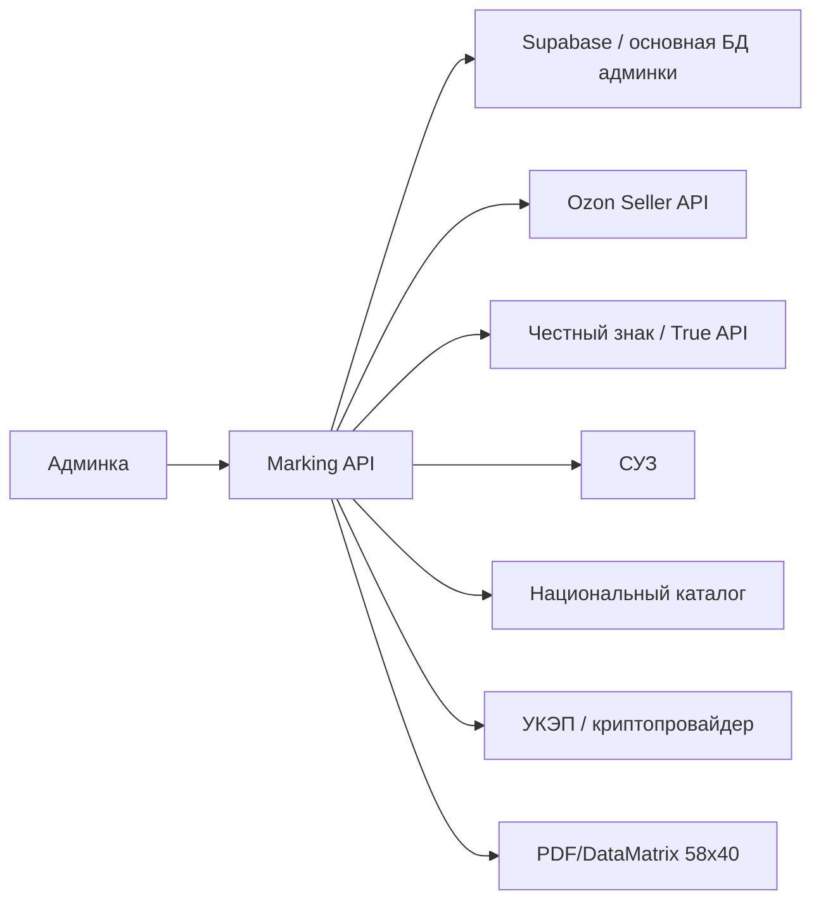
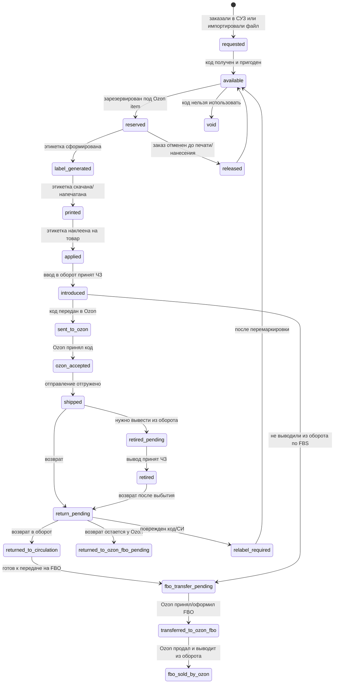
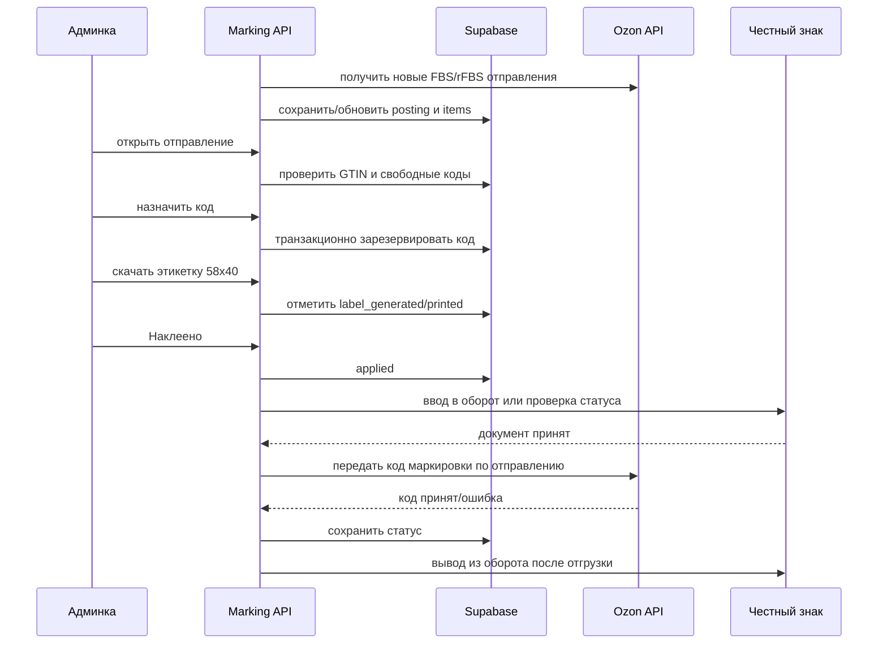

# Честный знак для Ozon-заказов: подробный flow внедрения

Дата: 2026-07-14  
Статус: проектный документ, без изменений в коде  
Фокус: только Честный знак, Ozon-заказы, коды маркировки, этикетки и вывод из оборота

## 1. Что должно получиться

В админке нужен операционный flow для Ozon FBS/rFBS-заказов:

1. Пришел заказ Ozon.
2. Админка показывает, какие позиции требуют маркировку.
3. Для каждой позиции можно назначить свободный код маркировки.
4. Можно скачать PDF-этикетку 58x40 мм с DataMatrix.
5. Сотрудник печатает этикетку, клеит на футболку и отмечает `Наклеено`.
6. Система вводит товар в оборот в Честном знаке или проверяет, что код уже в обороте.
7. Система передает код маркировки в Ozon по конкретному отправлению.
8. Перед отгрузкой админка показывает чеклист готовности.
9. После отгрузки система оформляет вывод из оборота по причине дистанционной продажи, если это обязанность продавца.
10. При возврате система помогает вернуть товар в оборот или перемаркировать его.
11. В отдельной вкладке `Честный знак / Процессы` видны все действия, документы, ошибки и движения каждого КМ.

Главная цель первой версии: убрать ручной хаос вокруг кодов и не допустить ситуации, когда один код ушел в два заказа, товар уехал без кода или код не был передан/выведен по правилам.

## 2. Источники и ограничения

Официальные материалы, которые нужно использовать при реализации:

- Честный знак, интеграция учетной системы по API для легкой промышленности: <https://markirovka.ru/knowledge/tovarnye-gruppy/legkaya-promishlennost/integratsiya-sistemy-markirovki-s-tovarouchetnoy-sistemoy-uchastnika-legprom>
- Честный знак, требования для начала работы и УКЭП: <https://markirovka.ru/knowledge/tovarnye-gruppy/legkaya-promishlennost/trebovaniya-dlya-nachala-raboty-v-sisteme-dlya-novykh-subektov-rf-legkaya-promyshlennost>
- Честный знак, описание товара и GTIN для заказа кодов: <https://markirovka.ru/knowledge/tovarnye-gruppy/legkaya-promishlennost/kak-dobavit-tovar-opisanie-tovara-v-sistemu-dlya-zakaza-kodov-markirovki-legprom>
- Честный знак, заказ и получение кодов маркировки: <https://markirovka.ru/knowledge/tovarnye-gruppy/legkaya-promishlennost/zakaz-i-poluchenie-kodov-markirovki-legprom>
- Честный знак, состав кода маркировки: <https://markirovka.ru/knowledge/tovarnye-gruppy/legkaya-promishlennost/sostav-koda-markirovki-legprom>
- Честный знак, требования к DataMatrix: <https://markirovka.ru/knowledge/tovarnye-gruppy/legkaya-promishlennost/kakim-dolzhen-byt-datamatrix-trebovaniya-k-preobrazovaniyu-i-kachestvu-naneseniya-legprom>
- Честный знак, ввод маркированных товаров в оборот: <https://markirovka.ru/knowledge/fast_start/start/vvod-markirovannykh-tovarov-v-oborot-instruktsiya>
- Честный знак, дистанционная торговля легпромом на маркетплейсах FBO/FBS/DBS: <https://markirovka.ru/knowledge/tovarnye-gruppy/legkaya-promishlennost/distantsionnaya-torgovlya-na-marketpleysakh-skhemy-fbo-fbs-dbs-legprom>
- Честный знак, онлайн-торговля и вывод из оборота: <https://markirovka.ru/knowledge/tovarnye-gruppy/legkaya-promishlennost/onlayn-torgovlya-internet-magazin-vyvod-iz-oborota-legprom>
- Честный знак, возврат товара, отгруженного маркетплейсу: <https://markirovka.ru/knowledge/tovarnye-gruppy/legkaya-promishlennost/kak-osushchestvit-vozvrat-tovara-kotoryy-byl-otgruzhen-marketpleysu>
- Ozon for dev, изменения методов управления кодами маркировки FBS/rFBS: <https://dev.ozon.ru/news/633-Izmeneniia-v-metodakh-dlia-upravleniia-kodami-markirovki-i-sborkoi-zakazov-dlia-FBS-rFBS/>
- Ozon for dev, маппинг ролей и методов Seller API: <https://dev.ozon.ru/start/300-Mapping-rolei-i-metodov-Seller-API/>
- Ozon Seller Edu, сборка FBS-заказов с маркированными товарами: <https://seller-edu.ozon.ru/fbs/ozon-logistika/markirovka>
- Ozon Seller Edu, отправка качественных FBS-возвратов на склад Ozon: <https://seller-edu.ozon.ru/fbs/orders-cancellations-returns/prodaja-vozvratov-fbs-na-fbo>
- Ozon Seller Edu, маркировка товаров на FBO: <https://seller-edu.ozon.ru/fbo/markirovka-tovarov/chestny-znak>
- Ozon Seller Edu, возвращение кодов маркировки с помощью УКД: <https://seller-edu.ozon.ru/fbo/markirovka-tovarov/ukd>

Ограничения:

- Часть технической документации True API, СУЗ и Национального каталога доступна в личном кабинете Честного знака. Перед реализацией нужно выгрузить актуальные PDF/Swagger/инструкции из ЛК.
- Этот документ не заменяет юридическую проверку. Для автоматического вывода из оборота нужно подтвердить схему Ozon и договорную роль продавца.
- Синхронизация SKU, таблиц товаров и перенос админки на сервер здесь не проектируются. В документе предполагается, что админка уже может получить Ozon-заказы и SKU/GTIN.

## 3. Базовое юридическое предположение

Для Ozon FBS/rFBS по легкой промышленности базовый сценарий такой:

- продавец остается собственником товара до передачи покупателю;
- маркетплейс/логистическая сторона может не являться участником оборота по этой операции;
- вывод из оборота по FBS делает собственник товара;
- причина вывода: `Дистанционная продажа` или другой точный справочный код, который нужно взять из True API;
- документ вывода должен быть подан не позднее 3 рабочих дней после отгрузки со склада и не позднее фактической доставки потребителю.

Это нужно подтвердить перед автоматизацией для конкретной схемы Ozon. Но для архитектуры лучше исходить именно из этого: система должна уметь сама выводить коды из оборота, а не надеяться, что Ozon сделает это за продавца.

## 4. Роли систем



`Админка`

- показывает заказы и статусы маркировки;
- запускает ручные действия;
- показывает ошибки и чеклист готовности;
- не хранит приватный ключ УКЭП;
- не показывает полный код маркировки без необходимости.

`Marking API`

- серверный модуль, который работает с секретами;
- назначает коды;
- подписывает и отправляет документы;
- генерирует этикетки;
- вызывает Ozon API;
- запускает фоновые задачи;
- обеспечивает идемпотентность.

`Supabase / основная БД`

- хранит GTIN-маппинг;
- хранит пул кодов;
- хранит связь кодов с Ozon-заказами;
- хранит документы ЧЗ;
- хранит журнал действий.

`УКЭП / криптопровайдер`

- отдельный серверный компонент;
- доступ только у backend-процесса;
- ключи не попадают в frontend, git, обычные логи и JSON-ответы.

## 5. Жизненный цикл кода маркировки



### Статусы в БД

Рекомендуемые статусы `marking_codes.status`:

- `available` - код свободен и может быть назначен;
- `reserved` - код закреплен за конкретной позицией заказа;
- `label_generated` - PDF/изображение этикетки сформировано;
- `printed` - этикетка скачана или отправлена на печать;
- `applied` - сотрудник подтвердил, что этикетка наклеена;
- `introduce_pending` - создан документ ввода в оборот;
- `introduced` - ЧЗ принял ввод в оборот;
- `send_to_ozon_pending` - идет передача в Ozon;
- `ozon_accepted` - Ozon принял код;
- `ozon_rejected` - Ozon отклонил код;
- `shipped` - отправление отгружено;
- `retire_pending` - нужно подать вывод из оборота;
- `retired` - ЧЗ принял вывод из оборота;
- `return_pending` - ожидается обработка возврата;
- `returned_to_circulation` - ЧЗ принял возврат в оборот;
- `returned_to_ozon_fbo_pending` - FBS-возврат/невыкуп едет на склад Ozon, а не к продавцу;
- `fbo_transfer_pending` - код должен быть в обороте, идет подготовка передачи/приемки на FBO;
- `transferred_to_ozon_fbo` - товар с кодом передан/принят Ozon для FBO-процесса;
- `fbo_sold_by_ozon` - дальнейшая продажа идет по FBO, вывод из оборота выполняет Ozon по своей роли;
- `relabel_required` - нужна перемаркировка;
- `blocked` - код нельзя использовать до ручного разбора;
- `void` - код окончательно исключен из использования.

Важное правило: статус должен отражать юридически значимое состояние, а не только нажатия в интерфейсе. Например, `printed` не означает `applied`, а `send_to_ozon_pending` не означает, что Ozon принял код.

## 6. Данные, которые нужны до первого заказа

### 6.1. Товарная карточка и GTIN

Для каждого продаваемого варианта футболки нужен GTIN. Практически это означает связку:

- дизайн;
- тип нанесения;
- цвет;
- размер;
- SKU/offer_id Ozon;
- GTIN из Национального каталога;
- код ТН ВЭД/ОКПД2, если требуется в документах;
- признак, что товар требует обязательную маркировку.

Для админки нужна таблица `marking_gtins`.

Минимальные поля:

```text
id
product_id
sku
offer_id
gtin
product_group
tnved_code
size
color
design_code
national_catalog_card_id
requires_marking
status
last_checked_at
created_at
updated_at
```

Статусы:

- `missing` - GTIN не указан;
- `draft` - GTIN указан вручную, но не проверен;
- `verified` - GTIN прошел проверку;
- `invalid` - GTIN не подходит или карточка не найдена;
- `archived` - связка больше не используется.

### 6.2. Проверка GTIN

Перед тем как разрешить назначение кода, система должна проверить:

1. У SKU есть GTIN.
2. GTIN относится к нужной товарной группе.
3. GTIN соответствует размеру/цвету/товару.
4. Карточка товара в Национальном каталоге пригодна для заказа кодов.
5. По этому GTIN можно заказать/использовать коды.

Если API Национального каталога сразу не внедрять, первая версия может иметь ручную валидацию:

- загрузка CSV `sku, offer_id, gtin`;
- ручной статус `verified`;
- запрет назначения кода для `missing` и `invalid`.

## 7. Получение кодов маркировки

Есть два пути. Их лучше внедрять последовательно.

### 7.1. MVP: ручной заказ кодов и импорт в админку

Flow:

1. В личном кабинете ЧЗ/СУЗ создается заказ кодов.
2. Коды выгружаются в файл.
3. Файл загружается в админку.
4. Backend парсит коды, определяет GTIN и серийный номер.
5. Полный код сохраняется в зашифрованном виде.
6. Коды попадают в пул `available`.
7. Админка показывает остаток свободных кодов по GTIN.

Плюсы:

- быстрее запустить;
- не нужно сразу реализовывать СУЗ API и подписание всех операций;
- можно проверить реальный принтер, Ozon и процесс на складе.

Минусы:

- коды придется периодически заказывать и загружать вручную;
- есть риск человеческой ошибки при выгрузке/импорте;
- не будет автоматического пополнения.

### 7.2. Полная версия: заказ кодов через СУЗ API

Flow:

1. Система видит, что по GTIN осталось меньше минимального порога свободных кодов.
2. Создает заказ кодов в СУЗ.
3. При необходимости подписывает запрос УКЭП.
4. Получает статус заказа.
5. Забирает коды.
6. Сохраняет полные КМ в зашифрованном виде.
7. Помечает коды как `available`.

Нужные сущности:

```text
marking_code_orders
marking_code_order_items
marking_codes
marking_events
```

Рекомендуемые поля `marking_code_orders`:

```text
id
source
external_order_id
product_group
status
requested_by_user_id
request_payload_encrypted
response_payload_encrypted
error_code
error_message
created_at
sent_at
completed_at
failed_at
```

Статусы заказа кодов:

- `draft`;
- `sent`;
- `processing`;
- `completed`;
- `failed`;
- `cancelled`.

## 8. Хранение кодов

Таблица `marking_codes` должна быть центральной.

Поля:

```text
id
gtin
product_id
sku
offer_id
full_code_encrypted
identification_code
serial
crypto_tail_fingerprint
status
source
code_order_id
assigned_posting_number
assigned_order_item_id
assigned_at
label_generated_at
printed_at
applied_at
introduced_at
sent_to_ozon_at
ozon_accepted_at
shipped_at
retired_at
returned_at
blocked_reason
created_at
updated_at
```

Что можно хранить открыто:

- GTIN;
- серийный номер;
- SKU;
- offer_id;
- статус;
- короткий fingerprint для сверки.

Что нельзя светить без необходимости:

- полный код маркировки;
- криптографическая часть;
- payload документов ЧЗ с полными кодами;
- подписи и внутренние идентификаторы, если они помогают восстановить операцию.

Рекомендация: `full_code_encrypted` хранить через серверное шифрование. Ключ шифрования держать в env/secret manager, не в БД.

## 9. Flow обработки Ozon-заказа



### 9.1. Появление заказа

Когда в админке появляется Ozon-заказ, для каждой позиции нужно вычислить `marking_required`.

Позиция `marking_required=true`, если:

- товар относится к маркируемой группе;
- SKU/offer_id есть в маппинге;
- у товара есть GTIN;
- позиция не является сервисной/подарочной/немаркируемой.

Статусы позиции:

- `not_required`;
- `missing_gtin`;
- `no_free_codes`;
- `ready_to_assign`;
- `assigned`;
- `label_printed`;
- `applied`;
- `introduced`;
- `sent_to_ozon`;
- `ozon_accepted`;
- `ready_to_ship`;
- `retired`;
- `error`.

### 9.2. Назначение кода

Назначение должно быть транзакционным:

```text
BEGIN
  выбрать один available код по GTIN FOR UPDATE SKIP LOCKED
  проверить, что позиция заказа еще не имеет кода
  обновить код: status=reserved, assigned_order_item_id=...
  создать ozon_order_item_marking
  создать marking_event
COMMIT
```

Если пользователь нажмет кнопку два раза, система должна вернуть уже назначенный код, а не взять новый.

Если заказ отменен до печати и нанесения:

- код можно вернуть в `available`;
- нужно записать событие `released_after_cancel`.

Если заказ отменен после печати/нанесения:

- автоматическое освобождение запрещено;
- статус `manual_review`;
- сотрудник должен решить, можно ли использовать товар с этим же кодом позже.

### 9.3. Этикетка 58x40 мм

Этикетка должна формироваться сервером.

Содержимое:

- DataMatrix ECC 200;
- полный код маркировки в корректной кодировке;
- SKU/offer_id;
- размер;
- цвет;
- номер Ozon отправления;
- короткий fingerprint кода для ручной сверки.

Не нужно выводить весь код маркировки текстом на этикетку: достаточно DataMatrix и короткой сверки.

Требования к реализации:

- не терять служебные разделители в коде;
- не преобразовывать код через JSON/string операции, которые могут удалить управляющие символы;
- проверять, что DataMatrix читается сканером;
- хранить checksum/fingerprint сгенерированной этикетки;
- при повторной печати не создавать новый код.

Endpoint:

```text
GET /api/marking/ozon/postings/:postingNumber/items/:itemId/label.pdf
```

Ответ:

- PDF `58mm x 40mm`;
- одна этикетка на один товар;
- для quantity > 1 - отдельные коды и отдельные страницы/файлы.

### 9.4. Подтверждение нанесения

Кнопка `Наклеено` нужна обязательно.

Почему нельзя считать скачивание этикетки нанесением:

- сотрудник мог скачать PDF, но не распечатать;
- принтер мог испортить этикетку;
- этикетка могла быть наклеена не на тот товар;
- товар мог быть отменен до сборки.

После `Наклеено`:

- код получает статус `applied`;
- позиция заказа становится готовой к вводу в оборот;
- можно разрешить передачу в Ozon только после проверки/ввода в оборот.

### 9.5. Ввод в оборот

Базовый порядок для собственной продукции:

1. Код получен.
2. Код нанесен на товар.
3. Товар введен в оборот в ЧЗ.
4. Товар можно отгружать/продавать.

В админке должно быть два режима:

- ручной: кнопка `Ввести в оборот`;
- автоматический: после `Наклеено` система сама создает документ.

Для первой версии лучше сделать ручной режим с фоновым статусом.

Документ ввода:

- создается на сервере;
- подписывается УКЭП;
- отправляется в ЧЗ;
- статус проверяется до `accepted` или `rejected`;
- payload и ответ сохраняются в `crpt_documents`;
- ошибки видны в карточке заказа.

Статусы:

- `introduce_not_started`;
- `introduce_document_created`;
- `introduce_sent`;
- `introduce_accepted`;
- `introduce_rejected`;
- `introduce_unknown`.

Если код уже в обороте:

- система должна уметь проверить статус и зафиксировать `introduced`;
- повторно отправлять документ без необходимости нельзя.

### 9.6. Передача кода в Ozon

Передача в Ozon не заменяет ввод/вывод в Честном знаке. Это отдельный marketplace-flow, чтобы Ozon принял отправление с маркируемым товаром.

Для FBS/rFBS нужно использовать актуальные методы Ozon по экземплярам товаров. По публичным материалам это семейство:

```text
/v6/fbs/posting/product/exemplar/create-or-get
/v6/fbs/posting/product/exemplar/set
/v5/fbs/posting/product/exemplar/status
/v5/fbs/posting/product/exemplar/validate
```

Точный payload нужно взять из актуальной документации Ozon перед разработкой.

Flow:

1. Получить или создать экземпляры товара для posting.
2. Сопоставить exemplar с order item.
3. Передать код маркировки.
4. Записать request/response.
5. Проверить статус.
6. Если Ozon отклонил код, показать ошибку и заблокировать отгрузку.

Статусы:

- `ozon_not_sent`;
- `ozon_send_pending`;
- `ozon_sent`;
- `ozon_accepted`;
- `ozon_rejected`;
- `ozon_status_unknown`.

Правило: отгрузку в админке можно считать готовой только при `ozon_accepted`.

## 10. Чеклист перед отгрузкой

Для каждого отправления админка должна считать `ready_to_ship`.

Маркируемая позиция готова, если:

- есть GTIN;
- код назначен;
- этикетка сформирована;
- сотрудник отметил `Наклеено`;
- код введен в оборот или подтвержден как `В обороте`;
- код передан в Ozon;
- Ozon принял код;
- нет активной ошибки ЧЗ/Ozon;
- quantity совпадает с количеством кодов.

Если в отправлении 2 одинаковые футболки:

- нужен 2 отдельных КМ;
- 2 отдельные записи `ozon_order_item_marking`;
- 2 отдельные этикетки;
- нельзя использовать один код на количество 2.

## 11. Вывод из оборота

### 11.1. Базовый FBS-сценарий

Для FBS по легпрому базово закладываем:

- вывод делает продавец/собственник;
- причина: дистанционная продажа;
- срок: не позднее 3 рабочих дней после отгрузки и не позднее фактической доставки;
- документ создается после того, как товар реально отгружен Ozon/логистике.

В системе это должен быть отдельный этап, а не часть передачи кода в Ozon.

Перед созданием документа вывода система обязана повторно проверить актуальный статус отправления в Ozon. Если отправление уже отменено, не выкуплено, возвращается покупателем или Ozon показывает, что возврат поедет на склад Ozon для дальнейшей продажи, автоматический вывод по старому FBS-заказу запрещен.

Правило:

```text
если Ozon status = delivered/получено покупателем -> можно выводить по FBS
если Ozon status = cancelled/returned/not_accepted/return_to_ozon_stock -> не выводить по FBS
если статус неоднозначный -> manual_review
```

Это нужно, чтобы код не стал `Выбыл` по заказу, который фактически не был продан конечному покупателю.

### 11.2. Когда запускать

Варианты:

1. Сразу после статуса Ozon `shipped`/`awaiting_deliver`.
2. Пакетом раз в день по всем отгруженным заказам.
3. Вручную кнопкой `Вывести из оборота`.

Рекомендация:

- MVP: ручная кнопка + список `Требует вывода`.
- Production: автоматический ежедневный job + ручной контроль ошибок.

### 11.3. Документ вывода

Таблица `crpt_documents`:

```text
id
type = retirement
reason = distance_sale
status
related_posting_number
payload_encrypted
signature
external_document_id
error_code
error_message
created_at
sent_at
accepted_at
rejected_at
```

Flow:

1. Найти отгруженные Ozon-позиции с `ozon_accepted`.
2. Проверить, что код еще не `retired`.
3. Создать документ вывода из оборота.
4. Подписать УКЭП.
5. Отправить в ЧЗ.
6. Дождаться принятия.
7. Пометить коды `retired`.

Если документ отклонен:

- коды остаются `retire_rejected`;
- заказ попадает в список ошибок;
- повторная отправка возможна только с тем же idempotency key или после ручного исправления.

### 11.4. Защита от дублей

Нужно уникальное ограничение:

```text
unique(marking_code_id, document_type, accepted_or_active)
```

Практически:

- один код не может иметь два активных документа вывода;
- если документ принят, повторный вывод невозможен;
- если документ отклонен, можно создать новую попытку, но связь с предыдущей ошибкой сохраняется.

## 12. Возвраты

### 12.1. Возврат после дистанционной продажи

Если товар вернулся после вывода из оборота, собственник формирует документ `Возврат в оборот` с причиной возврата при дистанционном способе продажи.

Flow:

1. Ozon показывает возврат.
2. Сотрудник получает товар физически.
3. Сотрудник сканирует DataMatrix или выбирает заказ.
4. Система находит код.
5. Сотрудник отмечает состояние товара:
   - товар целый, код читается;
   - товар целый, код поврежден;
   - товар поврежден;
   - товар потерян/не вернулся.
6. Если товар целый и код читается, система создает документ возврата в оборот.
7. После принятия ЧЗ код получает `returned_to_circulation`.
8. Товар можно вернуть в продажу.

### 12.2. Поврежденный код

Если футболка пригодна к продаже, но DataMatrix поврежден:

- старый код нельзя просто перепечатать без проверки правил;
- может потребоваться перемаркировка;
- система ставит статус `relabel_required`;
- сотрудник проходит отдельный flow перемаркировки.

### 12.3. Товар испорчен

Если товар испорчен:

- код остается `retired`;
- товар не возвращается в продажу;
- в системе фиксируется `write_off`.

### 12.4. FBS-невыкуп или возврат, который Ozon оставляет на складе для FBO

Отдельный сложный сценарий: заказ был собран как FBS, код передали в Ozon, товар уехал в ПВЗ, покупатель не забрал или вернул товар, после чего Ozon не возвращает его продавцу, а размещает на своем складе и продает дальше как FBO.

В системе это должен быть отдельный процесс `fbs_return_to_fbo`, а не обычный возврат покупателя.

Главное правило:

- если код уже был выведен из оборота по FBS-продаже, перед FBO-приемкой нужно вернуть его в оборот;
- если код еще не был выведен, вывод по старому FBS-заказу нужно отменить/заблокировать;
- новый код не нужен, если старый DataMatrix физически целый и читается;
- повторный ввод в оборот не нужен, если код и так находится в статусе `В обороте`;
- после передачи товара Ozon по FBO дальнейший вывод из оборота по продаже конечному покупателю должен выполнять Ozon, если по документам/УПД он стал участником оборота по этому товару.

Flow, если код уже `retired`:

1. Ozon показывает возврат/невыкуп и направление возврата `на склад Ozon`.
2. Система находит код, который был передан в старом FBS-заказе.
3. Система видит, что код уже выведен из оборота.
4. Система создает процесс `fbs_return_to_fbo`.
5. Система создает документ `Возврат в оборот` с причиной возврата при дистанционном способе продажи.
6. После принятия ЧЗ код получает `returned_to_circulation`.
7. Система помечает код `fbo_transfer_pending`.
8. Ozon принимает товар на FBO, сканирует код и формирует документы/черновики по своему процессу.
9. После подтверждения ЭДО/УПД или другого принятого Ozon документа система помечает код `transferred_to_ozon_fbo`.
10. По дальнейшей FBO-продаже система не делает FBS-вывод из оборота, а только сверяет отчеты/статусы.

Flow, если код еще не `retired`:

1. Ozon показывает возврат/невыкуп и направление возврата `на склад Ozon`.
2. Система находит код старого FBS-заказа.
3. Система отменяет pending-задачу вывода из оборота по этому FBS-заказу.
4. Система проверяет статус кода в ЧЗ.
5. Если код `В обороте`, система сразу ставит `fbo_transfer_pending`.
6. Ozon принимает товар на FBO и оформляет дальнейшие документы.
7. После подтверждения передачи Ozon система ставит `transferred_to_ozon_fbo`.

Flow, если DataMatrix поврежден или Ozon не смог принять код:

1. Процесс получает статус `manual_review`.
2. Код нельзя автоматически вернуть в продажу.
3. Нужно понять, можно ли физически восстановить/перепечатать средство идентификации или требуется другой сценарий по правилам ЧЗ.
4. Если для товарной группы нет доступного сценария перемаркировки в таком случае, товар нельзя автоматически возвращать в оборот и продавать.

### 12.5. Автоматизация FBS -> возврат -> FBO

Нужен отдельный оркестратор `fbs_return_to_fbo_orchestrator`.

Входные события:

- Ozon posting получил статус отмены, возврата или невыкупа;
- Ozon return показывает, что товар едет не продавцу, а на склад Ozon;
- появился FBO/возвратный отчет Ozon по этому товару;
- появился документ ЭДО/УПД/УКД от Ozon;
- ЧЗ изменил статус кода.

Автоматические действия:

1. Связать возврат с исходным FBS posting.
2. Найти `marking_code_id`, который был назначен и передан в Ozon.
3. Заблокировать автоматический FBS-вывод из оборота.
4. Проверить текущий статус КМ в ЧЗ.
5. Если КМ `Выбыл`, создать задачу `return_to_circulation_required`.
6. Если КМ `В обороте`, создать задачу `wait_fbo_acceptance`.
7. После принятия на FBO связать код с FBO-документом/поставкой.
8. Снять код с очереди FBS-вывода.
9. Перевести процесс в `transferred_to_ozon_fbo`.

Что нельзя автоматизировать без ручной проверки:

- поврежденный или нечитаемый DataMatrix;
- расхождение GTIN/SKU между FBS-заказом и FBO-приемкой;
- Ozon принял другой код;
- ЧЗ показывает, что код принадлежит другому участнику или уже выбыл по другой операции;
- нет документа/подтверждения, что товар принят Ozon на FBO.

Рекомендуемые статусы процесса `fbs_return_to_fbo`:

- `detected`;
- `source_code_found`;
- `retirement_cancelled`;
- `return_to_circulation_required`;
- `return_to_circulation_sent`;
- `return_to_circulation_accepted`;
- `waiting_fbo_acceptance`;
- `waiting_edo_document`;
- `transferred_to_ozon_fbo`;
- `closed`;
- `manual_review`;
- `failed`.

Минимальное правило для MVP: не делать автоматический FBS-вывод из оборота, пока не понятно, что покупатель действительно получил товар. Если Ozon показывает невыкуп/возврат, отправление попадает во вкладку `Возвраты/FBO` и требует обработки.

## 13. Ошибки и ручной разбор

### 13.1. Ошибки до назначения кода

- `missing_gtin` - нет GTIN для SKU;
- `gtin_not_verified` - GTIN не проверен;
- `no_free_codes` - нет свободных кодов;
- `ambiguous_item` - не удалось сопоставить Ozon item с SKU.

Действия:

- заполнить GTIN;
- импортировать/заказать коды;
- поправить маппинг SKU;
- повторить назначение.

### 13.2. Ошибки этикетки

- `label_generation_failed`;
- `datamatrix_invalid`;
- `printer_error`;
- `scan_failed`.

Действия:

- не менять код автоматически;
- повторно сгенерировать этикетку;
- при повреждении физического средства идентификации перевести в ручной разбор.

### 13.3. Ошибки Честного знака

- подпись не создана;
- токен/сессия недействительны;
- документ отклонен;
- код не принадлежит участнику;
- код уже выбыл;
- GTIN/описание товара недостаточно;
- API временно недоступен.

Действия:

- сохранить полный технический ответ в закрытом виде;
- показать человеку короткое объяснение;
- разрешить повтор только для временных ошибок;
- для бизнес-ошибок требовать ручное исправление.

### 13.4. Ошибки Ozon

- Ozon не нашел posting;
- exemplar не создан;
- код не прошел валидацию;
- код уже использован;
- отправление отменено;
- позиция изменилась.

Действия:

- не освобождать код автоматически после `applied`;
- показать ошибку в отправлении;
- дать кнопку `Проверить статус`;
- дать ручную операцию замены кода только до отгрузки.

### 13.5. Ошибки FBS-возврата, который уходит на FBO

- `fbs_return_to_fbo_without_code` - не удалось найти код исходного FBS-заказа;
- `retired_code_waiting_fbo` - код уже выбыл, но товар едет на склад Ozon;
- `return_to_circulation_rejected` - ЧЗ отклонил возврат в оборот;
- `fbo_acceptance_without_edo` - Ozon принял/перемещает товар, но нет документа передачи;
- `fbo_gtin_mismatch` - GTIN в исходном FBS-коде не совпадает с FBO-товаром;
- `fbo_code_unreadable` - Ozon/склад не смог считать DataMatrix;
- `double_retirement_risk` - система видит риск повторного вывода из оборота по FBS и FBO.

Действия:

- не создавать новый код автоматически;
- заблокировать FBS-вывод из оборота;
- запросить текущий статус КМ в ЧЗ;
- запросить свежий статус возврата/приемки в Ozon;
- показать процесс во вкладке `Честный знак / Требуют действия`;
- разрешить закрытие процесса только после документа ЧЗ или подтвержденной передачи Ozon.

## 14. Таблицы для первой версии

### `marking_gtins`

```text
id uuid primary key
product_id uuid
sku text not null
offer_id text
gtin text not null
product_group text not null
tnved_code text
size text
color text
design_code text
requires_marking boolean not null default true
status text not null
last_checked_at timestamptz
created_at timestamptz not null
updated_at timestamptz not null
```

Индексы:

```text
unique(sku)
unique(offer_id) where offer_id is not null
index(gtin)
index(status)
```

### `marking_codes`

```text
id uuid primary key
gtin text not null
sku text
offer_id text
full_code_encrypted text not null
identification_code text
serial text
fingerprint text not null
status text not null
source text not null
assigned_posting_number text
assigned_order_item_id uuid
assigned_at timestamptz
label_generated_at timestamptz
printed_at timestamptz
applied_at timestamptz
introduced_at timestamptz
sent_to_ozon_at timestamptz
ozon_accepted_at timestamptz
shipped_at timestamptz
retired_at timestamptz
returned_at timestamptz
blocked_reason text
created_at timestamptz not null
updated_at timestamptz not null
```

Индексы:

```text
index(gtin, status)
index(assigned_posting_number)
unique(full_code_hash)
unique(assigned_order_item_id) where assigned_order_item_id is not null and status not in ('released','void')
```

Вместо индекса по `full_code_encrypted` лучше хранить отдельный `full_code_hash`.

### `ozon_order_item_marking`

```text
id uuid primary key
posting_number text not null
ozon_order_item_id uuid
offer_id text
sku text
quantity integer not null default 1
marking_code_id uuid not null references marking_codes(id)
ozon_exemplar_id text
ozon_status text
ozon_error_code text
ozon_error_message text
created_at timestamptz not null
updated_at timestamptz not null
```

### `crpt_documents`

```text
id uuid primary key
type text not null
status text not null
reason text
related_posting_number text
idempotency_key text not null
payload_encrypted text
signature text
external_document_id text
response_encrypted text
error_code text
error_message text
created_at timestamptz not null
sent_at timestamptz
accepted_at timestamptz
rejected_at timestamptz
```

Индексы:

```text
unique(type, idempotency_key)
index(status)
index(related_posting_number)
```

### `crpt_document_codes`

```text
id uuid primary key
document_id uuid not null references crpt_documents(id)
marking_code_id uuid not null references marking_codes(id)
created_at timestamptz not null
```

### `marking_events`

```text
id uuid primary key
entity_type text not null
entity_id uuid
event_type text not null
message text
payload jsonb
actor_user_id uuid
created_at timestamptz not null
```

В `payload` нельзя писать полный код маркировки.

### `marking_processes`

Высокоуровневые процессы, которые видны в админке как отдельные строки работы.

```text
id uuid primary key
process_type text not null
status text not null
priority text not null default 'normal'
posting_number text
return_id text
fbo_supply_id text
ozon_order_id text
ozon_return_status text
current_step text
next_action text
next_action_deadline_at timestamptz
assigned_user_id uuid
error_code text
error_message text
metadata jsonb
created_at timestamptz not null
updated_at timestamptz not null
closed_at timestamptz
```

Типы процессов:

- `fbs_order_marking`;
- `introduce_to_circulation`;
- `send_code_to_ozon`;
- `retire_distance_sale`;
- `fbs_return`;
- `fbs_return_to_fbo`;
- `return_to_circulation`;
- `fbo_transfer`;
- `relabel`;
- `manual_review`.

### `marking_movements`

Нормализованная лента движения кода: физическое движение товара, документы ЧЗ, статусы Ozon и ручные действия.

```text
id uuid primary key
marking_code_id uuid references marking_codes(id)
process_id uuid references marking_processes(id)
movement_type text not null
from_state text
to_state text
source_system text not null
posting_number text
return_id text
document_id uuid references crpt_documents(id)
ozon_exemplar_id text
actor_user_id uuid
occurred_at timestamptz not null
payload jsonb
created_at timestamptz not null
```

Типы движений:

- `code_imported`;
- `code_assigned`;
- `label_printed`;
- `label_applied`;
- `introduced`;
- `sent_to_ozon`;
- `ozon_accepted`;
- `fbs_shipped`;
- `retirement_sent`;
- `retired`;
- `return_detected`;
- `return_to_circulation_sent`;
- `returned_to_circulation`;
- `fbo_transfer_pending`;
- `fbo_transferred`;
- `fbo_sold`;
- `manual_note`;
- `error`.

`marking_events` остается техническим аудитом, а `marking_movements` становится понятной бизнес-лентой для интерфейса.

## 15. API админки

Минимальный набор:

```text
GET  /api/marking/health
GET  /api/marking/gtins
POST /api/marking/gtins/import
POST /api/marking/codes/import
GET  /api/marking/codes/pool
GET  /api/marking/processes
GET  /api/marking/processes/:processId
GET  /api/marking/movements
GET  /api/marking/ozon/postings
GET  /api/marking/ozon/postings/:postingNumber
POST /api/marking/ozon/postings/:postingNumber/items/:itemId/assign-code
GET  /api/marking/ozon/postings/:postingNumber/items/:itemId/label.pdf
POST /api/marking/ozon/postings/:postingNumber/items/:itemId/mark-printed
POST /api/marking/ozon/postings/:postingNumber/items/:itemId/mark-applied
POST /api/marking/ozon/postings/:postingNumber/introduce
POST /api/marking/ozon/postings/:postingNumber/send-to-ozon
POST /api/marking/ozon/postings/:postingNumber/retire
POST /api/marking/ozon/postings/:postingNumber/cancel-retirement
POST /api/marking/returns/:returnId/return-to-circulation
POST /api/marking/returns/:returnId/prepare-fbo-transfer
POST /api/marking/processes/:processId/retry
POST /api/marking/processes/:processId/manual-review
POST /api/marking/processes/:processId/close
POST /api/marking/documents/:documentId/check-status
```

Все `POST` должны иметь идемпотентность:

- по `posting_number + item_id + action`;
- по `document type + code ids`;
- по `external document id`, если он уже получен.

## 16. Экран в админке

### 16.1. Список отправлений

Колонки:

- Ozon posting number;
- дата отгрузки;
- статус Ozon;
- количество товаров;
- маркируемых товаров;
- GTIN status;
- code status;
- Ozon code status;
- CRPT status;
- retirement status;
- общий статус готовности.

Фильтры:

- `Нужно назначить код`;
- `Нет GTIN`;
- `Нет свободных кодов`;
- `Нужно распечатать`;
- `Нужно наклеить`;
- `Нужно передать в Ozon`;
- `Ozon отклонил`;
- `Готово к отгрузке`;
- `Нужно вывести из оборота`;
- `Ошибка ЧЗ`;
- `Возврат`.

### 16.2. Карточка отправления

На карточке должны быть:

- товары;
- фото;
- SKU/offer_id;
- размер;
- GTIN;
- назначенный код fingerprint;
- статус каждого этапа;
- кнопки действий;
- журнал событий по отправлению.

Кнопки:

- `Назначить код`;
- `Скачать 58x40`;
- `Наклеено`;
- `Ввести в оборот`;
- `Передать в Ozon`;
- `Проверить Ozon`;
- `Вывести из оборота`;
- `Проверить ЧЗ`;
- `Отправить в ручной разбор`.

### 16.3. Пул кодов

Показывать:

- GTIN;
- название товара;
- размер/цвет;
- свободные коды;
- зарезервированные;
- примененные;
- выведенные;
- ошибки;
- минимальный порог;
- дата последнего пополнения.

### 16.4. Документы ЧЗ

Показывать:

- тип документа;
- статус;
- дата создания;
- дата отправки;
- дата принятия/отклонения;
- связанные коды;
- связанный Ozon posting;
- ошибка;
- кнопка `Проверить статус`.

### 16.5. Отдельная вкладка "Честный знак / Процессы"

Это главный операционный экран по маркировке. Он не должен быть спрятан внутри заказов Ozon, потому что один код может пройти несколько бизнес-событий: FBS-заказ, возврат, возврат в оборот, передача на FBO, последующая продажа Ozon.

Вкладки внутри раздела:

- `Все процессы`;
- `Требуют действия`;
- `FBS заказы`;
- `Возвраты и FBO`;
- `Документы ЧЗ`;
- `Коды`;
- `Ошибки`;
- `История движений`.

Колонки в `Все процессы`:

- тип процесса;
- статус;
- приоритет;
- SKU/offer_id;
- GTIN;
- fingerprint КМ;
- Ozon posting;
- return id;
- текущий шаг;
- следующее действие;
- срок действия;
- последняя ошибка;
- ответственный;
- дата обновления.

Фильтры:

- `Нужно назначить код`;
- `Нужно ввести в оборот`;
- `Нужно передать в Ozon`;
- `Нужно вывести из оборота`;
- `Нужно вернуть в оборот`;
- `Возврат едет на FBO`;
- `Ждет УПД/УКД`;
- `Ошибка ЧЗ`;
- `Ошибка Ozon`;
- `Ручной разбор`;
- `Просрочено`.

Карточка процесса должна показывать:

- краткий статус и следующее действие;
- связанные Ozon-заказы, возвраты, FBO-поставки;
- связанные коды маркировки;
- документы ЧЗ;
- документы/подтверждения Ozon;
- бизнес-ленту `marking_movements`;
- технический аудит `marking_events`;
- безопасные действия.

Действия в карточке:

- `Назначить код`;
- `Скачать этикетку`;
- `Наклеено`;
- `Проверить статус КМ`;
- `Ввести в оборот`;
- `Передать в Ozon`;
- `Отменить FBS-вывод`;
- `Вернуть в оборот`;
- `Подготовить к FBO`;
- `Привязать документ Ozon/ЭДО`;
- `Повторить`;
- `В ручной разбор`;
- `Закрыть процесс`.

### 16.6. Вкладка "Возвраты и FBO"

Отдельная таблица для сценария `fbs_return_to_fbo`.

Колонки:

- исходный FBS posting;
- Ozon return id;
- куда едет возврат: продавцу или на склад Ozon;
- SKU/offer_id;
- GTIN;
- fingerprint КМ;
- текущий статус КМ в ЧЗ;
- был ли код выведен по FBS;
- нужен ли `Возврат в оборот`;
- статус FBO-приемки;
- статус документа Ozon/ЭДО;
- следующий шаг.

Автоматические подсказки:

- `КМ уже выбыл: нужно вернуть в оборот перед FBO`;
- `КМ в обороте: FBS-вывод заблокирован, ждем FBO-приемку`;
- `Нет подтверждения Ozon: не закрывать процесс`;
- `Код поврежден/не читается: ручной разбор`;
- `Ozon продал по FBO: проверить, что продавец не делает повторный вывод`.

## 17. Фоновые задачи

### MVP

- проверка статусов документов ЧЗ каждые 5-10 минут;
- проверка статусов Ozon по отправленным кодам;
- ежедневный список отправлений, требующих вывода из оборота;
- синхронизация Ozon-возвратов и невыкупов;
- guard-задача, которая блокирует FBS-вывод для возвращенных/невыкупленных отправлений;
- алерт, если по GTIN мало свободных кодов.

### Production

- автоматическое назначение кодов по новым заказам;
- автоматический ввод в оборот после `Наклеено`;
- автоматическая передача в Ozon после успешного ввода;
- автоматический вывод из оборота после отгрузки;
- автоматическое создание заказа кодов в СУЗ при достижении порога;
- сверка статусов кодов в ЧЗ.
- автоматическая обработка `fbs_return_to_fbo`;
- автоматическое создание документа `Возврат в оборот`, если FBS-код уже был выведен, а товар едет на FBO;
- автоматическое закрытие FBS-процесса после подтвержденной FBO-передачи;
- сверка FBO-продаж Ozon, чтобы продавец не сделал повторный вывод из оборота.

### 17.1. Оркестратор процессов

Нужен общий job `marking_process_orchestrator`.

Он:

1. Берет незакрытые `marking_processes`.
2. Проверяет, какой следующий шаг возможен.
3. Выполняет безопасные автоматические действия.
4. Для рискованных действий создает `next_action` для человека.
5. Записывает `marking_movements`.
6. Обновляет `marking_events`.

Примеры безопасных автоматических действий:

- проверить статус документа ЧЗ;
- проверить статус кода в ЧЗ;
- проверить статус Ozon posting;
- отменить pending-задачу FBS-вывода, если Ozon уже показал возврат;
- перевести процесс в `manual_review`, если есть расхождение.

Примеры действий, которые лучше требовать от человека в MVP:

- создать документ возврата в оборот;
- закрыть процесс FBS -> FBO без документа Ozon;
- обработать поврежденный DataMatrix;
- заменить код;
- подтвердить, что товар физически принят Ozon.

## 18. Этапы внедрения

### Этап 0. Подтверждение схемы

Цель: убрать юридические и API-неопределенности до разработки.

Сделать:

- подтвердить, что Ozon-схема для этих заказов FBS/rFBS;
- подтвердить, кто выводит товар из оборота;
- получить актуальные API-документы True API, СУЗ и Национального каталога из ЛК ЧЗ;
- проверить, есть ли тестовый контур;
- подтвердить, какие документы нужны для твоего производства футболок;
- определить, нужен ли ввод в оборот до передачи кода в Ozon;
- выбрать криптопровайдер и место установки УКЭП.

Результат:

- финальная таблица документов ЧЗ;
- точные справочные коды причин;
- точные API endpoints;
- решение по ручному/автоматическому выводу.

### Этап 1. GTIN и готовность товаров

Цель: админка знает, какие SKU можно маркировать.

Сделать:

- создать `marking_gtins`;
- загрузить GTIN по всем маркируемым SKU;
- сделать экран проверки GTIN;
- запретить маркировку SKU без GTIN;
- добавить отчет `товары без GTIN`.

Результат:

- для каждого Ozon SKU понятно, какой GTIN использовать.

### Этап 2. Пул кодов и ручной импорт

Цель: хранить коды и назначать их без дублей.

Сделать:

- создать `marking_codes`;
- реализовать импорт файла с кодами;
- шифровать полный код;
- показывать пул кодов по GTIN;
- сделать транзакционное назначение кода заказу;
- сделать журнал событий.

Результат:

- можно назначить код конкретной позиции Ozon-заказа.

### Этап 3. Этикетка 58x40

Цель: печатать корректный DataMatrix.

Сделать:

- генератор PDF 58x40;
- DataMatrix ECC 200;
- endpoint скачивания;
- повторная печать без нового кода;
- ручной статус `Наклеено`;
- тест на реальном принтере и сканере.

Результат:

- сотрудник может распечатать и наклеить этикетку на футболку.

### Этап 4. Передача кода в Ozon

Цель: Ozon принимает коды по отправлениям.

Сделать:

- интеграцию с актуальными exemplar endpoints Ozon;
- передачу кода;
- проверку статуса;
- обработку ошибок;
- блокировку отгрузки при `ozon_rejected`.

Результат:

- отправление готово к Ozon-сборке с точки зрения маркетплейса.

### Этап 5. Ввод в оборот через ЧЗ

Цель: закрыть юридически значимый ввод.

Сделать:

- подключить УКЭП;
- создать документ ввода;
- подписать;
- отправить;
- проверять статус;
- сохранять ответы и ошибки.

Результат:

- код получает статус `introduced`, подтвержденный ЧЗ.

### Этап 6. Вывод из оборота

Цель: закрыть FBS-дистанционную продажу.

Сделать:

- список отправлений `Требует вывода`;
- документ вывода по причине дистанционной продажи;
- подпись УКЭП;
- отправка в ЧЗ;
- проверка статуса;
- защита от повторного вывода;
- алерт по срокам.

Результат:

- проданные через Ozon товары корректно выводятся из оборота.

### Этап 7. Возвраты

Цель: обрабатывать возвратные товары без потери статусов, включая сценарий, когда FBS-возврат остается на складе Ozon и дальше продается по FBO.

Сделать:

- экран возвратов;
- сканирование/поиск кода;
- документ возврата в оборот;
- процесс `fbs_return_to_fbo`;
- блокировку FBS-вывода для невыкупленных/возвращенных отправлений;
- проверку текущего статуса КМ в ЧЗ;
- перевод кода в `fbo_transfer_pending`;
- привязку FBO-приемки/документа Ozon;
- flow перемаркировки при поврежденном коде;
- списание испорченного товара.

Результат:

- возвраты не ломают учет кодов, не создают повторные продажи выбывших кодов и не приводят к повторному выводу из оборота после FBO-продажи Ozon.

### Этап 8. СУЗ API и автоматический заказ кодов

Цель: убрать ручную выгрузку кодов из ЛК.

Сделать:

- заказ кодов через СУЗ;
- получение кодов;
- мониторинг порогов;
- алерты;
- автоматическое пополнение.

Результат:

- пул кодов пополняется автоматически.

### Этап 9. Автоматизация end-to-end

Цель: оставить человеку только физическую операцию печати/наклейки и разбор ошибок.

Автоматизировать:

- назначение кода;
- ввод в оборот после `Наклеено`;
- передачу в Ozon;
- вывод из оборота после отгрузки;
- возврат в оборот для FBS-возвратов;
- перевод FBS-возврата в FBO-процесс;
- проверку документов;
- уведомления об ошибках.

Результат:

- обычный заказ проходит без ручных API-действий.

## 19. MVP, который стоит делать первым

Первый рабочий релиз:

- GTIN-маппинг;
- импорт кодов из файла;
- пул кодов;
- назначение кода позиции Ozon;
- PDF 58x40;
- статус `Наклеено`;
- передача кода в Ozon;
- ручной ввод в оборот или проверка статуса в ЧЗ;
- список `Требует вывода из оборота`;
- ручной вывод из оборота;
- guard, который запрещает вывод из оборота для отмененных/невыкупленных/возвращенных FBS-отправлений;
- вкладка `Честный знак / Процессы`;
- ручной процесс `fbs_return_to_fbo` для возвратов, которые Ozon оставляет на складе;
- журнал событий.

Не включать в первый релиз:

- автоматический заказ кодов через СУЗ;
- полностью автоматический вывод без ручного подтверждения;
- автоматическое закрытие FBS -> FBO без подтверждения Ozon/ЭДО;
- сложную перемаркировку;
- массовую автоматизацию без проверенного процесса.

## 20. Что нужно получить от тебя перед разработкой

1. Актуальные API-документы ЧЗ из личного кабинета: True API, СУЗ, Национальный каталог.
2. Подтверждение Ozon-схемы: FBS, rFBS или другая.
3. Подтверждение, кто выводит из оборота по твоему договору с Ozon.
4. Список GTIN по SKU или выгрузка из Национального каталога.
5. Пример файла с кодами маркировки из ЛК ЧЗ.
6. Пример реального Ozon-заказа, где товар требует маркировку.
7. Модель принтера этикеток и DPI.
8. Где физически будет стоять УКЭП и криптопровайдер.
9. Пример Ozon-возврата/невыкупа, который уезжает на склад Ozon для дальнейшей FBO-продажи.
10. Пример документа Ozon/ЭДО/УКД по FBO-приемке или возврату маркированного товара.

## 21. Критерии готовности

Интеграция готова, когда:

- ни один маркируемый Ozon item не может быть отгружен без кода;
- один код невозможно назначить двум заказам;
- PDF 58x40 стабильно сканируется;
- Ozon принимает переданные коды;
- ЧЗ принимает ввод и вывод из оборота;
- ошибки видны в админке;
- повторные нажатия не создают дублей;
- возвраты переводят код в правильное состояние;
- FBS-невыкуп, который уходит на FBO, не выводится ошибочно из оборота;
- если FBS-код уже выбыл, система требует `Возврат в оборот` до FBO-передачи;
- после передачи на FBO продавец не делает повторный вывод из оборота за Ozon;
- полный код маркировки не светится в логах и frontend;
- по каждому коду можно восстановить весь путь: получение, печать, нанесение, Ozon, ввод, вывод, возврат, FBO-передача.
