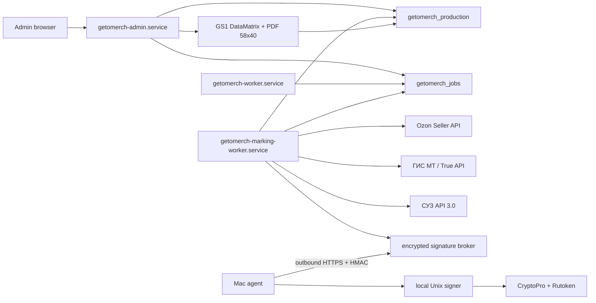

# Честный знак в GetoMerch Admin: канонический flow и план внедрения

Дата актуализации: 10 августа 2026 года.
Статус: целевая спецификация; этапы 0-13 реализованы, production-блок 2
завершен с полностью выключенными внешними операциями маркировки.
Первый канал: Ozon FBS.
Целевая модель: общий marking core для Ozon FBS и заказов KOMUI.

## 1. Назначение и приоритет документа

Этот документ определяет:

- юридически значимые точки процесса, которые должна поддерживать система;
- границы GetoMerch, Ozon, ГИС МТ, СУЗ, Национального каталога и УКЭП;
- структуру данных и инварианты;
- состояния физической единицы, КМ, документов и Ozon-экземпляров;
- сценарии FBS, FBO, возврата и будущих заказов KOMUI;
- серверную топологию, безопасность и эксплуатацию;
- этапы внедрения и критерии приемки.

При конфликте старых заметок в этом каталоге с настоящим документом действует
этот `FLOW.md`. По общим границам GetoMerch/KOMUI действует
`docs/GETOMERCH_KOMUI_SERVER_DATA_ARCHITECTURE.md`.

Документ не заменяет:

- актуальные API-контракты True API, СУЗ API и Национального каталога из
  авторизованного личного кабинета;
- договор с Ozon и ЭДО-документы;
- проверку классификации товара; сведения о РД не являются техническим gate;
- консультацию специалиста по маркировке по спорному производственному
  сценарию.

## 2. Результат, который должен получить пользователь

### 2.1. Обычная работа

1. Ozon FBS posting синхронизируется в GetoMerch.
2. Система определяет обязательность маркировки по внутреннему профилю товара
   и данным Ozon.
3. Для каждой позиции создается provisional physical unit, assignment и
   транзакционный резерв выпущенного КМ нужного GTIN из заранее пополняемого
   пула.
4. Пользователь из карточки заказа скачивает PDF 58x40 мм, изготавливает товар,
   наносит СИ и нажимает `КМ нанесен`.
5. Для `lp` worker проверяет, что автоматический отчет СУЗ, созданный при
   выдаче КМ, принят, затем подает `LP_INTRODUCE_GOODS`, ждет принятия ГИС МТ
   и подтверждает состояние КМ. Для другой товарной группы применимый отчет
   определяется ее актуальным contract snapshot.
6. Только после этого система передает полный набор экземпляров posting в
   Ozon и опрашивает Ozon до финального принятия или отказа.
7. Серверный shipping gate запрещает отметить заказ отправленным, пока
   обязательные экземпляры не приняты ГИС МТ и Ozon.
8. При фактической передаче Ozon складская транзакция и custody фиксируются
   атомарно, после чего создается процесс дистанционного вывода из оборота с
   контролем срока.
9. При отмене или возврате система учитывает, был ли PDF создан, нанесен ли
   КМ и отправлялся ли exemplar в Ozon.

Это основной `jit_after_order` flow GetoMerch FBS: заказ появляется раньше
изготовления конкретной единицы, но нанесение, ввод в оборот и подтверждение
Ozon обязательно завершаются до передачи товара Ozon. Код можно
зарезервировать автоматически при заказе, однако отправлять его в ГИС МТ или
Ozon до подтверждения физического нанесения нельзя.

### 2.2. Операционный интерфейс

Пользователь получает раздел `Честный знак` с вкладками:

- `Требуют действия`;
- `Заказы FBS`;
- `Товары и GTIN`;
- `Коды`;
- `Единицы`;
- `Документы`;
- `Возвраты / FBO`;
- `Ошибки`;
- `История`.

Каждая строка должна отвечать на четыре вопроса:

1. Что произошло?
2. В каком состоянии физический товар, ГИС МТ и Ozon?
3. Что блокирует следующий шаг?
4. Какое безопасное действие доступно сейчас?

## 3. Не входит в первую реализацию

- синхронизация внутренних остатков GetoMerch на витрину KOMUI;
- создание fulfillment для продаж Ozon FBO;
- автоматическое закрытие спорного FBS -> FBO без документов Ozon/ЭДО;
- хранение приватного ключа УКЭП в Next.js или основном worker;
- автоматический вывод из оборота без проверенного production flow;
- автоматическое переиспользование КМ после печати, отмены или возврата;
- автоматический запуск ввода или отправки КМ в Ozon сразу при появлении
  заказа, до подтверждения нанесения СИ на изготовленную единицу;
- распознавание правовой природы товара только по названию или Ozon-категории;
- прямая запись GetoMerch в `komui_production`;
- перенос полного КМ в аналитику, клиентские логи или Telegram.

## 4. Фактическая production-архитектура

### 4.1. Source of truth

```text
Production database: getomerch_production
Database server:     PostgreSQL 17, VPS, loopback only
Application:         /opt/getomerch/current
Web service:         getomerch-admin.service
Worker:              getomerch-worker.service
Domain:              admin.komui.ru
```

Production runtime обязан использовать:

```text
GETOMERCH_DB_READ_SOURCE=server
GETOMERCH_DB_WRITE_SOURCE=server
```

Supabase не участвует в новом marking runtime. Новый код не должен создавать
Supabase-only adapter, dual-write или fallback на замороженную БД.

### 4.2. Что уже можно переиспользовать

- `src/lib/ozon/client.ts`: timeout, retry, `Retry-After`, cancellation и
  санитизация ответов;
- `getomerch_jobs.jobs` и `job_events`: durable queue, heartbeat, dedupe,
  retry и отмена;
- `getomerch_audit.operation_requests`: идемпотентность admin-команд;
- `getomerch_audit.audit_log`: технический аудит успешных и неуспешных
  мутаций;
- repository/service layer и транзакционные mutations;
- `requireAdminSession()` и internal service authentication;
- systemd deployment, hourly encrypted backup и restore drill;
- generic fulfillment projection для Ozon FBS, стабильные Ozon source item
  keys и append-only fulfillment events.

### 4.3. Чего сейчас нет

- сериализованных физических единиц товара;
- marking product profiles и GTIN readiness;
- exemplar API Ozon;
- шифрованного пула КМ;
- GS1 DataMatrix/PDF renderer;
- True API, СУЗ и signer;
- marking workers, reconciliation и UI.

Текущая кнопка `Отправил заказ` выполняет внутреннее складское списание. Она
не передает КМ в Ozon и не является подтверждением ГИС МТ. Перед внедрением
маркировки этот mutation path должен получить server-side readiness guard.

## 5. Нормативные и бизнес-предпосылки

### 5.1. Определение обязательности

Маркировка определяется не текстом карточки и не предположением
`футболка = маркируется`, а сочетанием:

- ТН ВЭД ЕАЭС;
- ОКПД2;
- вида товара и даты применимого этапа маркировки;
- роли GetoMerch: производитель, заказчик контрактного производства,
  перепродавец или кастомизатор уже маркированного товара.

Для футболок необходимо проверить фактический код ТН ВЭД/ОКПД2 по документам.
Внутренний флаг `requires_marking` является сохраненным проверенным решением,
а не вычислением по названию.

### 5.2. Один размер и цвет — отдельная карточка

Официальная рекомендация Национального каталога исходит из правила
`1 GTIN = 1 карточка товара`; размер и цвет являются существенными
характеристиками. Поэтому базово каждый вариант размера/цвета имеет отдельный
GTIN.

Дизайн или вид нанесения требуют отдельного GTIN, если они меняют атрибуты
карточки товара. Это нельзя решать только по внутреннему `design_id`.

### 5.3. Производственная модель GetoMerch

До разработки для каждой группы товара выбирается один из режимов:

#### `own_production`

GetoMerch производит готовое изделие из немаркированной заготовки:

1. Готовая модификация описана в Национальном каталоге.
2. Получены КМ на ее GTIN.
3. Зафиксирован требуемый отчет о нанесении. Для `lp` СУЗ создает его
   автоматически при выдаче КМ.
4. СИ физически нанесено на единицу.
5. Подан ввод в оборот `LP_INTRODUCE_GOODS`.

#### `pre_marked_minor_customization`

Покупается уже маркированное изделие и наносится несущественный принт или
вышивка без изменения основных атрибутов. Официальные материалы допускают,
что перемаркировка не требуется. В систему защищенно регистрируется уже
существующий КМ, а новый код не выпускается.

Применимость этого режима должна быть подтверждена для фактических артикулов.

#### `remarking_after_customization`

Доработка меняет атрибуты кода товара, например артикул, производителя или
цвет. Требуется новый КМ со сценарием перемаркировки; старый КМ закрывается по
применимому основанию. Эти операции нельзя маскировать как обычный импорт
нового кода.

`production_mode` описывает происхождение и правовой сценарий товара. Отдельный
`fulfillment_marking_mode` определяет момент создания физической единицы:

- `jit_after_order` — основной режим собственного производства GetoMerch FBS;
- `prebuilt_stock` — заранее изготовленный готовый маркированный товар;
- `pre_marked_minor_customization` — резерв уже маркированной заготовки.

Эти два измерения нельзя объединять в один enum: например,
`production_mode='own_production'` может работать и как `jit_after_order`, и
как `prebuilt_stock`.

### 5.4. Рабочий момент маркировки GetoMerch FBS

Для фактического процесса GetoMerch FBS основной flow проекта строится как
`jit_after_order`: заказ запускает изготовление конкретной единицы, после чего
единица маркируется до передачи товара Ozon.

Это архитектурное и операционное решение проекта. Переписка со службой
поддержки не используется как requirement, evidence, production gate или
источник бизнес-правил. Готовность flow определяется актуальными официальными
контрактами систем, карточкой НК/GTIN и успешной end-to-end проверкой.
Отсутствие РД и диагностические флаги НК не блокируют процесс.

Штатная последовательность:

```text
получить FBS-заказ
  -> зарезервировать выпущенный КМ нужного GTIN
  -> изготовить конкретную единицу
  -> напечатать и нанести СИ
  -> проверить принятый автоматический отчет СУЗ для этого КМ
  -> подать LP_INTRODUCE_GOODS
  -> дождаться принятия ГИС МТ
  -> передать КМ в Ozon и дождаться принятия
  -> передать товар Ozon
```

Решение не отменяет обязательность корректной карточки НК/GTIN, фактического
нанесения СИ, принятых документов ГИС МТ и принятого exemplar Ozon до
отгрузки. При изменении товара, производственного процесса или канала
конфигурация и применимые внешние контракты проверяются повторно.

### 5.5. FBS

Для FBS маркетплейс выступает логистической стороной, а вывод из оборота
выполняет собственник товара. Для документа `Дистанционная продажа`:

- срок: не позднее трех рабочих дней, следующих за днем отгрузки со склада;
- предельная точка: не позднее фактической доставки покупателю;
- с 1 марта 2026 года дополнительно требуются КПП и глобальный идентификатор
  адресного объекта места деятельности/ФИАС.

Система не должна ждать статуса `delivered`, если из-за этого нарушается срок.

### 5.6. FBO

Для FBO Ozon является участником оборота после передачи товара агенту.
Базовый процесс поставки:

- собственник передает маркированный товар через применимый УПД;
- вид товарооборота для передачи агенту подтверждается актуальными
  методическими рекомендациями/ЭДО;
- после приемки Ozon выполняет дальнейшие операции и вывод при продаже.

Продажа FBO не создает fulfillment в GetoMerch и не списывает внутренний
склад. Если позже реализуется FBO supply, склад меняется при передаче поставки,
а marking process связывается с supply/УПД.

В официальном материале, проверенном 22 июля 2026 года, для такой передачи
указан вид товарооборота `00005` (`Передача Агенту`). Значение хранится как
versioned configuration/evidence, а не бессрочная константа в коде.

### 5.7. Виртуальная доступность и маркировочная готовность

Текущая коммерческая доступность `100 шт.` на Ozon или постоянное `в наличии`
на KOMUI не доказывают существование ста готовых промаркированных единиц.
Система должна явно разделять:

```text
storefront/marketplace availability
internal aggregate inventory
serialized marking-ready units
available codes
```

Для основного `jit_after_order` режима количество готовых маркированных units
не ограничивает коммерческий остаток напрямую. Операционная готовность
рассчитывается по отдельным ресурсам:

- выпущенные доступные КМ по каждому GTIN;
- заготовки, принты/вышивки и упаковка;
- фактическая производственная мощность до срока сборки Ozon;
- доступность signer, ГИС МТ и Ozon API;
- очередь уже принятых заказов.

Dashboard показывает риск, если кодов или производственной мощности не хватит
до дедлайна. Он не меняет Ozon stock автоматически без отдельной policy.
Настройка `100 шт.` остается коммерческим решением, а не складским или
маркировочным фактом. Для `prebuilt_stock` и
`pre_marked_minor_customization` readiness дополнительно учитывает готовые или
исходно маркированные единицы.

## 6. Целевая архитектура



### 6.1. Web application

- аутентифицирует owner session;
- читает безопасные projections;
- валидирует команды и записывает idempotency request;
- ставит внешние операции в queue;
- детерминированно формирует PDF;
- не вызывает True API напрямую из browser request;
- не получает доступ к приватному ключу УКЭП.

### 6.2. Marking worker

Рекомендуется отдельный systemd worker из того же репозитория:

```text
getomerch-marking-worker.service
```

Он использует `claimNextJob(types)` только для marking job types. Это не дает
медленному CRPT polling или signer timeout задерживать синхронизацию заказов и
финансов Ozon.

Параметры concurrency назначаются после capacity review. На текущем VPS
нельзя запускать неограниченное число PDF/crypto/API jobs.

### 6.3. Signer

Signer этапа 9 — изолированный локальный процесс на Mac владельца:

- видит контейнер приватного ключа и криптопровайдер;
- принимает только локальные запросы по Unix socket;
- подписывает строго допустимые типы данных;
- не имеет доступа к Ozon API и бизнес-таблицам;
- не возвращает приватный ключ или контейнер;
- журналирует только hash, certificate thumbprint и результат;
- проверяет HMAC credential локального caller и не принимает IP-соединения.

Signer проверяет allowlist operation type, максимальный размер payload,
ожидаемый hash/correlation ID и срок сертификата. Mac-агент сам инициирует
HTTPS к VPS, используя отдельный HMAC credential, timestamp и durable nonce.
Входящего порта на Mac нет. PIN вводится только в CryptoPro на Mac; PIN,
challenge, access token и private key никогда не пишутся в journal.

VPS хранит запрос и результат подписи только как AES-256-GCM ciphertext.
Safe views содержат hash, статусы и публичные метаданные сертификата. Сетевой
relay не вызывает CryptoPro напрямую: он делегирует локальному Unix signer.
Во время ожидания PIN relay продолжает heartbeat каждые 10 секунд. Timeout
CryptoPro составляет 60 секунд, lease broker — 90 секунд, ожидание worker —
100 секунд; это не даёт интерфейсу ложно показывать Mac offline во время
нормального ввода PIN.

Реализован только purpose `crpt_auth_attached_cades_bes`. Challenge
декодируется из base64, подписывается attached CAdES-BES и используется для
получения unified token. Token хранится только в памяти marking-worker,
обновляется single-flight и не попадает в БД или journal. Подписание будущих
документов с detached CAdES не разрешено до этапа 10.

### 6.4. Сетевые границы

- PostgreSQL остается на loopback;
- signer не публикуется через nginx; публичен только HMAC-защищённый endpoint
  `/api/marking-agent/v1` с rate limit;
- CRPT/СУЗ/Ozon доступны только server-side;
- admin API не принимает полный КМ в path/query;
- полный КМ допускается в body защищенного import-запроса по TLS и во
  внутреннем server-side payload; он не сохраняется в client state после
  завершения запроса.

## 7. Модель идентификаторов

Нельзя смешивать следующие значения:

| Идентификатор | Назначение |
|---|---|
| `merch_products.id` | внутренний вариант SKU GetoMerch |
| `offer_id` | артикул продавца Ozon |
| `ozon_sku` | идентификатор товара в Ozon |
| `posting_number` | отправление FBS |
| `fulfillment_item_id` | общая строка исполнения Ozon FBS/KOMUI |
| `unit_ordinal` | физическая единица внутри строки quantity |
| `marking_unit_id` | сериализованная физическая единица готового товара |
| `gtin` | код товара Национального каталога |
| `trade_item_id` | локальная юридическая карточка GTIN/НК |
| `marking_code_id` | локальная запись КМ |
| `code_binding_id` | историческая связь КМ с физической единицей |
| `exemplar_id` | экземпляр товара в Ozon |
| `crpt_document_id` | документ в ГИС МТ |

`product_id` в Ozon exemplar API не равен `merch_products.id`. Adapter хранит
и передает именно значение, полученное от Ozon для posting/product.

## 8. Generic fulfillment как обязательная предпосылка

Статус реализации этапа 2: schema, Ozon FBS projection, bounded backfill и
read-only диагностика готовы локально; production миграция и backfill не
выполнялись.

Маркировка должна ссылаться на:

```text
merch_fulfillment_orders
merch_fulfillment_order_items
merch_fulfillment_events
```

Минимальные требования:

- `source_channel IN ('ozon_fbs', 'komui')`;
- `source_channel=ozon_fbs` связан только с `fulfillment_scheme=fbs`;
- Ozon FBO не является допустимым source channel, а Ozon order с
  `source=fbo` не может иметь fulfillment link;
- `UNIQUE (source_channel, source_order_key)`;
- item содержит source item key, product mapping, quantity и
  `marking_requirement`;
- строка Ozon item имеет стабильную связь с `merch_ozon_order_items`;
- для `quantity=N` количество сохраняется без агрегационной потери; unit
  ordinals `1..N` появятся вместе с physical units на этапе 6;
- serialized marking unit резервируется тем же транзакционным allocator-ом,
  что и остальные ресурсы fulfillment;
- отмена/разделение posting обрабатывается versioned source event.

Если текущий sync удаляет и создает order items заново, его необходимо сначала
перевести на стабильный source item key и upsert с сохранением UUID. Array
index ответа Ozon не является идентификатором. При отсутствии надежного item
ID ключ строится из документированного набора immutable Ozon fields и
проверяется на collision; неоднозначность блокирует marking flow.

Не следует добавлять временный Ozon-only FK в marking assignment, а затем
переносить его на KOMUI. Сначала создается минимальный fulfillment projection
для текущих Ozon FBS-заказов; складской allocator можно расширять отдельно.

## 9. Раздельные state machines

Один общий `marking_codes.status` запрещен: он неизбежно смешает физический
факт, ГИС МТ, assignment и Ozon.

### 9.1. Состояние пула

```text
available
assigned
quarantine
blocked
void
```

- `available`: код может быть связан с единицей и не имеет active binding;
- `assigned`: закреплен live binding-ом (`planned/active`) за одной физической
  единицей;
- `quarantine`: автоматическое использование запрещено до проверки;
- `blocked`: есть системная/правовая ошибка;
- `void`: код окончательно исключен из использования.

### 9.2. Состояние физической единицы

```text
preparing
marking_pending
ready
reserved
shipped
returned_inspection
returned_ready
transferred_to_ozon
cancelled
damaged
lost
destroyed
```

Это состояние самой футболки, а не этикетки или ГИС МТ. `ready` означает, что
единица физически готова, имеет активную допустимую связь с КМ и может быть
назначена заказу. В `jit_after_order` provisional unit создается в
`preparing` и уже может иметь assignment конкретному заказу;
`ready`/`reserved` достигается только после изготовления, нанесения и
подтвержденного CRPT readiness. `cancelled` допустим только для не
изготовленной provisional unit; после render она временно сохраняет
quarantined planned binding до подтверждения уничтожения копий.
`returned_ready` достигается только после приемки возврата и завершения
необходимых операций ГИС МТ.

### 9.3. Физическое хранение (custody)

```text
own
ozon_logistics
buyer
return_logistics
ozon_fbo
destroyed
unknown
```

Custody отвечает только на вопрос, где физически находится товар. Оно не
заменяет право собственности, CRPT state, Ozon status или складскую
транзакцию. Переход в `ozon_fbo` требует evidence передачи/приемки.

### 9.4. Состояние связи КМ с единицей и этикетки

Binding state:

```text
planned
active
removed
replaced
cancelled
```

Label state:

```text
not_rendered
label_rendered
printed
applied
damaged
lost
destroyed
unknown
```

`label_rendered` означает, что PDF мог покинуть сервер. Такой КМ нельзя
автоматически вернуть в свободный пул, даже если печать не подтверждена.
`applied` относится только к физическому нанесению; юридическое состояние
по-прежнему берется из ГИС МТ.

### 9.5. Нормализованное состояние ГИС МТ

```text
unknown
emitted
applied
in_circulation
withdrawn
blocked
invalid
```

Точные raw status codes зависят от API-контракта и хранятся отдельно в
`crpt_status_raw`. Нормализация не должна терять исходный код и дату проверки.

### 9.6. Состояние Ozon

```text
not_required
not_sent
validation_pending
validated
submission_pending
accepted
rejected
superseded
```

HTTP-ответ на `set` не переводит запись в `accepted`. Финальное состояние
получается из status endpoint.

### 9.7. Состояние assignment

```text
active
released
quarantined
completed
cancelled
```

История assignments не удаляется. Уникальные partial indexes разрешают только
один `active` assignment для физической единицы и одного order unit slot.

### 9.8. Состояние документа

```text
draft
payload_built
signed
submitting
processing
accepted
rejected
requires_manual_review
superseded
```

`submitting` фиксируется до внешнего create-запроса. Если worker
перезапустился в этом состоянии, POST не повторяется: документ требует сверки
в ЛК. Новые типы документов следующих этапов могут расширять state machine
только forward-only миграцией.

### 9.9. Состояние процесса

```text
open
waiting_user
waiting_external
ready
completed
manual_review
failed
cancelled
```

Process хранит `next_action`, `deadline_at` и blocker, но юридический факт
берется из соответствующего code/document/submission state.

## 10. Целевая схема данных

Все таблицы ниже находятся в `public`, принадлежат GetoMerch и создаются
forward-only миграциями после текущих `0001`-`0003`. Номер `0004` нельзя
резервировать в документе: используется следующий свободный номер на момент
реализации.

Для изменяемых внешних статусов используются `text + CHECK`, а не PostgreSQL
enum: это позволяет additive migration при изменении API. Все FK, partial
unique indexes, неотрицательные counters, допустимые transitions и индексы по
`status/deadline/updated_at` создаются в той же миграции, а не остаются только
валидацией TypeScript.

### 10.1. `merch_marking_trade_items`

Одна юридическая товарная карточка Национального каталога/GTIN.

```text
id uuid primary key
gtin text not null unique
product_group text not null
tnved_code text
okpd2_code text
national_catalog_card_id text
national_catalog_status text
verification_status text not null
verification_source text
source_snapshot_hash text
verified_at timestamptz
verified_by text
archived_at timestamptz
created_at timestamptz not null
updated_at timestamptz not null
```

GTIN хранится в каноническом 14-значном виде. Изменение GTIN создает новую
trade item, а не переписывает исторические codes/units/documents.

#### 10.1.1. `merch_marking_trade_item_documents`

Необязательные сведения о разрешительной документации являются отношением
один-ко-многим и хранятся отдельно. Их отсутствие не влияет на marking
readiness:

```text
id uuid primary key
trade_item_id uuid not null references merch_marking_trade_items(id)
document_type text not null
document_number text not null
issued_at date
valid_until date
status text not null
source_snapshot_hash text
verified_at timestamptz
archived_at timestamptz
created_at timestamptz not null
updated_at timestamptz not null
```

Истекший документ не удаляется. Readiness validator проверяет наличие
применимого действующего документа на дату операции, если он требуется.

### 10.2. `merch_marking_product_profiles`

Проверенное решение, как конкретный внутренний SKU относится к маркировке,
trade item и моменту изготовления физической единицы. Несколько внутренних
SKU могут ссылаться на один GTIN только если подтверждено, что принт/вышивка
не создает другую карточку товара.

```text
id uuid primary key
product_id uuid not null references merch_products(id) on delete restrict
trade_item_id uuid references merch_marking_trade_items(id) on delete restrict
requires_marking boolean not null
production_mode text not null
fulfillment_marking_mode text not null
application_method text
application_surface text
label_template_version text
verification_status text not null
verification_source text
source_snapshot_hash text
verified_at timestamptz
verified_by text
archived_at timestamptz
created_at timestamptz not null
updated_at timestamptz not null
```

Constraints:

- partial `UNIQUE (product_id) WHERE archived_at IS NULL`;
- для маркируемого verified-профиля `trade_item_id` обязателен;
- `requires_marking=true` разрешает назначения только при
  `verification_status='verified'`;
- mapping нескольких SKU на один trade item требует явного verification
  evidence;
- `fulfillment_marking_mode` принимает `jit_after_order`, `prebuilt_stock`
  или `pre_marked_minor_customization`; основной режим GetoMerch FBS —
  `jit_after_order`;
- смена trade item архивирует профиль и создает новый;
- профиль архивируется, а не удаляется.

Для fulfillment profile относится к продаваемому SKU конкретного размера.
Строка `merch_products.is_blank=true` не назначается заказу как готовый товар;
происхождение из маркированной заготовки отражается через `origin_type` unit и
verified mapping финального SKU на тот же trade item.

### 10.3. `merch_marking_locations`

Места деятельности для юридически значимых документов.

```text
id uuid primary key
name text not null
warehouse_id uuid references merch_warehouses(id) on delete restrict
kpp text
fias_id text
crpt_location_id text
address_snapshot text
status text not null
verified_at timestamptz
created_at timestamptz not null
updated_at timestamptz not null
```

Обязательность КПП зависит от правовой формы и актуального API contract; она
проверяется business validator, а не безусловным `NOT NULL`.

### 10.4. `merch_marking_import_batches`

Аудит ручного импорта КМ.

```text
id uuid primary key
source text not null
filename text
file_sha256 text not null
status text not null
rows_total integer not null
rows_valid integer not null
rows_duplicate integer not null
rows_rejected integer not null
created_by text not null
created_at timestamptz not null
applied_at timestamptz
error_summary jsonb not null
```

Содержимое исходного файла не хранится открыто. Preview не пишет коды в пул.
Apply выполняется отдельной идемпотентной командой.

#### 10.4.1. `merch_marking_import_rows`

Зашифрованный staging между preview и apply:

```text
id uuid primary key
batch_id uuid not null references merch_marking_import_batches(id)
row_number integer not null
gtin text
trade_item_id uuid references merch_marking_trade_items(id)
code_envelope bytea
code_hmac bytea
hmac_key_version integer
fingerprint text
validation_status text not null
error_codes text[] not null
applied_code_id uuid references merch_marking_codes(id)
created_at timestamptz not null
scrubbed_at timestamptz
unique (batch_id, row_number)
```

Preview сохраняет допустимые КМ только зашифрованно и возвращает browser-у
агрегаты/redacted ошибки. Apply переносит строки в основной пул одной
идемпотентной job. После apply/TTL encrypted staging очищается, а номер строки,
статус, fingerprint и ошибки остаются для аудита. Открытый temp-файл удаляется
сразу после фиксации staging.

### 10.5. `merch_marking_codes`

Защищенный пул КМ. Запись описывает цифровой КМ и его состояние в ГИС МТ,
но сама по себе не означает существование готовой физической футболки.

```text
id uuid primary key
trade_item_id uuid not null references merch_marking_trade_items(id)
gtin_snapshot text not null
code_ciphertext bytea not null
code_nonce bytea not null
code_auth_tag bytea not null
encryption_key_version integer not null
code_hmac bytea not null
hmac_key_version integer not null
fingerprint text not null
serial text
acquisition_mode text not null
import_batch_id uuid references merch_marking_import_batches(id)
code_order_item_id uuid
pool_state text not null
crpt_state text not null
crpt_status_raw text
crpt_checked_at timestamptz
blocked_reason text
created_at timestamptz not null
updated_at timestamptz not null
```

Constraints and indexes:

- `UNIQUE (hmac_key_version, code_hmac)` предотвращает повторный импорт без
  хранения plaintext; import проверяет digest по всем активным HMAC versions;
- indexes по `(trade_item_id, pool_state, crpt_state)`;
- полный КМ, криптохвост и payload не индексируются в открытом виде;
- `fingerprint` содержит только безопасный короткий хвост для ручной сверки;
- изменение `trade_item_id` после импорта запрещено;
- `pool_state='assigned'` означает live связь с физической единицей, а не
  резерв заказа.

`acquisition_mode` как минимум различает `own_suz_emission`,
`supplier_marked_import` и `remarking`. Код уже маркированной заготовки,
полученный из документа поставщика или защищенного импорта, нельзя помещать в
свободный печатный пул: он создается вместе с binding конкретной физической
единицы.

Рекомендуемое шифрование: envelope encryption AES-256-GCM. Отдельный HMAC key
используется для duplicate lookup. Ключи имеют версии и не хранятся в БД.

### 10.6. `merch_marking_units`

Сериализованный учет конкретной физической единицы товара, включая
provisional unit, которая изготавливается под уже полученный заказ.

```text
id uuid primary key
product_profile_id uuid not null references merch_marking_product_profiles(id)
product_id_snapshot uuid not null references merch_products(id)
internal_serial text not null unique
unit_state text not null
custody_state text not null
warehouse_id uuid references merch_warehouses(id) on delete restrict
origin_type text not null
origin_reference_type text
origin_reference_key text
last_stock_transaction_id uuid references merch_transactions(id)
version bigint not null
created_at timestamptz not null
updated_at timestamptz not null
```

Правила:

- строка создается при подготовке конкретной футболки, а не при импорте файла
  КМ; в `jit_after_order` она может быть provisional и еще не входить в
  агрегатный остаток готового товара;
- `product_id_snapshot` обязан соответствовать профилю на момент создания;
- `ready` требует активный code binding и допустимый CRPT state;
- смена склада сопровождается обычной складской транзакцией, а не только
  обновлением `warehouse_id`;
- сериализованная единица не создает второй независимый количественный
  остаток: reconciliation сопоставляет ее с `merch_inventory` и ledger;
- после передачи Ozon custody и unit state меняются, но строка не удаляется.

### 10.7. `merch_marking_code_bindings`

Историческая связь физической единицы с КМ. Отдельная таблица нужна для
перемаркировки: у одной футболки может быть старый снятый и новый активный КМ.

```text
id uuid primary key
marking_unit_id uuid not null references merch_marking_units(id)
marking_code_id uuid not null references merch_marking_codes(id)
status text not null
label_state text not null
binding_reason text not null
template_version text
render_count integer not null
print_confirmed_count integer not null
bound_by text not null
bound_at timestamptz not null
first_rendered_at timestamptz
last_rendered_at timestamptz
first_printed_at timestamptz
last_printed_at timestamptz
applied_at timestamptz
removed_at timestamptz
removal_reason text
created_at timestamptz not null
updated_at timestamptz not null
```

Partial unique indexes:

```text
UNIQUE marking_unit_id WHERE status IN ('planned', 'active')
UNIQUE marking_code_id WHERE status IN ('planned', 'active')
```

Binding создается до render. Перед началом отдачи PDF сервер консервативно
переводит `label_state` минимум в `label_rendered`; последующие загрузки
увеличивают `render_count`, но не создают новый КМ. После `label_rendered`
автоматическое удаление binding и освобождение КМ запрещены, даже если сетевой
ответ оборвался.

Render означает, что PDF успешно сформирован сервером и запись о возможном
раскрытии этикетки зафиксирована до отправки HTTP-ответа. Скачивание не
подтверждает физическую печать и не меняет склад. Отдельное действие
`КМ нанесён` остается единственным подтверждением нанесения и точкой
атомарного изменения JIT-остатков.

### 10.8. `merch_marking_assignments`

Историческая связь физической единицы с unit slot строки fulfillment. Для
`jit_after_order` assignment может быть создан до завершения изготовления.

```text
id uuid primary key
fulfillment_item_id uuid not null references merch_fulfillment_order_items(id)
unit_ordinal integer not null
marking_unit_id uuid not null references merch_marking_units(id)
code_binding_id uuid not null references merch_marking_code_bindings(id)
product_profile_id uuid not null references merch_marking_product_profiles(id)
gtin_snapshot text not null
status text not null
assigned_by text not null
assigned_at timestamptz not null
released_at timestamptz
release_reason text
completed_at timestamptz
created_at timestamptz not null
updated_at timestamptz not null
```

Partial unique indexes:

```text
UNIQUE marking_unit_id WHERE status = 'active'
UNIQUE (fulfillment_item_id, unit_ordinal) WHERE status = 'active'
```

Назначение выполняется одной транзакцией и имеет две ветки.

Для `prebuilt_stock`:

1. Блокируется fulfillment item.
2. Проверяется `unit_ordinal <= quantity`.
3. Выбирается готовая serialized unit через `FOR UPDATE SKIP LOCKED`.
4. Проверяются active binding, равенство `code.trade_item_id` и
   `unit.profile.trade_item_id`, CRPT readiness, склад/custody и отсутствие
   active assignment.
5. Создается assignment.
6. Unit переводится в `reserved`; состояние пула КМ не подменяет резерв.
7. Пишется marking event и общий audit log.

Для основного `jit_after_order`:

1. Блокируется fulfillment item и проверяется ordinal/profile.
2. Создается provisional unit в `preparing`, еще не увеличивающая остаток
   готового SKU.
3. Через `FOR UPDATE SKIP LOCKED` выбирается `available` КМ того же verified
   trade item.
4. Создаются `planned` binding и active assignment; код переводится в
   `assigned`.
5. Пишутся event/audit и пользователю становится доступна первичная печать.

Ни одна ветка не вызывает Ozon или ГИС МТ внутри DB-транзакции. Если КМ нет,
unit/assignment/binding не остаются частично созданными.

### 10.9. `merch_marking_ozon_submission_batches`

Одна ревизия полного запроса `set` по posting.

```text
id uuid primary key
posting_number text not null
posting_snapshot_hash text not null
request_revision integer not null
supersedes_batch_id uuid references merch_marking_ozon_submission_batches(id)
status text not null
external_task_id text
request_hash text not null
request_payload_envelope bytea
api_contract_version text not null
response_redacted jsonb not null
attempt_count integer not null
submitted_at timestamptz
checked_at timestamptz
accepted_at timestamptz
rejected_at timestamptz
created_at timestamptz not null
updated_at timestamptz not null
unique (posting_number, request_revision)
```

Каждая отправка хранит revision. Повторный `set` формирует новый полный
snapshot всех актуальных products/exemplars posting, а не только измененный
код. Async task и общий terminal status принадлежат batch.

### 10.10. `merch_marking_ozon_submissions`

Результат передачи отдельной физической единицы внутри batch.

```text
id uuid primary key
batch_id uuid not null references merch_marking_ozon_submission_batches(id)
assignment_id uuid not null references merch_marking_assignments(id)
ozon_product_id bigint not null
exemplar_id bigint
status text not null
error_codes text[] not null
error_message text
response_redacted jsonb not null
created_at timestamptz not null
updated_at timestamptz not null
unique (batch_id, assignment_id)
```

Item status не считается `accepted`, пока terminal status batch и ответ Ozon
не подтверждают конкретный exemplar.

### 10.11. `merch_marking_documents`

Документы ГИС МТ.

```text
id uuid primary key
document_type text not null
operation_mode text not null
status text not null
location_id uuid references merch_marking_locations(id)
location_snapshot jsonb not null
revision integer not null
supersedes_document_id uuid references merch_marking_documents(id)
idempotency_key text not null unique
api_contract_version text not null
payload_envelope bytea
payload_hash text
signature_envelope bytea
signature_hash text
certificate_thumbprint text
external_document_id text
response_redacted jsonb not null
error_code text
error_message text
created_by text not null
created_at timestamptz not null
signed_at timestamptz
submitted_at timestamptz
checked_at timestamptz
accepted_at timestamptz
rejected_at timestamptz
```

Типы первой полной версии:

```text
application_report
introduction
withdrawal_remote_sale
return_to_circulation
transfer_to_agent
remarking
```

Это внутренние нормализованные типы, а не обещание конкретного имени метода
True API. Exact document type/version определяется contract snapshot. Проверка
статуса КМ является query/job и не записывается как фиктивный документ.

API payload с полными КМ шифруется. Обычный `response_redacted` не содержит
полных кодов и подписей.

После `signed` payload, contract version, location snapshot и состав КМ
неизменяемы. Любое исправление создает новую document revision со ссылкой на
предыдущую; повторный submit использует те же canonical bytes и idempotency
key, пока внешний contract допускает повтор.

Фактическая реализация этапа 10 хранит AES-256-GCM envelope раздельными
полями `*_ciphertext`, `*_nonce`, `*_auth_tag`, `*_key_version`. Первый
разрешенный тип — `introduction` с внешним `LP_INTRODUCE_GOODS`. Полный payload
и detached signature доступны только SECURITY DEFINER worker-командам.
Неизвестный результат create-запроса блокирует автоматическую новую ревизию до
сверки в ЛК ГИС МТ.

### 10.12. `merch_marking_document_codes`

```text
document_id uuid not null references merch_marking_documents(id)
marking_code_id uuid not null references merch_marking_codes(id)
operation_result text
error_code text
error_message text
created_at timestamptz not null
primary key (document_id, marking_code_id)
```

Документ может быть пакетным, но результат должен быть виден для каждого КМ.

### 10.12.1. `merch_marking_document_confirmations`

Принятый документ и подтвержденное состояние конкретного КМ не объединяются.

```text
document_id uuid primary key references merch_marking_documents(id)
circulation_state text not null
raw_status text
error_code text
error_message text
checked_at timestamptz
confirmed_at timestamptz
updated_at timestamptz not null
```

`circulation_state` принимает `pending`, `confirmed` или
`requires_manual_review`. Физическая единица переходит из `marking_pending` в
`reserved` только после `confirmed`. Повторная проверка terminal state
идемпотентна и не создает второе marking event.

### 10.13. `merch_marking_processes`

Операционная очередь.

```text
id uuid primary key
process_type text not null
status text not null
fulfillment_order_id uuid references merch_fulfillment_orders(id)
fulfillment_item_id uuid references merch_fulfillment_order_items(id)
marking_unit_id uuid references merch_marking_units(id)
assignment_id uuid references merch_marking_assignments(id)
source text not null
source_key text not null
priority integer not null
current_step text not null
next_action text
deadline_at timestamptz
manual_review_reason text
last_error_code text
owner text
version bigint not null
created_at timestamptz not null
updated_at timestamptz not null
completed_at timestamptz
```

Partial unique index разрешает только один незавершенный бизнес-процесс по
`(process_type, source, source_key)`. Изменения используют `version` как
optimistic lock; завершенные процессы остаются в истории.

### 10.14. `merch_marking_evidence`

Проверяемые основания для production policy, возврата, передачи в FBO и
ручных решений.

```text
id uuid primary key
process_id uuid references merch_marking_processes(id)
product_profile_id uuid references merch_marking_product_profiles(id)
marking_unit_id uuid references merch_marking_units(id)
assignment_id uuid references merch_marking_assignments(id)
evidence_type text not null
source text not null
external_reference text
scope_snapshot jsonb not null
observed_at timestamptz not null
payload_envelope bytea
payload_hash text not null
details_redacted jsonb not null
verification_status text not null
verified_by text
verified_at timestamptz
created_at timestamptz not null
```

Constraint требует хотя бы один subject: process, product profile, unit или
assignment. В таблице хранятся проверяемые технические и операционные
основания: версии внешних контрактов, результаты проверок, ссылки на документы
ГИС МТ/Ozon/ЭДО и redacted snapshots. Переписка со службой поддержки не
сохраняется и не учитывается в readiness или state transitions.

В MVP достаточно ID/дат/хэша и redacted snapshot. Если потребуются файлы
ЭДО, для них сначала проектируется отдельное шифрованное хранилище, retention
и backup; бинарные вложения не складываются бесконтрольно в `jsonb`.

`*_envelope` — self-describing versioned ciphertext с key version, nonce и
authentication tag. Эти поля не содержат plaintext даже в backup.

### 10.15. `merch_marking_events`

Append-only бизнес-история.

```text
id bigint generated always as identity primary key
marking_code_id uuid references merch_marking_codes(id)
marking_unit_id uuid references merch_marking_units(id)
code_binding_id uuid references merch_marking_code_bindings(id)
assignment_id uuid references merch_marking_assignments(id)
process_id uuid references merch_marking_processes(id)
document_id uuid references merch_marking_documents(id)
event_type text not null
actor_type text not null
actor_id text
source text not null
details_redacted jsonb not null
occurred_at timestamptz not null
created_at timestamptz not null
```

`marking_events` не заменяет `getomerch_audit.audit_log`:

- audit log отвечает на вопрос, кто выполнил команду и каков before/after;
- marking event показывает бизнес-движение КМ;
- job event показывает технический ход фоновой задачи.

### 10.16. `merch_marking_return_cases`

Структурированная связь Ozon-возврата с исходной физической единицей:

```text
id uuid primary key
source text not null
source_return_id text not null
source_return_item_id text not null
original_fulfillment_order_id uuid not null references merch_fulfillment_orders(id)
original_assignment_id uuid references merch_marking_assignments(id)
marking_unit_id uuid references merch_marking_units(id)
marking_code_id uuid references merch_marking_codes(id)
return_kind text not null
destination text not null
source_status text not null
process_status text not null
source_snapshot_hash text not null
source_contract_version text not null
detected_at timestamptz not null
direction_confirmed_at timestamptz
seller_received_at timestamptz
fbo_intake_reference text
version bigint not null
created_at timestamptz not null
updated_at timestamptz not null
unique (source, source_return_id, source_return_item_id)
```

`destination` различает `to_seller`, `to_ozon_fbo`, `lost_destroyed` и
`unknown`. Изменение направления создает новую revision/event и отменяет
только еще не начатые jobs старой ветки. Полный внешний payload не хранится в
открытом виде; достаточно hash, contract version и redacted evidence. До
любой CRPT/ЭДО-мутации assignment, unit и code обязаны быть однозначно
заполнены; иначе case остается в `manual_review`.

### 10.17. Таблицы СУЗ второй очереди

```text
merch_marking_code_orders
merch_marking_code_order_items
```

Они хранят order status, GTIN, способ выпуска, количество, внешние IDs,
стоимость snapshot, отчеты о нанесении и ошибки. Автозаказ кодов не должен
появляться до стабильной работы ручного import flow.

## 11. Инварианты

1. Не больше одного live binding (`planned/active`) на КМ.
2. Не больше одного live binding (`planned/active`) на физическую единицу.
3. Один active assignment на физическую единицу.
4. Один active assignment на `(fulfillment_item, unit_ordinal)`.
5. Количество active assignments не превышает `item.quantity`.
6. Trade item/GTIN кода, unit profile, binding и assignment согласованы;
   несколько SKU могут разделять GTIN только при verified mapping.
7. `ready` невозможен без active binding, `label_state='applied'` и допустимого
   состояния ГИС МТ.
8. `ozon_accepted` невозможен без assignment и Ozon submission.
9. `withdrawn` устанавливается только после принятого документа/подтвержденного
   внешнего факта.
10. Переход возвращенного КМ обратно в `in_circulation` не выполняется
    кнопкой; нужен принятый документ или подтвержденный external status.
11. Код после `label_rendered` не освобождается автоматически.
12. Код после `binding.label_state='applied'`, `crpt_state='in_circulation'`,
    `crpt_state='withdrawn'` или Ozon submission не переиспользуется без
    отдельного разрешенного transition.
13. Изменение склада/custody serialized unit согласовано со складским ledger;
    отдельный marking counter не становится вторым источником остатка.
14. Ozon FBO не создает fulfillment assignment продажи.
15. Внешний HTTP-вызов не выполняется внутри DB transaction.
16. Смена статуса выполняется compare-and-set/row lock, а не blind update.
17. Повтор job или POST с тем же idempotency key не создает новый документ,
    assignment или Ozon task.
18. Marking business records не удаляются общим 30-дневным job retention.
19. Provisional unit в `preparing` не учитывается в on-hand готового SKU.
20. Ozon submission невозможен до `label_state='applied'`, завершения
    применимых CRPT-документов и актуального CRPT readiness.

## 12. Получение и подготовка КМ

### 12.1. MVP: ручной импорт

1. Пользователь заказывает КМ в СУЗ/ЛК.
2. Скачивает файл в поддерживаемом формате.
3. Загружает файл в `Импорт кодов`.
4. Backend вычисляет SHA-256, парсит файл и записывает batch с encrypted
   staging rows; открытый temp-файл сразу удаляется.
5. UI показывает redacted preview:
   - GTIN;
   - количество;
   - неизвестные GTIN;
   - дубли по HMAC;
   - синтаксические ошибки;
   - несовместимый формат/разделители.
6. Apply по `batch_id` выполняется job-ом и переносит допустимые staging rows
   в основной encrypted pool одной идемпотентной операцией.
7. Повтор того же примененного файла является idempotent no-op; повторный
   Apply возвращает прежний итог.
8. Непримененный staging имеет короткий TTL и очищается отдельной job.

Импорт не означает, что КМ нанесен или введен в оборот. Начальный внешний
статус помечается непроверенным и затем подтверждается через ГИС МТ.

### 12.2. Полная версия: СУЗ API 3.0

1. Reconciliation считает доступные КМ по verified GTIN.
2. Порог рассчитывается из текущего пула, скорости заказов, SLA изготовления
   и ожидаемого времени пополнения.
3. При достижении порога сначала создается предложение на заказ; после canary
   допустимо автоматическое подтверждение в заданных лимитах.
4. Worker создает заказ в СУЗ, отслеживает статус, получает КМ и сохраняет их
   зашифрованно.
5. Срок получения/преобразования кодов и другие deadlines сохраняются из
   фактического ответа СУЗ и versioned contract snapshot. Они не хардкодятся
   по статье или памяти оператора.
6. Полученные КМ становятся `available`, но не считаются нанесенными и не
   создают физический товар.
7. Отчет о нанесении и ввод выполняются только после подтверждения нанесения
   на конкретную physical unit.

Лимиты, стоимость КМ и статусы не хардкодятся без contract snapshot. В UI
показываются дата и версия источника.

### 12.3. `jit_after_order` flow

Для `own_production + jit_after_order` штатная подготовка одной единицы
выглядит так:

1. После FBS-заказа одной транзакцией создать provisional unit в `preparing`,
   active assignment и `planned` binding к `available` КМ того же verified
   trade item.
2. Показать в заказе fingerprint и действие `Скачать КМ 58x40`. Само
   резервирование еще не отправляет КМ в ГИС МТ или Ozon.
3. Пользователь изготавливает товар, печатает PDF и физически наносит СИ.
4. Пользователь нажимает `КМ нанесен`. Команда повторно проверяет assignment,
   binding, GTIN и отсутствие отмены/смены posting.
5. Одна составная складская транзакция списывает заготовку и принт/вышивку,
   приходует готовый SKU как зарезервированный этим заказом, переводит unit в
   `marking_pending`, binding в `active`, а label в `applied`.
6. Worker подтверждает принятый автоматический отчет СУЗ для `lp`, отправляет
   `LP_INTRODUCE_GOODS` через signer, опрашивает terminal status через
   `GET /api/v4/true-api/doc/{docId}/info` и сверяет фактический статус КМ.
7. После acceptance unit становится `reserved` и процесс получает CRPT
   readiness; только тогда разрешается Ozon exemplar flow.
8. Фактическая передача Ozon списывает готовый SKU и переводит unit в
   `shipped` одной транзакцией.

`КМ нанесен` является явным аудируемым подтверждением физического действия.
Команда хранит actor, timestamp, binding, template version и render count.
Дополнительное техническое подтверждение для каждой единицы не требуется.

КМ не отправляется в Ozon сразу после появления заказа. Это разрешается
только после физического `applied` и подтвержденного CRPT readiness, чтобы
отмена или ошибка производства не оставляли Ozon с кодом несуществующей
единицы.

Если заказ отменен после шага 5, изготовленная единица остается в агрегатном
остатке готового SKU, сохраняет active binding и после проверки переходит в
`ready` для другого заказа. Если отмена произошла раньше, применяются правила
раздела 18.

### 12.4. Альтернативные flows

Для `pre_marked_minor_customization` система создает единицу и защищенно
импортирует существующий КМ, не печатая новый без необходимости. Для
`remarking_after_customization` создается новый binding, а предыдущий остается
в истории как `removed/replaced` вместе с закрывающим документом.

Для `prebuilt_stock` используется тот же lifecycle, но unit создается,
изготавливается, маркируется и вводится в оборот до заказа. Новый заказ только
резервирует готовую `ready` unit; этот режим остается поддерживаемым, но не
является основным для GetoMerch FBS.

Bulk-файл собственных еще не нанесенных КМ может наполнять `available` pool.
Регистрация уже нанесенного поставщиком КМ всегда выполняется атомарной
командой `создать unit + code + active binding`; такой код не становится
свободным даже на короткое время.

Нельзя увеличивать `merch_inventory` только созданием provisional serialized
unit. Приход готового товара выполняется составной командой `КМ нанесен` или
эквивалентным подтвержденным производственным событием, чтобы агрегатный
остаток и число изготовленных единиц можно было сверить.

Для маркируемого готового SKU `merch_inventory.quantity` остается агрегатным
остатком, а `merch_marking_units` является его сериализованным subledger:

- производство атомарно списывает заготовку/принт, приходует готовый SKU и
  создает либо финализирует ранее созданную provisional unit;
- резерв готовой единицы меняет `ready -> reserved`; в `jit_after_order`
  unit проходит `preparing -> marking_pending -> reserved`, но on-hand
  увеличивается только при подтвержденном изготовлении;
- физическая отгрузка одной транзакцией списывает готовый SKU и переводит unit
  в `shipped`;
- возврат увеличивает остаток только после приемки и допустимого marking
  transition;
- для SKU с `requires_marking=true` число собственных on-hand units по складу
  должно совпадать с агрегатным остатком после завершения переходных jobs.

## 13. GS1 DataMatrix и этикетка 58x40

### 13.1. Формат

58x40 мм — выбранный формат носителя, а не нормативно обязательный размер.
DataMatrix должен соответствовать требованиям для GS1 DataMatrix/ECC 200.

Полная последовательность КМ для легпрома включает FNC1/application
identifiers: AI `01` + GTIN14, AI `21` + serial, ASCII GS (`0x1D`), AI `91` +
ключ проверки, ASCII GS и AI `92` + код проверки. В актуальном официальном
описании для легпрома указаны serial 13, ключ 4 и код проверки 44 символа;
parser не должен молча принимать иные длины без новой contract version.
Строка `GS` из двух печатных букв не является разделителем.

Renderer обязан:

- принимать только decrypted bytes server-side;
- сохранять FNC1/GS separators;
- строить DataMatrix без промежуточного JPEG и размытия;
- использовать целое число printer dots на module;
- соблюдать quiet zone по стандарту/renderer contract;
- добавлять SKU, размер, цвет, fingerprint и template version;
- не печатать полный КМ человекочитаемым текстом;
- не заменять DataMatrix линейным EAN-13.

Место нанесения (`product`, товарный ярлык или упаковка) не выбирается только
по удобству печати. Оно фиксируется в verified product profile по применимым
правилам и фактическому способу выпуска. Формат 58x40 не означает, что для
каждого товара допустима наклейка именно на внешнюю упаковку.

Официально рекомендуемый размер точечного модуля: `0.255-0.615 мм`. Для
конкретного DPI выбирается целое число точек внутри этого диапазона. Значение
закрепляется только после физического теста.

### 13.2. Endpoint

```text
POST /api/admin/marking/code-bindings/:bindingId/label
Accept: application/pdf
X-Idempotency-Key: ...
```

Ответ:

```text
Content-Type: application/pdf
Content-Disposition: attachment
Cache-Control: no-store, private
Pragma: no-cache
X-Content-Type-Options: nosniff
```

Endpoint получает binding ID, а не полный КМ. В `jit_after_order` первичная
печать выполняется из карточки заказа после транзакционного создания unit,
assignment и binding. Повторная загрузка строит ту же этикетку и не назначает
новый КМ. До отправки первых байтов сервер консервативно фиксирует
`label_rendered`; каждая загрузка записывает event с template version, actor,
timestamp и render count.

### 13.3. Приемка шаблона печати

До production нужны тесты минимум на:

- реальном принтере и его DPI;
- обычной скорости и температуре печати;
- типовом материале этикетки;
- нескольких образцах полного КМ;
- геометрии DataMatrix, quiet zone и целого числа printer dots на module;
- соответствии итоговой этикетки утвержденному template contract.

Печать проверяется с масштабом 100%, без `Fit to page`, browser headers и
полей. Для каждого поддерживаемого DPI сохраняется отдельная template version;
смена принтера или материала требует повторной приемки.

Скриншот PDF сам по себе не является приемкой. Результат теста, параметры
принтера, материал и template version фиксируются как rollout evidence. Эта
приемка выполняется для шаблона и оборудования, а не как отдельный шаг каждого
заказа.

## 14. Определение marking requirement в Ozon

Ozon sync должен сохранять актуальные поля:

- `requirements.products_requiring_mandatory_mark`;
- `optional.products_with_possible_mandatory_mark`;
- product/exemplar data из детального posting/exemplar API;
- Ozon product ID/SKU, который требуется exemplar endpoints.

Минимальная additive projection в `merch_ozon_order_items`:

```text
ozon_product_id bigint
marking_requirement text
marking_requirement_source text
marking_requirement_checked_at timestamptz
marking_source_snapshot_hash text
marking_contract_version text
```

`marking_requirement` нормализуется в `required/possible/not_reported`, но
исходный posting snapshot hash и contract version сохраняются. Если массив
requirements нельзя однозначно сопоставить строке заказа по Ozon product ID,
система не угадывает по SKU или позиции массива, а создает discrepancy.

Устаревшее `products.mandatory_mark` не используется как единственный
источник решения.

Decision table:

| Внутренний профиль | Ozon required | Ozon possible | Результат |
|---|---:|---:|---|
| verified, маркировка обязательна | да | любое | обязательный flow |
| verified, маркировка обязательна | нет | да | передать КМ, записать discrepancy info |
| verified, маркировка обязательна | нет | нет | блокировка и ручная сверка карточки Ozon |
| verified, не требуется | да | любое | блокировка и ручная сверка GTIN/категории |
| нет/не проверен | да/возможно | любое | `missing_marking_profile` |

Ozon не является источником правовой классификации товара. Его requirement —
обязательный operational signal и объект reconciliation.

## 15. Ozon exemplar API

На дату актуализации публично заявлены:

```text
POST /v6/fbs/posting/product/exemplar/create-or-get
POST /v5/fbs/posting/product/exemplar/validate
POST /v6/fbs/posting/product/exemplar/set
POST /v5/fbs/posting/product/exemplar/status
POST /v1/fbs/posting/product/exemplar/update
```

Перед кодированием contract нужно повторно выгрузить из Ozon Seller API.
В феврале 2026 года Ozon отдельно уточнил обязательность `posting_number`,
`products`, `product_id`, `exemplars` и `exemplar_id` для соответствующих
методов.

Правила adapter-а:

1. Сначала `create-or-get`, чтобы получить актуальные exemplar IDs и
   requirements.
2. Количество exemplars должно совпасть с физическими единицами.
3. Опционально `validate` для раннего показа ошибок.
4. `set` отправляет полный актуальный набор products/exemplars posting.
5. HTTP success означает создание/принятие задачи, а не принятие КМ.
6. `status` опрашивается до terminal result.
7. При изменении уже созданных экземпляров используется только актуальный
   поддерживаемый `update` flow.
8. Response и errors санитизируются до записи в логи.
9. Полный request хранится только зашифрованно или реконструируется из
   assignments.
10. Представление КМ для поля Ozon строится из тех же canonical bytes, что и
    DataMatrix. Правила кодирования FNC1/GS берутся из текущей схемы Ozon и
    покрываются contract fixture, а не ручной конкатенацией строк.
11. Перед submit сохраняются posting snapshot hash, contract version и hash
    полного request; изменение posting создает новую revision.

## 16. Основной Ozon FBS flow

### 16.1. Синхронизация

1. `ozon_orders_sync` получает posting.
2. Source snapshot сохраняется идемпотентно.
3. FBS adapter создает/обновляет generic fulfillment.
4. Для каждого item сохраняются marking signals Ozon.
5. Product profile сопоставляется по стабильному `product_id` GetoMerch.
6. Создается marking process, если маркировка обязательна или есть
   discrepancy.

### 16.2. Создание или подбор физической единицы

Ветка определяется `product_profile.fulfillment_marking_mode`:

- `jit_after_order`: для каждого unit ordinal создается provisional unit и
  резервируется `available` КМ нужного GTIN;
- `prebuilt_stock`: выбирается существующая `ready` unit с active binding и
  допустимым CRPT state;
- `pre_marked_minor_customization`: резервируется проверенная исходно
  маркированная единица.

Для `quantity=N` создается или назначается N отдельных units с N bindings.
Batch-действие не должно скрывать частичную готовность: каждая единица видна
отдельно.

### 16.3. Резерв и назначение

В первом rollout пользователь нажимает `Зарезервировать КМ`; после canary это
может происходить автоматически при синхронизации нового заказа. Операция
выполняется транзакционно по разделу 10.8 и не вызывает внешние API.

Автоматический резерв допускается только при verified profile, однозначном
SKU/GTIN mapping, достаточном пуле КМ и актуальном posting snapshot. Ошибка не
должна создавать частичные unit/binding/assignment.

### 16.4. Этикетка в карточке заказа

В `jit_after_order` основное действие заказа — `Скачать КМ 58x40`. Оно печатает
КМ уже созданного binding и является первичной печатью. После физического
нанесения пользователь нажимает `КМ нанесен`; только это действие запускает
дальнейший CRPT flow.

Повторная загрузка строит тот же КМ для той же unit. UI явно показывает
`Повторная печать`, render count и предупреждение об уничтожении лишней или
поврежденной копии. Она никогда не назначает новый код автоматически.

Карточка показывает последовательность:

```text
Требуется КМ
  -> КМ зарезервирован
  -> Этикетка скачана
  -> КМ нанесен
  -> Ввод принят
  -> Ozon принял
  -> Можно отгружать
```

### 16.5. ГИС МТ readiness

Перед Ozon submission система проверяет применимый legal flow. Для основного
`jit_after_order` обязательны:

- binding `active` и label `applied`;
- принятый автоматический отчет СУЗ для `lp` либо иной требуемый отчет по
  contract snapshot товарной группы;
- принятый документ ввода;
- актуально проверенный КМ в допустимом состоянии ГИС МТ;
- отсутствие отмены, split-conflict или смены состава posting.

Для уже маркированного/готового товара допускается сохраненное подтвержденное
состояние `in_circulation` без повторного ввода.

При `unknown` или stale status запускается status check. Нельзя переводить
код в `in_circulation` по локальной кнопке.

### 16.6. Передача в Ozon

Появление заказа и резерв КМ сами по себе не запускают этот раздел. Он
становится доступен только после подтвержденного нанесения и CRPT readiness.

1. Lock posting marking process.
2. Повторно получить exemplars/requirements.
3. Сверить quantity, product IDs и assignments.
4. Построить полный revision snapshot.
5. Выполнить validate.
6. Поставить set job.
7. Poll status.
8. Для каждой единицы сохранить accepted/rejected и error codes.

### 16.7. Shipping gate

Server-side `shipOzonOrderInternal` должен отказать, если:

- есть item с required marking без полного числа assignments;
- assigned unit не `ready/reserved`, binding не active или СИ не `applied`;
- CRPT readiness не выполнен;
- Ozon submission не `accepted`;
- есть stale assignment после split/cancel;
- marking process в `manual_review`.

UI показывает те же blockers, но не является единственной защитой.

При обработке подтвержденного handover event после успешного gate одна
DB-транзакция фиксирует складское списание готового SKU,
`unit_state='shipped'`, custody, fulfillment event, marking event и создание
withdrawal process/job. Внешний запрос ГИС МТ выполняется worker-ом после
commit. Если транзакция не завершилась, ни один из этих локальных фактов не
считается состоявшимся.

### 16.8. Дистанционный вывод

Триггер — подтверждённая фактическая передача отправления Ozon, а не создание
заказа, печать, упаковка, ожидание доставки или Ozon status. В текущем
контракте этапа 11 этот факт создаёт только аудируемая операторская команда
`Передал Ozon`, которую нельзя нажимать заранее. `merch_ozon_orders.shipped_at`
является результатом этой же транзакции, но не независимым доказательством.
Повторная синхронизация и положительный статус Ozon не создают handover.

1. Создать process `fbs_remote_withdrawal`.
2. Рассчитать deadline не позднее третьего рабочего дня после даты отгрузки.
   До production-calendar hardening используется более простой версионированный
   расчёт понедельник-пятница; он не должен продлевать официальный срок.
3. Проверить, что posting действительно передан Ozon. Отмена до handover не
   создает вывод; возврат после handover не отменяет уже возникший процесс.
4. Сформировать документ с КМ, реквизитами, КПП/МОД и ценой, если требует
   contract.
5. Подписать УКЭП.
6. Отправить и poll status.
7. Только после acceptance установить normalized `withdrawn`.
8. Если Ozon сообщил возврат параллельно, связать withdrawal и return process.
   Уже отправленный документ не считать отмененным: сначала получить его
   terminal status, затем решить, требуется ли `Возврат в оборот`.

Целевой расчёт выполняется в зафиксированной business timezone по ежегодно
обновляемому производственному календарю РФ. Версия календаря и исходные
timestamps сохраняются в process/document snapshot. Этап 11 уже хранит
`weekday-conservative-v1` deadline и выделяет просрочку в UI; автоматические
Telegram alerts за 24 часа и 4 часа входят в reconciliation/hardening этапа
14. При недоступности API документ не отмечается принятым без внешнего
результата.

Для каждого КМ действует ровно один результат исходной FBS-отгрузки:

- withdrawal `accepted` — КМ выведен; при подтвержденном невыкупе/возврате
  потребуется отдельный возврат в оборот;
- withdrawal `rejected` и проверенный CRPT state остается `in_circulation` —
  возвратный документ не создается, причина отказа сохраняется;
- withdrawal завис/неизвестен — любые последующие возвратные документы
  блокируются до reconciliation, чтобы не создать обратную операцию к
  несуществующему выводу.

## 17. Сложные Ozon-сценарии

### 17.1. Quantity больше одного

Одна строка `quantity=3` создает unit ordinals 1, 2, 3. Нельзя хранить массив
КМ в одном JSON-поле order item: это ломает уникальность, аудит и частичные
ошибки.

### 17.2. Split posting

При разделении отправления:

- source version сравнивается с текущей;
- assignments переносятся только если Ozon однозначно связывает старую и
  новую физическую единицу;
- до Ozon submission готовую unit можно переназначить новому posting без
  изменения binding или повторной печати;
- после Ozon submission создается superseding process и используется
  поддерживаемый update/status flow;
- старый Ozon submission не удаляется.

### 17.3. Multibox

`multi_box_qty` и состав коробок берутся из актуального Ozon contract.
Marking assignment остается на физической единице, а Ozon revision отражает
текущую упаковку. Перемещение между коробками не создает новый КМ.

### 17.4. Ozon отклонил один из кодов

- принятые единицы не переназначаются;
- отклоненная единица получает `rejected` и отдельные error codes;
- posting блокируется;
- замена КМ разрешается только после анализа физического и CRPT state;
- старый код уходит в quarantine, а не `available`.

## 18. Отмена до передачи Ozon

Decision table:

| Состояние | Действие |
|---|---|
| КМ зарезервирован, PDF еще не отдавался | отменить assignment и provisional unit, отменить planned binding, вернуть КМ в `available` |
| PDF создан, нанесение не подтверждено | отменить assignment/provisional unit; binding и КМ поместить в quarantine до evidence уничтожения всех копий |
| СИ нанесено, внешнего Ozon submission нет | сохранить изготовленную unit и active binding; завершить/сверить CRPT flow, после чего освободить assignment и перевести unit в `ready` |
| Выполнена повторная печать нанесенного КМ | сохранить unit/binding; освободить assignment только после контроля лишней этикетки |
| Ozon принял exemplar | снять/обновить связь только через поддерживаемый Ozon flow |
| Ошибочно создан draft withdrawal до handover | отменить локальный draft; внешнего вывода быть не должно |
| Вывод ошибочно отправлен/принят до handover | `manual_review`; после подтверждения внешнего состояния выполнить корректирующий flow |

Отмена должна сначала остановить еще не начатые CRPT/Ozon jobs по revision, а
уже выполняющийся внешний запрос переводит процесс в reconciliation. Заказная
отмена не должна автоматически менять CRPT state или считать внешний документ
отмененным без terminal result.

Штатно `fbs_remote_withdrawal` создается только подтвержденным handover event,
поэтому отмена из этого раздела не должна порождать вывод или возврат в оборот.

После подтвержденного уничтожения всех ненанесенных копий оператор может
закрыть binding и вернуть КМ из quarantine в `available` только через
аудируемую команду и повторную проверку ГИС МТ. Если уничтожение не доказано
или неизвестно, куда попала этикетка, код остается в quarantine/void и не
переиспользуется.

## 19. FBS-отмены, невыкупы и возвраты

### 19.1. Какие случаи различает система

| Событие | Физическое направление | Marking flow |
|---|---|---|
| Отмена до передачи Ozon | товар остается у GetoMerch | раздел 18; дистанционного вывода нет |
| Невыкуп/отказ после FBS-отгрузки, возврат продавцу | `return_to_seller` | завершить исходный withdrawal, затем при необходимости вернуть КМ в оборот |
| Возврат покупателя после получения, возврат продавцу | `return_to_seller` | тот же возврат в оборот; состояние товара проверяется при приемке |
| Невыкуп/возврат остается у Ozon для продажи как FBO | `to_ozon_fbo` | раздел 20: возврат КМ в оборот, затем передача Ozon как агенту |
| Потеря/утилизация/неидентифицируемый возврат | `exception` | ручной разбор, применимый вывод/списание/перемаркировка |

Тип возврата и направление не выводятся только из общего статуса заказа.
Return adapter сохраняет `return_id`, исходный posting, offer/SKU, количество,
причину, timestamps, очищенный source evidence, snapshot hash и contract
version, но никогда не устанавливает `destination`. Направление и факт оплаты
подтверждает оператор. Если Ozon не дает однозначно связать возврат с исходным
assignment/exemplar, процесс получает `manual_review`; система не выбирает КМ
по SKU, GTIN или порядку строк.

### 19.2. Общая reconciliation исходного вывода

После подтвержденной FBS-отгрузки исходный `fbs_remote_withdrawal` должен
дойти до terminal status даже если покупатель отказался от товара:

1. Если withdrawal принят и КМ `withdrawn`, создать ровно один process
   `fbs_return_to_circulation`.
2. Сформировать документ `Возврат в оборот` с причиной `Возврат при
   дистанционном способе продажи` и дождаться acceptance.
3. Если withdrawal отклонен и актуальная проверка показывает
   `in_circulation`, возвратный документ не отправлять; записать idempotent
   no-op evidence.
4. При неизвестном или противоречивом состоянии остановить последующие
   операции до сверки ГИС МТ.

Return event не устанавливает `in_circulation` локально. Это состояние
появляется только после принятого документа либо подтвержденного внешнего
статуса.

### 19.3. Возврат физически приходит GetoMerch

1. Создать/обновить process `fbs_return_to_seller` по Ozon `return_id`.
2. До фактического получения не увеличивать внутренний остаток.
3. Идентифицировать unit по исходному posting, assignment и exemplar; при
   неоднозначности оставить товар и процесс в quarantine/manual review.
4. При приемке указать состояние товара и СИ: `intact`,
   `relabel_same_code`, `remark_required` или `destroy_pending`.
5. Только для `intact` одной транзакцией записать складской приход и
   `unit_state='returned'`. Остальные варианты получают `quarantined` без
   доступного остатка.
6. Согласовать CRPT state по разделу 19.2.

Если товар пригоден и исходный КМ снова `in_circulation`, unit остаётся
сериализованной возвращённой единицей и может быть допущена к дальнейшему
процессу. Если СИ повреждено или отсутствует, старый КМ не возвращается в
свободный пул: unit остаётся в quarantine до отдельного процесса новой
этикетки или перемаркировки. Если товар испорчен, применимый процесс
утилизации закрывает unit; автоматический складской приход запрещён.

### 19.4. Идемпотентность и гонки

- один Ozon `return_id + return item` создает один return case;
- один return case может иметь не более одного активного документа возврата в
  оборот; исправление создаётся новой revision;
- повторная синхронизация не повторяет складской приход или CRPT-документ;
- смена подтвержденного направления `to_seller <-> to_ozon_fbo` записывает
  отдельное событие и переключает незавершённую физическую ветку. Признак
  оплаты после формирования payload `LP_RETURN` неизменяем;
- возврат, split posting и обновление exemplar сериализуются по marking unit;
- внутренний остаток увеличивается только при физическом возврате GetoMerch,
  но не когда товар остается на складе Ozon.

## 20. Невыкуп FBS остается у Ozon и продается как FBO

Это отдельный process `fbs_return_to_fbo`. Типичный триггер: GetoMerch передал
маркированный FBS-заказ, покупатель не забрал его в ПВЗ, а Ozon подтвердил, что
конкретная единица остается на складе и будет доступна для FBO-продажи.

Названия Ozon-статусов, return endpoints и признаки направления не
хардкодируются по текущему интерфейсу ЛК. Перед реализацией сохраняется
датированный contract snapshot Ozon Seller API/регламента услуги продажи
FBS-возвратов со склада Ozon.

### 20.1. Обязательная последовательность

1. Return adapter получает Ozon return ID и однозначную связь с исходным
   assignment/exemplar; оператор подтверждает направление `to_ozon_fbo`.
2. Завершить reconciliation исходного FBS withdrawal по разделу 19.2.
3. Если КМ был выведен, подать `Возврат в оборот` с причиной возврата при
   дистанционной продаже и дождаться acceptance. Если КМ уже подтвержденно
   `in_circulation`, не создавать лишний документ.
4. Получить Ozon evidence, что именно эта physical unit принята/оставлена для
   FBO, и связать ее с FBO supply/intake reference.
5. Оформить передачу этого же КМ Ozon как агенту через применимый
   УПД с функцией `ДОП` и видом товарооборота `00005 — Передача Агенту`.
6. Дождаться terminal acceptance документа ГИС МТ/ЭДО и подтверждения
   приемки Ozon. Один складской статус Ozon не заменяет этот шаг.
7. Только после этого перевести unit в `transferred_to_ozon`, custody в
   `ozon_fbo`, а FBS assignment закрыть как завершенный переходом в FBO.
8. Последующая FBO-продажа поступает только в аналитику: Ozon выполняет вывод
   в своей роли, GetoMerch не создает новый fulfillment, не резервирует
   внутренние материалы и не подает второй seller withdrawal.

Если после перехода в FBO товар позднее возвращается с Ozon обратно
GetoMerch, это уже обратная FBO-передача: Ozon оформляет применимый УПД с видом
товарооборота `00006 — Возврат от агента` либо УКД. Она не должна повторно
обрабатываться как исходный FBS-невыкуп.

У GetoMerch не возникает складского прихода при таком переходе: после FBS
handover физическая единица не возвращалась на собственный склад. Меняется
custody и юридический контур передачи, а не внутренний остаток.

### 20.2. Что можно автоматизировать

Автоматически допустимо:

- обнаружить невыкуп/возврат и создать return case;
- связать его с исходным assignment и КМ;
- опрашивать withdrawal/return-to-circulation/FBO-transfer statuses;
- после подтвержденного withdrawal сформировать и отправить возврат в оборот;
- подготовить проект FBO-передачи и показать оператору единую задачу;
- после принятого ЭДО/ГИС МТ документа закрыть переход и исключить unit из
  внутренних очередей.

До отдельной интеграции с ЭДО создание и подписание УПД остается управляемым
ручным шагом с загрузкой external document ID/evidence. После подключения ЭДО
его можно автоматизировать той же durable queue и signer, но без изменения
порядка состояний.

### 20.3. Блокирующие ситуации

Система не закрывает переход только по статусу заказа. Требуются:

- Ozon return ID, подтвержденное направление и FBO intake/supply reference;
- конкретные assignment, unit, exemplar и КМ;
- terminal state исходного FBS withdrawal;
- принятый возврат в оборот, если КМ был `withdrawn`;
- применимый УПД/ЭДО и подтверждение FBO-приемки.

Если Ozon сообщил FBO-продажу раньше завершения возврата в оборот и передачи
агенту, создается критический alert и `manual_review`; система не подделывает
задним числом acceptance и не создает повторный вывод. Если направление
изменилось на возврат продавцу, процесс продолжает ветку раздела 19.3.

## 21. Будущий flow KOMUI

После появления mirror и generic fulfillment:

1. KOMUI подтверждает оплату и отправляет versioned event.
2. GetoMerch создает fulfillment.
3. Marking core применяет подтвержденный для канала fulfillment mode:
   `jit_after_order` либо назначение готовой физической единицы.
4. КМ не передается в Ozon; source adapter = `komui`.
5. Shipment status приходит от KOMUI/СДЭК через защищенный API/event.
6. Если доставка выполняется сторонней службой, GetoMerch создает применимый
   дистанционный вывод в срок.
7. Возврат проходит общий physical/CRPT flow.

KOMUI не получает полный КМ без доказанной необходимости. GetoMerch не пишет
в `komui_production` напрямую.

Правило сайта `все размеры всегда доступны` остается storefront policy, но
не отменяет marking readiness. Режим маркировки KOMUI определяется отдельной
channel configuration и актуальными официальными контрактами канала. При
любом режиме дефицит КМ или производственной мощности создает операционную
проблему, но система не подменяет внешний факт локальным статусом `ready`.

## 22. Admin API

Все routes находятся под `/api/admin/marking`, вызывают
`requireAdminSession()` и не используют Supabase.

### 22.1. Read routes

```text
GET /api/admin/marking/summary
GET /api/admin/marking/processes
GET /api/admin/marking/processes/:id
GET /api/admin/marking/orders
GET /api/admin/marking/orders/:fulfillmentOrderId
GET /api/admin/marking/product-profiles
GET /api/admin/marking/codes
GET /api/admin/marking/units
GET /api/admin/marking/units/:id
GET /api/admin/marking/documents
GET /api/admin/marking/returns
GET /api/admin/marking/returns/:id
GET /api/admin/marking/imports/:batchId
```

Требования:

- bounded pagination;
- явные колонки, без `SELECT *` и широкого `to_jsonb`;
- full code никогда не возвращается;
- filters выполняются SQL, а не полной загрузкой в browser;
- список содержит freshness timestamps.

### 22.2. Mutation routes

```text
POST /api/admin/marking/imports/preview
POST /api/admin/marking/imports/apply
POST /api/admin/marking/units
POST /api/admin/marking/units/:id/bind-code
POST /api/admin/marking/code-bindings/:id/label
POST /api/admin/marking/code-bindings/:id/confirm-printed
POST /api/admin/marking/code-bindings/:id/confirm-applied
POST /api/admin/marking/assignments
POST /api/admin/marking/assignments/:id/release
POST /api/admin/marking/returns/:id/confirm-received
POST /api/admin/marking/returns/:id/reconcile
POST /api/admin/marking/returns/:id/prepare-fbo-transfer
POST /api/admin/marking/returns/:id/confirm-external-document
POST /api/admin/marking/processes/:id/send-to-ozon
POST /api/admin/marking/processes/:id/check-ozon
POST /api/admin/marking/processes/:id/create-crpt-document
POST /api/admin/marking/documents/:id/submit
POST /api/admin/marking/documents/:id/check
POST /api/admin/marking/processes/:id/retry
POST /api/admin/marking/processes/:id/manual-review
```

Каждый POST:

- требует `X-Idempotency-Key`;
- связывает key с actor, route и request hash; повтор с другим payload
  возвращает conflict;
- проверяет Origin/CSRF policy;
- валидирует transition server-side;
- записывает request/audit;
- для внешней операции возвращает `202 + jobId`;
- не удерживает DB transaction во время HTTP-вызова.

`confirm-applied` подтверждает физическое нанесение выбранного binding и
записывает actor, timestamp, template version и render count. Полный КМ не
принимается этим endpoint и не возвращается в response. Команда повторно
проверяет assignment, GTIN, posting revision и допустимый label state.

## 23. Background jobs

Планируемые job types:

```text
marking_import_apply
marking_ozon_exemplar_submit
marking_ozon_exemplar_poll
marking_crpt_document_sign
marking_crpt_document_submit
marking_crpt_document_poll
marking_crpt_code_status_sync
marking_ozon_returns_sync
marking_return_to_circulation_create
marking_fbo_transfer_reconcile
marking_return_reconcile
marking_reconciliation
marking_code_order_submit
marking_code_order_poll
marking_codes_download
```

Добавление типов требует migration для `jobs_type_check` и синхронного
обновления TypeScript `JOB_TYPES`.

Job payload содержит только внутренние IDs, revision и безопасный correlation
ID. Полный КМ, canonical CRPT payload, подпись и PIN УКЭП в queue/job events не
записываются; worker получает и расшифровывает их непосредственно перед
внешним вызовом.

Retry policy:

- network timeout, 408, 429, 5xx: bounded exponential retry с jitter;
- invalid payload, forbidden transition, CRPT/Ozon business rejection: без
  автоматического retry до изменения данных;
- unknown result после timeout: сначала status/reconciliation, потом решение;
- исчерпание попыток: `manual_review` + Telegram alert;
- один active job на dedupe key.

## 24. Reconciliation

### 24.1. Ozon

- required products против локальных product profiles;
- exemplar count против quantity;
- accepted exemplar IDs против active assignments;
- posting split/cancel/return;
- stale pending submissions.

### 24.2. ГИС МТ

- normalized state против актуального external state;
- документы `processing` дольше SLA;
- withdrawn коды в активных заказах;
- in-circulation коды с закрытым/потерянным товаром;
- code owner/GTIN discrepancies.

### 24.3. Физический и складской учет

- число ready/reserved serialized units не превышает подтвержденное физическое
  количество;
- одна физическая единица не участвует в двух fulfillment;
- `custody_state='own'` имеет допустимый warehouse;
- `ozon_fbo` не находится во внутреннем available pool;
- unit count по product/warehouse сверяется с агрегатным остатком и ledger;
- cancelled assignment освобождает unit, но не разрывает active binding;
- provisional unit до подтверждения производства не учитывается как готовый
  складской остаток;
- binding, остановленный после label render, но до нанесения, находится в
  quarantine;
- изготовленная unit после отмены заказа сохраняет active binding и становится
  `ready` только после CRPT reconciliation.

Reconciliation не исправляет юридически значимое состояние вслепую. Он
создает процесс с предлагаемым действием и evidence.

## 25. UI

### 25.1. `Требуют действия`

Колонки:

- срочность и deadline;
- source/FBS posting;
- товар, размер, количество;
- GTIN readiness;
- физическая готовность;
- ГИС МТ;
- Ozon;
- blocker;
- следующее действие.

Приоритет:

1. deadline дистанционного вывода;
2. отгрузка сегодня с отсутствующим/отклоненным КМ;
3. external rejection;
4. возврат/FBO discrepancy;
5. low code pool;
6. несрочные справочные ошибки.

### 25.2. Карточка FBS

Каждая physical unit — отдельная строка. Группировка по товару допустима, но
не должна скрывать индивидуальные статусы.

Показывать:

- фото, SKU, размер, цвет;
- order unit `1/N` и internal serial физической единицы;
- GTIN;
- fingerprint;
- unit, binding/label, CRPT и Ozon status;
- deadline;
- последнюю ошибку;
- этапы `Требуется КМ -> КМ зарезервирован -> Этикетка скачана -> КМ нанесен
  -> Ввод принят -> Ozon принял -> Можно отгружать`;
- безопасные действия по текущему этапу.

Основные действия `jit_after_order`:

```text
Зарезервировать КМ
Скачать КМ 58x40
КМ нанесен
Повторная печать
Проверить ГИС МТ
Передать в Ozon
Проверить Ozon
```

`Скачать КМ 58x40` — основная первичная печать после резерва. Кнопка
`Повторная печать` появляется после первого render и требует предупреждения.
Внешние шаги могут выполняться worker-ом автоматически, но UI всегда
показывает их terminal status и blocker.

### 25.3. Физические единицы

Экран `Единицы` показывает сериализованный готовый товар:

- internal serial, фото/SKU/размер/цвет;
- склад и custody;
- unit state;
- active GTIN/fingerprint и label state;
- CRPT state и freshness;
- текущий fulfillment или признак доступности;
- происхождение и последнюю складскую транзакцию;
- действия `Связать КМ`, `Скачать 58x40`, `КМ нанесен`,
  `Открыть перемаркировку`.

Создание/списание единицы не должно молча менять агрегатный остаток. UI
показывает результат составной складской команды и reconciliation status.

### 25.4. Пул КМ

Агрегаты по GTIN:

- available;
- assigned;
- quarantine;
- blocked;
- emitted/applied/in circulation/withdrawn;
- минимальный порог;
- последняя проверка;
- расхождение с физическим остатком.

Нельзя добавлять кнопку `Показать полный код` в список. Полный КМ доступен
только renderer/Ozon/CRPT adapter-у.

### 25.5. Документы

- тип;
- количество КМ;
- location/KPP/MOD snapshot;
- contract version;
- signed/submitting/submitted/accepted timestamps;
- external ID;
- redacted error;
- retry/check/manual review.

### 25.6. История

Одна временная шкала объединяет business events, документы, Ozon submissions
и manual actions. Технические payload доступны только в redacted виде.

## 26. Ошибки и ручной разбор

Обязательные codes:

```text
missing_marking_profile
profile_not_verified
gtin_mismatch
no_available_code
no_ready_unit
production_not_confirmed
code_duplicate
code_not_ready
code_already_bound
unit_already_reserved
binding_not_active
stock_reconciliation_mismatch
import_preview_expired
label_render_failed
duplicate_label_risk
application_confirmation_required
crpt_status_stale
crpt_document_rejected
signer_unavailable
signature_failed
ozon_requirement_mismatch
ozon_exemplar_count_mismatch
ozon_exemplar_rejected
posting_changed
withdrawal_deadline_risk
return_code_unreadable
return_mapping_ambiguous
return_direction_unknown
withdrawal_return_race
fbs_to_fbo_evidence_missing
fbo_transfer_not_accepted
fbo_sale_before_transfer
manual_review_required
```

Сообщение пользователю содержит причину и действие. Raw external response не
показывается без санитизации и не должен содержать полный КМ.

При ручной операции в ЛК пользователь вводит external document ID и прикладывает
redacted evidence. Локальная кнопка не может сразу поставить `accepted`:
worker сначала проверяет документ/КМ через API либо оставляет процесс в
`manual_review`, если машинная проверка недоступна.

## 27. Безопасность

### 27.1. Полный КМ

- AES-256-GCM с уникальным nonce;
- versioned HMAC для duplicate lookup;
- ключи версионируются;
- ключи не хранятся в БД или Git;
- plaintext существует только в памяти на время render/API request;
- buffers по возможности обнуляются после использования;
- запрещены plaintext exports и debug logs.

Server никогда не возвращает полный КМ в JSON. Исключение по назначению —
байты защищенного PDF, содержащие DataMatrix. Browser не получает строковое
представление полного КМ; import выполняется отдельным защищенным upload flow,
а renderer передает только PDF с `no-store`.

### 27.2. Key management

`marking-master-key` и HMAC key:

- доступны только нужным systemd units;
- не входят в обычный application backup;
- имеют защищенную off-host escrow-копию;
- участвуют в отдельном restore drill;
- ротируются через новую key version и controlled re-encryption job.

При ротации HMAC система временно вычисляет digest текущей и предыдущей
версией, чтобы дубликат нельзя было импортировать под новым ключом. Удалять
старую версию разрешается только после полного backfill и проверки
уникальности.

Потеря ключа означает потерю возможности использовать сохраненные КМ. Backup
без проверенного восстановления ключа не считается рабочим.

### 27.3. УКЭП

Фактическая УКЭП находится на физическом Рутокене владельца и не переносится
на VPS. Реализована полуавтоматическая схема: foreground signer и outbound-only
агент работают на Mac, а durable broker находится на VPS. Это позволяет
автоматически передавать задачу на подпись, но требует включённый Mac,
подключённый Рутокен и ввод PIN в CryptoPro, когда его запрашивает носитель.

На VPS запрещены private key, контейнер и PIN. Серверный agent credential не
даёт доступа к owner UI или marking base tables. Отдельные HMAC secrets
используются для HTTPS agent API и локального Unix signer; их ротация не
связана с ротацией сертификата УКЭП.
Карточка `Последняя авторизация` показывает последний успешный auth job и срок
выданного token, но не heartbeat памяти worker. После рестарта worker token
теряется и авторизацию нужно проверить повторно.

### 27.4. Web security

- owner session только;
- marking routes защищены внутри handler, не только middleware;
- mutation требует same-origin и idempotency key;
- PDF `no-store`;
- CSP не допускает внешнюю загрузку PDF/КМ;
- rate limits на import/render/external commands;
- body size limit для import;
- MIME/format validation, без исполнения загруженных файлов.

При появлении нескольких пользователей вводятся отдельные роли
`marking_operator`, `marking_admin`, `auditor`. Текущая система однопользовательская,
поэтому README не должен утверждать, что RBAC уже существует.

## 28. Наблюдаемость и алерты

Метрики:

- open/manual_review/overdue processes;
- available codes по GTIN;
- Ozon accepted/rejected/pending;
- Ozon return cases по destination/status;
- CRPT accepted/rejected/pending;
- signer health и certificate expiry;
- token refresh failures;
- queue age и retry count;
- reconciliation discrepancies;
- withdrawal deadlines;
- label render failures;
- DB/worker latency и memory.

Telegram alerts:

- нет кодов по GTIN;
- отгрузка близко, Ozon не принял КМ;
- документ ГИС МТ отклонен;
- срок вывода под риском;
- signer/certificate недоступен;
- FBS -> FBO требует документа;
- FBO-продажа обнаружена до принятой передачи агенту;
- возврат не сопоставлен с исходным assignment/КМ;
- reconciliation обнаружил двойное назначение или mismatch.

Алерт содержит IDs/fingerprint, но не полный КМ, подпись или секретный
external payload.

## 29. Backup и disaster recovery

Новые public marking tables и private job/audit rows включаются в allowlist
backup и restore verification.

Business events, assignments, documents and evidence не наследуют короткий
retention технической queue. До запуска утверждается срок хранения с учетом
бухгалтерских/маркировочных требований; по умолчанию hard delete отключен, а
архивация сохраняет шифрование и проверяемые hashes.

Restore drill проверяет:

1. Все marking tables и constraints восстановлены.
2. Counts и hashes совпали.
3. Нет двух active assignments на один код/unit.
4. Encrypted code расшифровывается отдельным recovery key procedure.
5. Signer key/certificate восстанавливается независимо от DB backup.
6. Pending jobs не выполняются автоматически до reconciliation.
7. После restore external write flags выключены до сверки с Ozon/ГИС МТ.

RPO в один час может быть неприемлем для маркировки, если между backup-ами
прошли назначения и внешние документы. До production запуска принимается
решение по PITR либо реализуется обязательная post-restore reconciliation,
которая исключает повторную отправку.

## 30. Тестирование

### 30.1. Unit

- parser полного КМ и ASCII GS;
- malformed/truncated codes;
- GTIN normalization/check digit;
- encryption/decryption/key rotation;
- HMAC duplicate detection;
- transition matrices;
- deadline calculation по рабочим дням;
- external error redaction;
- Ozon request snapshot builder.

### 30.2. Database/concurrency

- 20 параллельных bind attempts не получают один КМ;
- 20 параллельных order assignments не резервируют одну unit;
- повтор idempotency key возвращает прежний результат;
- quantity limit;
- отмена до label render освобождает КМ и отменяет provisional unit;
- label render блокирует automatic release binding/code и требует quarantine;
- отмена после нанесения сохраняет изготовленную unit/binding и не теряет
  приход готового товара;
- unit/aggregate inventory reconciliation и rollback составной складской
  команды;
- cancellation race с Ozon/CRPT job;
- document acceptance race;
- один return item не создает два return cases или два возвратных документа;
- race исходного withdrawal и return event приходит к одному terminal CRPT
  состоянию;
- `to_ozon_fbo` не увеличивает внутренний остаток;
- `to_seller` увеличивает остаток ровно один раз при подтвержденной приемке;
- transaction rollback на каждом fault checkpoint.

### 30.3. Contract

- Ozon create-or-get/validate/set/status/update against recorded sanitized
  fixtures;
- Ozon return/destination contract against recorded sanitized fixtures;
- ЭДО transfer-to-agent/return-from-agent contract snapshot;
- актуальный Ozon canary под write feature flag;
- True API/СУЗ test contour, если доступен;
- signer known-message verification;
- invalid certificate/expired token/time drift.

### 30.4. Label

- PDF page exactly 58x40 мм;
- deterministic output by template version;
- no plaintext KM in metadata;
- geometry/quiet-zone/module-size checks;
- зафиксированная приемка шаблона и printer profile;
- 203/300 DPI profiles, если используются оба.

### 30.5. End-to-end

- один FBS item;
- quantity > 1;
- основной `jit_after_order`: reserve -> first print -> applied -> CRPT -> Ozon;
- ручное аудируемое подтверждение нанесения;
- mixed marked/unmarked posting;
- split/multibox;
- cancellation before/after print;
- Ozon rejection;
- CRPT rejection;
- return to seller before/after accepted withdrawal;
- damaged label/remarking;
- FBS return to FBO before/after accepted withdrawal;
- невыкуп в ПВЗ -> return to circulation -> transfer to agent;
- изменение направления возврата;
- неоднозначное сопоставление return item;
- FBO sale before accepted transfer-to-agent;
- worker restart in every pending state;
- backup/restore and reconciliation.

## 31. Feature flags и rollout

Минимальный набор:

```text
GETOMERCH_MARKING_ENABLED=false
GETOMERCH_MARKING_IMPORT_ENABLED=false
GETOMERCH_MARKING_LABELS_ENABLED=false
GETOMERCH_MARKING_SIGNER_ENABLED=false
GETOMERCH_MARKING_OZON_WRITE_ENABLED=false
GETOMERCH_MARKING_CRPT_READ_ENABLED=false
GETOMERCH_MARKING_CRPT_WRITE_ENABLED=false
GETOMERCH_MARKING_CRPT_INTRODUCTION_ENABLED=false
GETOMERCH_MARKING_WITHDRAWAL_ENABLED=false
GETOMERCH_MARKING_RETURNS_ENABLED=false
GETOMERCH_MARKING_OZON_RETURNS_SYNC_ENABLED=false
GETOMERCH_MARKING_SUZ_WRITE_ENABLED=false
GETOMERCH_MARKING_SUZ_OMS_ID=
GETOMERCH_MARKING_SUZ_OMS_CONNECTION=
GETOMERCH_MARKING_JUST_IN_TIME_ENABLED=false
GETOMERCH_MARKING_DEFAULT_FULFILLMENT_MODE=jit_after_order
GETOMERCH_MARKING_AUTOMATION_ENABLED=false
GETOMERCH_MARKING_SHIPPING_GATE_MODE=observe
```

Все flags являются server-only. `jit_after_order` является целевым штатным
режимом GetoMerch FBS, но его runtime-флаг остается `false` до production
миграций и canary. При отсутствии или неверном значении внешние записи и
just-in-time flow остаются выключенными; значения не экспортируются как
`NEXT_PUBLIC_*`.

Глобальный `GETOMERCH_MARKING_ENABLED=false` не является обходом для уже
verified маркируемого SKU. До rollout он скрывает новый контур; после включения
enforce аварийный режим оставляет required-заказы заблокированными до
проверенного manual flow. Gate не трактует timeout/disabled worker как
`маркировка не требуется`.

Rollout:

1. Schema + read-only UI.
2. GTIN/profile backfill.
3. Import preview/apply, units и bindings на тестовых данных.
4. Label physical acceptance.
5. CRPT status/documents вручную под write flag.
6. Shipping gate `observe`, сравнение без блокировки.
7. Один verified GTIN + один реальный FBS `jit_after_order` canary: резерв,
   первичная печать, нанесение, CRPT acceptance.
8. Ozon write вручную только после CRPT readiness.
9. Gate `enforce` только после успешного canary и сверки CRPT readiness.
10. Дистанционный вывод вручную.
11. Возвраты.
12. СУЗ.
13. Ограниченная automation.

Rollback не возвращает runtime на Supabase и не удаляет marking data. Он:

- выключает external write flags;
- останавливает marking worker;
- сохраняет read-only UI, required classification, shipping gate и аудит;
- выполняет reconciliation;
- продолжает ручной процесс через ЛК по сохраненному evidence; разблокировка
  требует проверенного external result, а не общего bypass-флага.

## 32. Этапы внедрения

Канонические состав работ, ворота выхода и статус каждого этапа находятся в
[`IMPLEMENTATION_PLAN.md`](./IMPLEMENTATION_PLAN.md). Нумерация в `FLOW.md`
полностью совпадает с этим планом:

0. Внешние контракты и product matrix.
1. Platform/security prerequisites: secrets, keyring, redaction, роли,
   изолированные worker и signer.
2. Generic fulfillment и Ozon marking projection.
3. Marking core schema, state machines, repositories и audit.
4. Product readiness: GTIN, НК, необязательные метаданные РД и UI.
5. Зашифрованный пул КМ и безопасный импорт.
6. Физические единицы, назначения заказу и JIT production transaction.
7. Этикетка 58x40 и действия в FBS-карточке.
8. Ozon exemplar adapter.
9. Signer и read-only ГИС МТ.
10. Отчет о нанесении и ввод в оборот.
11. Shipping gate и дистанционный вывод из оборота.
12. Отмены, возвраты и FBS -> FBO.
13. СУЗ API и автоматическое пополнение пула.
14. Reconciliation, hardening и полный rollout.

На 10 августа 2026 года этапы 0-13 реализованы. После rehearsal миграции
`0005`-`0018` применены к `getomerch_production`, серверные marking credentials
и изолированный worker развернуты, 52 существующих Ozon FBS item получили
внутренние fulfillment. Все внешние write flags выключены, реальные КМ не
импортировались. Следующий production-шаг выполняется ограниченным canary, а
следующий этап разработки: этап 14. Реальная detached подпись УКЭП, read-only ГИС МТ,
контрольные `LP_INTRODUCE_GOODS` и `LK_RECEIPT/DISTANCE`, подтвержденные
`LP_RETURN`, `in_circulation`/`withdrawn`, а также физическая приемка шаблона
`getomerch-58x40-v1` на двух принтерах остаются обязательными воротами перед
pilot rollout.

## 33. Материалы, которые нужно получить от владельца

1. Выгрузка НК по GTIN всех размеров и цветов.
2. ТН ВЭД/ОКПД2; сведения о РД можно предоставить позднее как необязательные
   метаданные.
3. Для каждой группы: откуда заготовка, маркирована ли она, кто производитель,
   меняются ли артикул/производитель/цвет после нанесения.
4. Актуальные True API/СУЗ/НК документы из ЛК.
5. Образец файла КМ через защищенный локальный путь, не Git/чат.
6. Реальный required-mark FBS posting.
7. Реальный FBS return -> FBO case и документы Ozon/ЭДО.
8. Тип УКЭП: токен/файл/cloud, модель носителя, экспортируемость и CSP.
9. Принтер, DPI, драйвер и материал этикетки.
10. Реквизиты места деятельности: КПП при наличии, МОД/ФИАС.
11. Минимальные пороги КМ по GTIN, срок изготовления и фактический SLA сборки
    Ozon.

## 34. Критерии готовности production

Интеграция считается готовой, когда:

- для каждого маркируемого SKU есть verified profile и trade item/GTIN;
- один КМ невозможно связать с двумя физическими единицами;
- одну физическую единицу невозможно одновременно назначить двум заказам;
- quantity > 1 корректно сериализуется;
- новый FBS-заказ может безопасно зарезервировать КМ и создать provisional
  unit без ложного прихода готового товара;
- первичная печать и аудируемое подтверждение `КМ нанесен` доступны в заказе;
- Ozon submission невозможен до подтверждения нанесения и CRPT readiness;
- serialized units сверяются с агрегатным складом и ledger;
- полный КМ зашифрован и отсутствует в JSON/logs/telemetry и открытых backup;
- PDF 58x40 проходит приемку утвержденного printer/template profile;
- Ozon принимает exemplars и status сохраняется;
- shipping gate работает server-side;
- CRPT документы подписываются и доходят до terminal status;
- вывод запускается по фактической отгрузке и контролирует срок;
- отмены не освобождают напечатанный код автоматически;
- возвратный документ не создается без terminal state исходного withdrawal и
  однозначной связи return item с КМ;
- возврат продавцу увеличивает остаток только после фактической приемки;
- FBS -> FBO не увеличивает внутренний остаток, требует принятого возврата в
  оборот при `withdrawn` и принятой передачи агенту;
- FBS -> FBO и последующая FBO-продажа не создают повторный seller withdrawal;
- worker restart и retry не создают дубли;
- все transitions покрыты тестами;
- backup и restore drill включают marking data и ключевой recovery;
- Telegram alerts не содержат полный КМ;
- по fingerprint можно восстановить полный путь единицы без просмотра
  plaintext в журнале.

## 35. Официальные источники и дата проверки

Публичные источники проверены 22 июля 2026 года:

- [Какие товары легпрома подлежат маркировке](https://markirovka.ru/knowledge/tovarnye-gruppy/legkaya-promishlennost/kakie-tovary-podlezhat-obyazatelnoy-markirovke-legprom)
- [GTIN и отдельные карточки по размерам/цветам](https://markirovka.ru/knowledge/tovarnye-gruppy/legkaya-promishlennost/skolko-dolzhno-byt-kartochek-tovarov-dlya-neskolkikh-tsvetov-i-razmerov)
- [Добавление товара в Национальный каталог](https://markirovka.ru/knowledge/tovarnye-gruppy/legkaya-promishlennost/kak-dobavit-tovar-opisanie-tovara-v-sistemu-dlya-zakaza-kodov-markirovki-legprom)
- [Кастомизация и перемаркировка](https://markirovka.ru/knowledge/tovarnye-gruppy/legkaya-promishlennost/nuzhna-li-peremarkirovka-pri-izmenenii-kharakteristik-tovara-kastomizatsiya-tovarov-legprom)
- [Заказ и получение КМ](https://markirovka.ru/knowledge/tovarnye-gruppy/legkaya-promishlennost/zakaz-i-poluchenie-kodov-markirovki-legprom)
- [Состав КМ и ASCII GS](https://markirovka.ru/knowledge/tovarnye-gruppy/legkaya-promishlennost/sostav-koda-markirovki-legprom)
- [Размеры DataMatrix](https://markirovka.ru/knowledge/tovarnye-gruppy/legkaya-promishlennost/kakovy-minimalnye-i-rekomenduemye-razmery-sredstv-identifikatsii-s-kodom-data-matrix-legprom)
- [Когда нужен ввод в оборот](https://markirovka.ru/knowledge/tovarnye-gruppy/legkaya-promishlennost/kogda-nuzhno-vvodit-tovar-v-oborot-legprom)
- [Ввод товара в оборот](https://markirovka.ru/knowledge/tovarnye-gruppy/legkaya-promishlennost/vvod-tovara-v-oborot-legprom)
- [Дистанционная торговля FBO/FBS](https://markirovka.ru/knowledge/tovarnye-gruppy/legkaya-promishlennost/distantsionnaya-torgovlya-na-marketpleysakh-skhemy-fbo-fbs-dbs-legprom)
- [Онлайн-торговля и срок вывода](https://markirovka.ru/knowledge/tovarnye-gruppy/legkaya-promishlennost/onlayn-torgovlya-internet-magazin-vyvod-iz-oborota-legprom)
- [Возврат товара от маркетплейса](https://markirovka.ru/knowledge/tovarnye-gruppy/legkaya-promishlennost/kak-osushchestvit-vozvrat-tovara-kotoryy-byl-otgruzhen-marketpleysu)
- [Возврат в оборот](https://markirovka.ru/knowledge/tovarnye-gruppy/legkaya-promishlennost/vozvrat-v-oborot-legprom)
- [Ozon Seller API](https://docs.ozon.ru/api/seller/)
- [Официальные уведомления Ozon Seller API](https://t.me/s/OzonSellerAPI)

Версии endpoint-ов и payload-ов являются изменяемым внешним контрактом.
Перед каждым этапом интеграции создается датированный contract snapshot,
sanitized fixtures и список методов. Закрытые документы из ЛК не коммитятся в
Git, если содержат реквизиты, сертификаты, токены или реальные КМ.
