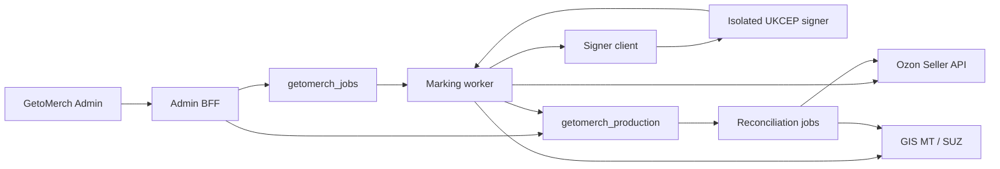

# План разработки интеграции «Честный знак» в GetoMerch Admin

Дата актуализации: 10 августа 2026 года.
Статус: этапы 0-13 реализованы; production-блок 2 завершен с внешними
write-интеграциями, оставленными выключенными.

Связанные документы:

- [FLOW.md](FLOW.md) — канонические бизнес-правила, состояния, структура данных
  и операционные сценарии;
- [README.md](README.md) — краткая сводка по интеграции;
- [GETOMERCH_KOMUI_SERVER_DATA_ARCHITECTURE.md](../GETOMERCH_KOMUI_SERVER_DATA_ARCHITECTURE.md)
  — общая серверная архитектура GetoMerch и KOMUI.

Если этот план расходится с `FLOW.md` в правилах оборота КМ, приоритет имеет
`FLOW.md`. Этот документ определяет порядок разработки, поставки и проверки.

## 1. Цель плана

Реализовать в production-админке полный управляемый процесс маркировки для
изготавливаемых после получения заказа футболок Ozon FBS:

```text
заказ Ozon FBS
  -> определение обязательности маркировки и GTIN
  -> резерв выпущенного КМ
  -> изготовление физической единицы
  -> печать и нанесение этикетки 58x40
  -> действие оператора «КМ нанесен»
  -> проверка автоматического отчета СУЗ для lp
  -> LP_INTRODUCE_GOODS
  -> подтверждение принятия ГИС МТ
  -> передача экземпляра в Ozon
  -> подтверждение принятия Ozon
  -> разрешение отгрузки
  -> дистанционный вывод из оборота
  -> обработка отмены, невыкупа, возврата или перехода на FBO
```

План должен привести не к набору несвязанных API-вызовов, а к сериализованному
учету каждой физической единицы, каждого КМ, внешнего документа и действия
оператора. Любое спорное состояние должно быть видно в админке и разрешаться
без ручного изменения строк БД.

## 2. Определение готового результата

Интеграция считается реализованной, когда для пилотного, а затем для всех
подлежащих маркировке Ozon FBS SKU выполняются условия:

1. Вариант товара однозначно связан с проверенным GTIN и моделью производства.
2. На каждую единицу количества заказа создается отдельная физическая единица.
3. Один активный КМ нельзя назначить двум физическим единицам или двум заказам.
4. Полный КМ зашифрован и не возвращается обычными JSON API.
5. Этикетка 58x40 строится из активного назначения и допускает безопасную
   повторную печать без создания нового КМ.
6. Внешние записи в Ozon и ГИС МТ выполняются worker-ом, идемпотентны и имеют
   подтвержденный terminal status.
7. Отгрузка блокируется, если обязательные состояния ГИС МТ или Ozon не
   подтверждены.
8. Дистанционный вывод, возврат в оборот и переход невыкупа FBS на FBO
   связываются с исходной физической единицей и исходным документом.
9. Ozon FBO не резервирует и не списывает внутренние заготовки GetoMerch.
10. Оператор видит полный журнал процесса, но не полный КМ в таблицах,
    уведомлениях и логах.
11. Остановка внешних записей не требует отката схемы БД или переключения на
    Supabase.
12. Backup, восстановление ключей и reconciliation проверены на тестовом
    восстановлении.

## 3. Зафиксированные границы

### 3.1. Production-контур

```text
Repository/releases: /opt/getomerch
Application:         /opt/getomerch/current
Web service:         getomerch-admin.service
Current worker:      getomerch-worker.service
Database:            getomerch_production
Domain:              https://admin.komui.ru
```

Marking-контур создается внутри GetoMerch Admin. Он не размещается в
`/opt/komui`, не пишет SQL в `komui_production` и не использует Supabase как
runtime source of truth.

### 3.2. Основной fulfillment-сценарий

- основной режим: `jit_after_order`;
- заказ Ozon FBS поступает до изготовления конкретной единицы;
- КМ должен быть нанесен, введен в оборот и принят Ozon до передачи товара;
- отдельное физическое считывание этикетки в админке не входит в процесс;
- физический факт фиксируется явным аудируемым действием `КМ нанесен`;
- переписка со службой поддержки не используется как requirement, evidence,
  production gate или источник бизнес-правил.

### 3.3. Что не включается в первый production-релиз

- заказы СУЗ через API: сначала используется защищенный импорт уже выпущенных
  КМ;
- заказы KOMUI: core проектируется общим, но первый source adapter — Ozon FBS;
- создание fulfillment по FBO-продажам;
- автоматическое подписание спорных документов возврата или FBS -> FBO без
  подтвержденных данных Ozon и ЭДО;
- изменение production source of truth или объединение БД KOMUI и GetoMerch.

## 4. Технические принципы реализации

1. **Каждый этап поставляется с выключенными внешними записями.** Сначала
   schema/read-only/preview, затем ограниченный canary, затем production.
2. **HTTP route не выполняет длинный внешний процесс.** Route валидирует
   команду, создает идемпотентную operation request и ставит durable job.
3. **Payload job содержит идентификаторы, а не полный КМ.** Worker получает
   секрет только непосредственно перед разрешенным внешним вызовом.
4. **Состояния разделены.** Физическое нанесение, внутренний склад, ГИС МТ,
   Ozon и документы имеют разные поля и переходы.
5. **Внешнее принятие всегда подтверждается опросом статуса.** Промежуточный
   HTTP-ответ не открывает shipping gate.
6. **Forward-only migrations.** Для каждой миграции используется следующий
   свободный номер в `db/migrations`; этот документ не резервирует конкретный
   номер.
7. **App rollback не понижает схему БД.** При инциденте отключаются feature
   flags и marking worker, а данные остаются для разбирательства.
8. **Явные колонки и bounded pagination.** В новых repository и API запрещены
   широкие `SELECT *` и неограниченные списки.
9. **Все команды аудируются.** Используются существующие
   `getomerch_audit.operation_requests`, audit log и actor metadata.
10. **Одна бизнес-команда — один idempotency key.** Повторный клик, retry HTTP
    или рестарт worker не создает второй КМ, документ или submission.

## 5. Целевая runtime-архитектура



### 5.1. Web application

Next.js отвечает только за:

- read models для карточек заказа и раздела `Честный знак`;
- проверку admin session и прав;
- создание идемпотентных команд;
- выдачу PDF с `Cache-Control: no-store` после отдельной авторизации;
- отображение состояний, блокировок и ручных задач.

Next.js не получает доступ к приватному ключу УКЭП и не удерживает HTTP-запрос
пользователя до завершения ГИС МТ или Ozon.

### 5.2. Marking worker

Marking jobs должны выполняться отдельно от текущих Ozon sync jobs. Рекомендуемая
реализация:

- отдельный entrypoint `scripts/getomerch-marking-worker.ts`;
- отдельный systemd unit `getomerch-marking-worker.service`;
- выбор только marking job types при claim;
- отдельный небольшой PostgreSQL pool;
- независимые concurrency и rate limits для Ozon, ГИС МТ и СУЗ;
- heartbeat, retry, cancellation и job events через существующую durable queue.

Это предотвращает ситуацию, когда длительный опрос документа ГИС МТ блокирует
синхронизацию заказов или финансов Ozon.

### 5.3. Signer

Signer разворачивается отдельным процессом и OS-пользователем. Перед выбором
runtime проводится техническая проверка фактического УКЭП и установленного
криптопровайдера. Интерфейс signer-а минимален:

```text
sign(payload_digest, certificate_id, purpose, request_id)
  -> signature
  -> certificate metadata
  -> signed_at
```

Правила:

- приватный ключ не читается web application и marking worker;
- предпочтителен Unix socket с проверкой peer credentials;
- разрешен только заранее определенный набор типов документов;
- подписывается точный digest, сохраненный в БД до вызова;
- request/response аудируются без тела КМ;
- таймаут не означает, что подпись не была создана: повтор идет с тем же
  `request_id`.

## 6. Зависимости и критический путь

```text
контракты и product verification
  -> platform/security prerequisites
  -> generic fulfillment и Ozon marking projection
  -> marking schema и product readiness
  -> secure KM pool
  -> physical unit + assignment + JIT production transaction
  -> label/order UX
  -> Ozon exemplar adapter
  -> signer и CRPT read-only
  -> CRPT application/introduction
  -> shipping gate и withdrawal
  -> returns и FBS -> FBO
  -> SUZ и полная automation
```

Ozon и ГИС МТ adapters можно разрабатывать параллельно после готовности core
schema, но production write нельзя включать до прохождения предыдущих ворот.

## 7. Сводка этапов

| Этап | Результат | Внешние production-записи |
|---|---|---|
| 0 | Внешние контракты и product matrix | нет |
| 1 | Секреты, ключи, роли, worker и операционные предпосылки | нет |
| 2 | Generic fulfillment и marking-признаки Ozon | нет |
| 3 | Core schema, state machines, repositories и audit | нет |
| 4 | Готовность каталога: GTIN, документы и UI | нет |
| 5 | Зашифрованный пул КМ и безопасный импорт | нет |
| 6 | Физические единицы, назначения и JIT-склад | нет |
| 7 | Этикетка 58x40 и действия в FBS-карточке | нет |
| 8 | Ozon exemplar adapter | canary после допуска |
| 9 | Signer и read-only ГИС МТ | только чтение |
| 10 | Отчет о нанесении и ввод в оборот | canary после допуска |
| 11 | Shipping gate и дистанционный вывод | canary после допуска |
| 12 | Отмены, возвраты и FBS -> FBO | частичная automation |
| 13 | СУЗ API и автопополнение пула | canary после допуска |
| 14 | Reconciliation, hardening и полный rollout | по матрице флагов |

Статус на `2026-08-10`: этапы 0 и 1 завершены, этапы 2-13 реализованы и
проверены локально. Marking infrastructure остается с feature flags off. Внешние
операции записи в ГИС МТ, СУЗ и Ozon не выполнялись. Фактические артефакты:
[`stage-0/`](./stage-0/README.md), [`stage-1/`](./stage-1/README.md),
[`stage-2/`](./stage-2/README.md), [`stage-3/`](./stage-3/README.md),
[`stage-4/`](./stage-4/README.md), [`stage-5/`](./stage-5/README.md) и
[`stage-6/`](./stage-6/README.md), [`stage-7/`](./stage-7/README.md) и
[`stage-8/`](./stage-8/README.md), [`stage-9/`](./stage-9/README.md) и
[`stage-10/`](./stage-10/README.md),
[`stage-11/`](./stage-11/README.md), [`stage-12/`](./stage-12/README.md) и
[`stage-13/`](./stage-13/README.md).

## 8. Этап 0. Внешние контракты и product matrix

### Цель

Зафиксировать проверяемые продуктовые данные и точные внешние контракты до
создания необратимых внешних документов.

### Работы

1. Проверить по каждому пилотному товару:
   - GTIN Национального каталога;
   - размер, цвет, состав, вид изделия;
   - модель `own_production`, `pre_marked_minor_customization` или
     `remarking_after_customization`;
   - наличие разрешительного документа как необязательную справочную
     характеристику, не влияющую на readiness.
2. Получить и сохранить локально вне Git актуальные закрытые документы:
   - True API и СУЗ;
   - форматы production/application report и ввода в оборот;
   - статусы документов и коды ошибок;
   - требования к аутентификации и УКЭП.
3. Зафиксировать Ozon Seller API contract snapshot:
   - create-or-get;
   - validate;
   - set;
   - status;
   - update;
   - поля marking requirement в FBS posting/product.
4. Создать sanitized fixtures для успешных, промежуточных и ошибочных
   ответов обоих внешних контуров.
5. Зафиксировать документы и идентификаторы Ozon для:
   - обычной FBS-отгрузки;
   - отмены до передачи;
   - невыкупа с возвратом продавцу;
   - невыкупа, оставленного Ozon для FBO;
   - обратной FBO-передачи продавцу.

### Артефакты

- датированный contract manifest без секретов;
- sanitized JSON fixtures в test fixtures;
- product verification record template;
- таблица GTIN пилотных SKU;
- перечень открытых вопросов с владельцем ответа и сроком пересмотра.

### Ворота выхода

- выбран хотя бы один реальный пилотный GTIN/SKU;
- известны обязательные поля всех первых CRPT и Ozon запросов;
- ни один production-секрет или реальный полный КМ не попал в Git.

### Стоп-условия

Этапы с внешними записями не начинаются, если неизвестен GTIN, модель
производства, тип документа ввода или точный контракт Ozon.

## 9. Этап 1. Platform и security prerequisites

### Цель

Подготовить инфраструктуру, в которой полный КМ и УКЭП не попадут в
неподходящий процесс, лог или backup.

### Работы в приложении и БД

1. Добавить централизованную marking-конфигурацию с fail-closed validation.
2. Зарегистрировать feature flags из раздела 24.
3. Добавить redaction для полей `cis`, `code`, `crypto_tail`, GS1 payload,
   подписываемого тела и PDF parameters.
4. Расширить job type contract для будущих marking jobs одновременно в:
   - TypeScript union;
   - database CHECK constraint;
   - worker dispatch;
   - job contract tests.
5. Подготовить отдельный marking worker с нулевым набором активных внешних
   handlers до следующих этапов.
6. Подготовить отдельные DB роли/права:
   - web: read и enqueue/command procedures;
   - marking worker: ограниченные mutation grants;
   - signer: без прямого доступа к бизнес-таблицам либо только к минимальному
     inbox/outbox интерфейсу.

### Key management

1. Создать versioned master keys:
   - encryption key для AES-256-GCM;
   - отдельный HMAC key для duplicate fingerprint;
   - key IDs в каждой зашифрованной записи.
2. Хранить ключи только в root-readable environment/secret storage сервера.
3. Описать rotation без немедленной полной перешифровки:
   - новые записи используют current key;
   - старые читаются по `key_version`;
   - фоновая re-encryption выполняется отдельно и идемпотентно.
4. Сделать recovery drill на тестовой копии:
   - восстановить БД;
   - восстановить ключи;
   - расшифровать контрольную запись;
   - подтвердить, что без ключа backup не раскрывает КМ.

### Operations

- systemd sandboxing для marking worker и signer;
- outbound allow-list, если поддерживается текущим firewall;
- log retention без payload-ов КМ;
- alerts только с entity ID, fingerprint prefix и error class;
- healthcheck отдельно для web, worker, signer, CRPT connectivity и Ozon
  connectivity.

### Тесты

- config validation при отсутствии каждого секрета;
- redaction unit tests;
- проверка, что full KM не появляется в error serialization;
- encrypt/decrypt, wrong key, corrupted ciphertext и key rotation;
- worker claim принимает только разрешенные marking job types.

### Ворота выхода

- marking worker может быть запущен с flags off и не выполняет внешних записей;
- backup/recovery ключей документирован и проверен;
- секреты отсутствуют в `NEXT_PUBLIC_*`, build output и логах;
- текущие Ozon jobs продолжают выполняться независимо.

## 10. Этап 2. Generic fulfillment и Ozon marking projection

Статус реализации: завершен локально. Production deployment миграций и
backfill являются отдельным rollout и пока не выполнялись. Подробности и
результаты проверок: [`stage-2/README.md`](./stage-2/README.md).

### Цель

Создать независимую от канала точку привязки marking core, не меняя текущий
Ozon order flow для немаркируемых товаров.

### Модель данных

Добавить минимальный fulfillment layer, согласованный с общей архитектурой:

- `merch_fulfillment_orders`;
- `merch_fulfillment_order_items`;
- `merch_fulfillment_events` или эквивалентный append-only журнал;
- уникальные source keys для Ozon posting и item;
- `source_channel`, `fulfillment_scheme`, `external_order_id`,
  `external_posting_number`;
- quantity и стабильный unit index для будущего разбиения строки на единицы.

Ozon FBO остается только аналитикой и не создает fulfillment item.

### Ozon sync

1. Расширить явную проекцию FBS ответов полями:
   - обязательность маркировки;
   - доступность exemplar flow;
   - product/offer/SKU identifiers;
   - quantity;
   - актуальный posting status;
   - данные, необходимые для возврата, если они уже доступны.
2. Не сохранять широкий внешний payload в основной таблице заказа.
3. Upsert fulfillment выполняется в той же логической mutation, что и
   нормализация Ozon snapshot, с идемпотентностью по source keys.
4. Backfill существующих активных FBS заказов выполнять bounded batches.

### API и UI

- read-only отображение source fulfillment IDs в диагностике заказа;
- признак `Маркировка требуется / не требуется / неизвестно`;
- неизвестное состояние не должно автоматически разрешать отгрузку после
  включения shipping gate.

### Тесты

- повторная синхронизация не дублирует fulfillment;
- quantity больше одного сохраняется без потери;
- split posting создает разные fulfillment orders/items;
- FBO не резервирует внутренний склад;
- отмена/смена статуса обновляет существующую сущность.

### Ворота выхода

- все активные FBS строки имеют стабильный fulfillment item;
- Ozon order UI не регрессировал;
- существующие inventory reservations не изменились для немаркируемых
  заказов;
- FBO analytics осталась независимой от fulfillment.

## 11. Этап 3. Marking core schema и state machines

### Цель

Создать основу сериализованного учета без хранения полного КМ и без внешних
записей.

### Первая группа таблиц

- `merch_marking_trade_items`;
- `merch_marking_trade_item_documents`;
- `merch_marking_product_profiles`;
- `merch_marking_locations`;
- `merch_marking_processes`;
- `merch_marking_evidence`;
- `merch_marking_events`.

Точный набор колонок, enums и ограничений берется из `FLOW.md`, раздел 10.

### Обязательные database invariants

1. GTIN хранится в нормализованном формате и проверяется по длине/check digit.
2. Один product profile имеет явный fulfillment mode и manufacturing model.
3. Профиль нельзя включить без GTIN, product group и evidence связи с
   товарной карточкой. РД и диагностические флаги НК не являются gate.
4. State transition выполняется только через service/mutation layer.
5. Event append происходит в той же транзакции, что и изменение состояния.
6. Время хранится в `timestamptz`, внешний payload — только sanitized subset.
7. Foreign keys используют `restrict` там, где удаление уничтожило бы историю.

### Кодовая структура

Рекомендуемые модули:

```text
src/lib/marking/domain/
  states.ts
  transitions.ts
  invariants.ts
  errors.ts
  idempotency.ts
src/lib/marking/repositories/
src/lib/marking/services/
src/lib/marking/read-models/
src/lib/marking/events/
```

Domain layer не импортирует React, Next.js route objects или vendor SDK.

### API

Первый read-only набор:

```text
GET /api/admin/marking/readiness
GET /api/admin/marking/processes
GET /api/admin/marking/processes/:id
GET /api/admin/marking/events
```

Все списки имеют cursor pagination, фильтры, explicit column projections и
ограниченный размер страницы.

### Тесты

- все допустимые и запрещенные state transitions;
- optimistic/concurrent update одного процесса;
- event и entity commit атомарны;
- API pagination и authorization;
- запросы не возвращают secret columns.

### Ворота выхода

- миграция проходит `db:migrate:verify` и rehearsal;
- read-only marking section работает на пустой схеме;
- state machine покрыта unit и DB tests;
- app rollback совместим с добавленной схемой.

## 12. Этап 4. Product readiness и GTIN

Статус реализации: развернут в production с внешними flags off. Точный
reconciliation выполнен для 138 актуальных Ozon-футболок: 124 профиля готовы,
7 ожидают модерацию НК, 7 приостановлены из-за Ozon
`ozon_requirement_mismatch`.

### Цель

Не допустить автоматическую маркировку товара с неподтвержденной карточкой.

### Функции

1. Раздел `Честный знак -> Товары`:
   - поиск по SKU, offer ID, GTIN и названию;
   - размер, цвет и канал;
   - manufacturing model;
   - marking requirement source;
   - разрешительный документ как необязательное справочное поле;
   - статус readiness;
   - причина блокировки.
2. Команды с audit/idempotency:
   - создать/изменить profile;
   - подтвердить GTIN;
   - приложить ссылку на evidence;
   - включить или приостановить профиль.
3. Backfill вариантов из существующих товаров и Ozon mappings.
4. Отчет о конфликтах:
   - один SKU связан с несколькими GTIN;
   - один GTIN имеет несовместимые атрибуты;
   - размер/цвет не совпадает с Национальным каталогом;
   - изменилось или истекло справочное значение документа;
   - marking requirement от Ozon противоречит профилю.

### Ограничения

- имя товара не используется для автоматического вывода GTIN;
- похожие SKU не объединяются по префиксу артикула;
- `unknown` требует ручного подтверждения;
- массовое включение доступно только после preview и показывает diff.

### Тесты

- GTIN validation;
- profile conflicts;
- preview/apply идемпотентность;
- backfill нескольких размеров и цветов;
- отсутствие или истечение РД отображается как информационное предупреждение
  и не блокирует readiness.

### Ворота выхода

- 124 SKU имеют `ready` profile; `D15-TSH-PRT-WHT-S` подходит как технический
  pilot profile, но внешний canary этим этапом не запускается;
- для 14 заблокированных SKU зафиксированы конкретные внешние причины;
- ни один профиль не активирован только по эвристике названия;
- результат проверяется идемпотентной командой
  `npm run marking:profiles:verify` и версионированным манифестом.

## 13. Этап 5. Secure KM pool и импорт

Статус реализации: завершен локально с flags off. Production migration,
передача keyring web service и загрузка реального пула не выполнялись.

### Цель

Безопасно загрузить ограниченный пул выпущенных КМ по GTIN и исключить дубли.

### Таблицы

- `merch_marking_import_batches`;
- `merch_marking_import_rows`;
- `merch_marking_codes`.

### Crypto representation

Для полного КМ сохраняются:

```text
ciphertext
iv
auth_tag
encryption_key_version
hmac_fingerprint
hmac_key_version
gtin
serial metadata where safe
pool_state
```

В БД запрещена plaintext-колонка полного КМ. Fingerprint используется для
duplicate detection, но не заменяет GTIN/serial при внешних операциях.

### Import flow

1. Оператор загружает файл через защищенный endpoint.
2. Файл обрабатывается потоково с лимитами размера и количества строк.
3. Создается preview batch:
   - валидные строки;
   - дубли внутри файла;
   - дубли в БД;
   - несовпадающий GTIN;
   - нераспознанный формат;
   - недопустимый статус.
4. Apply использует batch ID и idempotency key.
5. Временный plaintext-файл не создается: валидная строка шифруется в памяти
   сразу после разбора.
6. Import rows хранят только безопасную диагностику и fingerprint prefix.

### Pool state transitions

Минимально:

```text
available -> reserved -> bound
available -> invalid
reserved  -> available     только до доступной пользователю этикетки
reserved  -> quarantined   после генерации этикетки, если нанесение не было
bound     -> retired/replaced только через отдельный документированный flow
```

### API

```text
POST /api/admin/marking/imports/preview
POST /api/admin/marking/imports/:id/apply
GET  /api/admin/marking/imports
GET  /api/admin/marking/pool
POST /api/admin/marking/codes/:id/quarantine
POST /api/admin/marking/codes/:id/release
```

Освобождение из quarantine требует причины и подтверждения уничтожения всех
распечатанных копий; оно не должно быть обычной массовой операцией.

### Тесты

- duplicate race при двух параллельных imports;
- corrupted/oversized file;
- rollback apply transaction;
- ciphertext нельзя расшифровать неверным key version;
- plaintext отсутствует в response, audit и job event.

### Ворота выхода

- загружен тестовый пул пилотного GTIN;
- количество `available` сверено с исходным файлом;
- duplicate constraints выдерживают concurrency test;
- выполнена recovery-проверка зашифрованного пула.

## 14. Этап 6. Физические единицы, assignments и JIT-склад

Статус реализации: завершен локально с flags off. Production migration,
работа с реальными заказами/КМ и внешние запросы не выполнялись.

### Цель

Связать единицу заказа, физически изготавливаемую футболку и один КМ.

### Таблицы

- `merch_marking_units`;
- `merch_marking_code_bindings`;
- `merch_marking_assignments`.

### Команда подготовки единицы

В одной database transaction:

1. Заблокировать fulfillment item и проверить актуальный quantity/status.
2. Создать недостающие unit slots `1..quantity`.
3. Выбрать один `available` КМ нужного GTIN через `FOR UPDATE SKIP LOCKED`.
4. Перевести КМ в `reserved`.
5. Создать physical unit, binding и assignment.
6. Записать marking event и operation result.
7. Не списывать заготовку и принт до действия `КМ нанесен`.

### Действие `КМ нанесен`

Это явное подтверждение физического факта оператором. В одной mutation:

1. Проверить, что PDF был сгенерирован для активного binding.
2. Проверить, что assignment не отменен и posting еще допускает подготовку.
3. Перевести unit/binding в applied state.
4. Списать одну заготовку и один принт/вышивку по существующим правилам.
5. Оприходовать одну готовую сериализованную единицу, зарезервированную за
   fulfillment item.
6. Поставить durable job подготовки документов ГИС МТ. На этапе 6 создается
   только идемпотентное задание `marking_crpt_application_submit`; внешний
   обработчик и отправка включаются на последующих этапах.
7. Записать actor, время и version всех затронутых записей.

### Гонки и отмены

- параллельный клик возвращает исходный operation result;
- отмена до PDF освобождает КМ;
- отмена после PDF, но до нанесения переводит КМ в quarantine;
- отмена после нанесения не разрывает binding и требует решения судьбы
  физической единицы;
- уменьшение quantity закрывает только еще не нанесенные лишние slots;
- split posting не переносит assignment без отдельной audited-команды.

### Тесты

- 20 параллельных резервов одного GTIN без дублей;
- quantity 2/3;
- отмена в каждой фазе;
- недостаток blanks, prints или KM;
- атомарность inventory ledger + marking state;
- повторный job после process crash.

### Ворота выхода

- пилотный заказ проходит внутренний flow без внешних запросов;
- inventory сверяется до и после каждого сценария;
- один КМ невозможно назначить повторно на уровне БД.

## 15. Этап 7. Этикетка 58x40 и FBS UX

Статус реализации: программная часть завершена локально с flags off.
Production migration, keyring credential, реальные КМ и физическая приемка
этикетки на принтерах не выполнялись. Результаты:
[`stage-7/README.md`](./stage-7/README.md).

### Цель

Дать оператору короткий и однозначный процесс изготовления без раскрытия КМ в
обычном интерфейсе.

### Label service

1. Детерминированно строить GS1 DataMatrix из расшифрованного активного КМ.
2. Генерировать PDF строго 58x40 мм с фиксированными quiet zones и DPI.
3. Не сохранять PDF как source of truth.
4. Поддержать повторную печать того же binding.
5. Сохранять время первого render, template version и render/reprint event.
   Скачивание не считается подтверждением физической печати.
6. Ответ:
   - `Content-Type: application/pdf`;
   - `Cache-Control: no-store, private`;
   - без полного КМ в имени файла и URL.

### Карточка заказа

На строке маркируемого товара показывать по каждой физической единице:

- masked fingerprint;
- GTIN;
- этап физической подготовки;
- статус ГИС МТ;
- статус Ozon;
- shipping blocker;
- последнее действие и ошибка.

Команды:

- `Зарезервировать КМ`;
- `Скачать КМ 58x40`;
- `КМ нанесен`;
- `Повторная печать`;
- `Отменить подготовку` с указанием причины.

Кнопки становятся доступны по state machine, а не по локальной логике React.

### Приемка печати

- контроль размера PDF в points/mm;
- тест минимум на двух фактических принтерах/драйверах;
- проверка DataMatrix сертифицированным средством контроля вне обязательного
  рабочего flow;
- проверка сохранения ASCII GS;
- проверка тихих зон, контраста и отсутствия масштабирования драйвером;
- утверждение template version до production.

### Тесты

- golden PDF/image fixtures без реальных КМ;
- одинаковый binding дает тот же payload;
- повторная печать не меняет state и КМ;
- отмененный/quarantined binding не выдает PDF;
- unauthorized и stale session получают отказ.

### Ворота выхода

- утвержденная этикетка стабильно печатается 58x40;
- полный КМ доступен только в защищенном PDF generation path;
- оператор может выполнить внутренний JIT flow без ручного изменения БД.

## 16. Этап 8. Ozon exemplar adapter

Статус реализации: программная часть завершена локально с flags off.
Миграция `0012`, реальный canary и внешние запросы Ozon в production не
выполнялись. Фактические границы приведены в [stage-8/README.md](stage-8/README.md).

### Цель

Передать КМ конкретной единицы конкретного FBS posting в Ozon и получить
подтвержденное принятие.

### Таблицы

- `merch_marking_ozon_submission_batches`;
- `merch_marking_ozon_submissions`.

### Adapter contract

Реализовать методы по актуальному contract snapshot:

```text
createOrGetExemplars
validateExemplars
setExemplars
getExemplarStatus
updateExemplars
```

Версии endpoint-ов берутся из manifest этапа 0, а не дублируются по route
handlers.

### Последовательность

1. Получить актуальные exemplar IDs для posting/product через предусмотренную
   контрактом операцию. `create-or-get` считать потенциальной внешней
   мутацией, даже если Ozon реализует ее идемпотентно.
2. Сопоставить ровно `quantity` assignments с exemplar IDs.
3. Выполнить validate.
4. При разрешенном flag создать submission batch и выполнить set.
5. Сохранять Ozon request ID и sanitized response.
6. Опросить status до `accepted`, `rejected` или timeout policy.
7. При частичном отказе не переотправлять принятые экземпляры без оснований.

### Идемпотентность

Ключ включает:

```text
posting_number + product_id + assignment_version + operation_kind
```

Новый batch создается только при изменении assignment version или явном
исправлении; он ссылается на предыдущий как superseded.

### Rollout

1. Fixtures/test contour и status для уже существующих exemplars, если контракт
   дает такой путь без создания новых сущностей.
2. Один canary `create-or-get` под Ozon write flag и allow-list.
3. Validate без set.
4. Один пилотный set с ручным подтверждением.
5. Расширение после сверки Ozon Seller UI.

### Тесты

- recorded sanitized contract fixtures;
- quantity, split posting, multibox;
- timeout после фактического приема;
- частичный rejection;
- posting отменен между validate и set;
- повторный set с тем же idempotency key.

### Ворота выхода

- один реальный пилотный КМ принят Ozon;
- статус в админке совпадает с Seller UI;
- ошибка Ozon не меняет CRPT или physical state;
- flag мгновенно останавливает новые Ozon writes.

## 17. Этап 9. Signer и read-only ГИС МТ

Статус реализации: код, migrations `0013/0014`, signer boundary, CRPT auth/read
adapter, изолированная marking-очередь, durable jobs, API/UI и outbound-only
Mac-агент развернуты в production. Heartbeat с реальным Рутокеном, nginx
`401/429` и challenge-контракты sandbox/production проверены. Физическая
подпись остановилась до PIN из-за просроченной лицензии CryptoPro CSP; после её
активации остается повторить auth canary. Подробности —
[`stage-9/PRODUCTION_CANARY_2026-08-10.md`](stage-9/PRODUCTION_CANARY_2026-08-10.md).

### Цель

Подтвердить техническую работу УКЭП, аутентификации и чтения статусов до
создания production-документов.

### Работы

1. Проверить фактический сертификат:
   - срок действия;
   - ИНН/ОГРН владельца;
   - цепочку доверия;
   - доступность криптопровайдера;
   - алгоритм подписи, который требует API.
2. Реализовать signer process и signer client.
3. Ограничить signer allow-list типами payload и calling service identity.
4. Реализовать CRPT auth/token lifecycle:
   - получение challenge;
   - подпись;
   - получение/обновление token;
   - хранение только необходимого срока;
   - single-flight refresh.
5. Реализовать read-only запросы статуса документа и КМ по доступным
   контрактам.

### Failure handling

- истек сертификат;
- PIN/носитель недоступен;
- crypto provider error;
- clock skew;
- token истек во время запроса;
- signer ответ потерян после подписи;
- CRPT timeout/maintenance.

### Тесты

- test certificate или официальный test contour;
- signer rejects неизвестный purpose;
- digest mismatch;
- duplicate request ID;
- token refresh concurrency;
- redaction подписываемых данных в логах.

### Ворота выхода

- signer работает без передачи private key web/worker;
- read-only status подтвержден в test, затем production contour;
- описана процедура замены сертификата без остановки истории документов;
- production write flag остается выключен.

## 18. Этап 10. Статус нанесения и ввод в оборот

### Цель

После физического действия `КМ нанесен` подтвердить применимое состояние
нанесения и создать документ ввода в оборот собственного производства.

### Таблицы

- `merch_marking_documents`;
- `merch_marking_document_codes`.
- `merch_marking_document_confirmations`.

### Pipeline документа

```text
draft
  -> payload_built
  -> signed
  -> submitting
  -> processing
  -> accepted | rejected | requires_manual_review
```

Отчет о нанесении и ввод в оборот являются разными внешними фактами, их нельзя
сворачивать в один boolean. Для товарной группы `lp` API СУЗ 3.0 указывает
автоматическое формирование отчета о нанесении при выдаче КМ. Поэтому
marking pool принимает только код с подтвержденным результатом этого отчета,
а после физического `КМ нанесен` worker не дублирует `/utilisation`, а подает
`LP_INTRODUCE_GOODS`.

### Работы

1. Payload builder с versioned schema и deterministic canonicalization.
2. Проверка profile, GTIN, location и ownership КМ. Данные РД не являются
   условием отправки.
3. Создание immutable payload digest.
4. Подпись через signer.
5. Submission worker и status polling через
   `GET /api/v4/true-api/doc/{docId}/info`.
6. Нормализация внешних ошибок в стабильные внутренние error classes.
7. Correction/supersede flow без редактирования принятого документа.
8. Сохранение внешнего document ID и sanitized evidence.
9. Отдельное подтверждение состояния КМ `in_circulation` после принятия
   документа; до этого unit остается `marking_pending`.
10. При неизвестном результате create-запроса запрет автоматической новой
    ревизии до ручной сверки в ЛК.

### Canary

1. Test contour, если доступен.
2. Один реальный КМ пилотного GTIN.
3. Ручная сверка в ЛК Честного знака.
4. Только после принятого application report — ввод в оборот.
5. Только после `in_circulation` — разрешение Ozon set/shipping.

### Тесты

- accepted/rejected/processing;
- duplicate submission после timeout;
- подпись устаревшей версии payload;
- отсутствие справочного РД не меняет результат submission;
- mixed GTIN batch запрещен, если контракт этого не допускает;
- partial document errors;
- process restart между sign и submit.

### Ворота выхода

- пилотный КМ имеет подтвержденный статус `in_circulation`;
- документы видны в админке и ЛК Честного знака;
- повтор worker/job не создает второй документ;
- reject формирует понятную ручную задачу.

### Статус реализации на 4 августа 2026 года

- migration `0015`, repositories, deterministic payload builder, detached
  signer purpose, create/poll adapter, worker pipeline и UI реализованы;
- все write flags, включая
  `GETOMERCH_MARKING_CRPT_INTRODUCTION_ENABLED`, по умолчанию `false`;
- clean migration rehearsal, contract checks и транзакционный сценарий
  `rejected -> correction -> accepted -> in_circulation` проходят;
- production migration и реальный canary не выполнялись;
- ворота выхода остаются открытыми до одного фактически подтвержденного
  `in_circulation` КМ.

## 19. Этап 11. Shipping gate и дистанционный вывод

### Цель

Не позволить передать обязательный маркируемый товар Ozon до готовности и
своевременно вывести его из оборота после фактической FBS-отгрузки.

### Shipping gate

Функция принимает fulfillment item/unit и возвращает:

```text
allowed: boolean
mode: observe | enforce
blockers[]
evidence_version
evaluated_at
```

Для маркируемой единицы обязательны:

- physical `applied`;
- CRPT `in_circulation`;
- Ozon `accepted`;
- актуальный posting допускает отгрузку;
- assignment не отменен и не superseded;
- нет unresolved critical discrepancy.

Rollout: сначала `observe`, сравнение с реальными действиями, затем `enforce`
для allow-list, затем для всех готовых профилей.

### Withdrawal

1. Триггером является подтвержденная фактическая передача/отгрузка Ozon, а не
   создание заказа и не печать этикетки.
2. Создать документ дистанционного вывода с применимым основанием, местом
   деятельности и shipment reference.
3. Сгруппировать коды в допустимый batch, сохранив связь каждого КМ с order.
4. Подписать, отправить и опрашивать до terminal status.
5. Контролировать нормативный срок, указанный в `FLOW.md` и актуальных
   официальных материалах.
6. Поздний/неподтвержденный вывод создает critical alert.

### Защита от ошибочного вывода

- posting отменен до передачи — withdrawal не создается;
- Ozon status сам по себе не считается физическим фактом, если не определен
  надежный mapping;
- повторная синхронизация не создает второй withdrawal;
- исправление документа выполняется отдельным correction flow.

### Тесты

- gate observe/enforce;
- один blocker и несколько blockers;
- handover event повторен;
- withdrawal accepted/rejected/timeout;
- отмена до и после handover;
- срок обработки и alert.

### Ворота выхода

- отгрузка пилотной единицы заблокирована до всех подтверждений;
- принятый withdrawal связан с unit, assignment и shipment;
- ошибка/остановка CRPT не приводит к молчаливому разрешению отгрузки.

### Статус реализации на 9 августа 2026 года

- migration `0016`, server-side gate, explicit operator handover, encrypted
  `LK_RECEIPT/DISTANCE` pipeline, worker dispatch и UI реализованы;
- Ozon status больше не завершает assignment и не считается доказательством
  физической передачи;
- `observe` сохраняет blockers и физический custody, `enforce` откатывает всю
  складскую транзакцию до изменения остатков;
- повтор handover и повтор submit идемпотентны, rejected document исправляется
  новой revision, ambiguous create требует ручной сверки;
- срок хранится как три консервативных будних дня; версия официального
  производственного календаря и Telegram deadline alerts остаются частью
  hardening этапа 14;
- clean migration rehearsal и DB lifecycle
  `processing -> rejected -> correction -> accepted -> withdrawn` проходят;
- production migration, реальный handover и True API canary не выполнялись;
- ворота выхода production остаются открытыми до canary этапов 9-11.

## 20. Этап 12. Отмены, возвраты и FBS -> FBO

### Цель

Автоматизировать безопасную часть возвратов и не допустить двойного вывода,
двойного прихода или потери custody.

### Таблица

- `merch_marking_return_cases`.

### Ozon return adapter

Нормализует факты Ozon в собственную модель:

```text
cancel_before_handover
return_to_seller
not_picked_up_to_seller
to_ozon_fbo
fbo_return_to_seller
unknown
```

Внутренние значения не должны быть прямой копией изменяемых строковых статусов
Ozon. Каждый mapping имеет contract version и sanitized source evidence.

### Возврат продавцу

1. Определить, был ли принят исходный withdrawal.
2. Если был, подготовить возврат КМ в оборот с ссылкой на исходный документ.
3. Дождаться принятия ГИС МТ.
4. Не восстанавливать внутренний остаток до фактической приемки GetoMerch.
5. При приемке оператор выбирает состояние:
   - пригоден, КМ цел;
   - требуется новая этикетка того же КМ;
   - КМ поврежден, нужна перемаркировка;
   - товар/КМ утилизируется.
6. Каждая ветка запускает отдельную state transition и документ.

### Невыкуп FBS остается у Ozon для FBO

Обязательная последовательность:

1. Зафиксировать Ozon return ID и подтвержденное направление `to_ozon_fbo`.
2. Проверить исходный withdrawal.
3. Если withdrawal принят, вернуть тот же КМ в оборот и дождаться принятия.
4. Не делать внутренний приход: физически товар GetoMerch не вернулся.
5. Получить FBO intake/supply reference.
6. Подготовить УПД ДОП с видом товарооборота `00005 — Передача Агенту` через
   применимый ЭДО-процесс.
7. Дождаться принятия передачи Ozon.
8. Перевести custody в `ozon_fbo` и закрыть FBS assignment переходом, сохранив
   ту же unit и тот же КМ.
9. Последующая FBO-продажа идет только в аналитику; seller withdrawal повторно
   не создается.

Если Ozon позднее возвращает этот FBO-товар продавцу, ожидается применимый УПД
`00006 — Возврат от агента` либо УКД. Он связывается с существующей unit и не
создает новый FBS return case.

### Что автоматизировать сразу

- обнаружение потенциального return case;
- reconciliation исходного withdrawal;
- подготовку возврата в оборот;
- polling его статуса;
- проверку обязательных FBO evidence;
- единую ручную задачу для ЭДО-передачи;
- запрет повторного seller withdrawal.

### Что оставить с подтверждением оператора

- фактическую приемку товара GetoMerch;
- оценку состояния товара/этикетки;
- подтверждение, что Ozon действительно оставляет единицу на FBO;
- подписание/отправку спорного ЭДО до подтверждения стабильного API.

### Тесты

- отмена до PDF, после PDF, после нанесения, после ввода и после handover;
- return до/после принятого withdrawal;
- duplicate Ozon return events;
- return destination меняется;
- FBS -> FBO без внутреннего прихода;
- FBO sale до принятой передачи агенту создает discrepancy;
- поздний FBO return to seller;
- поврежденная этикетка и перемаркировка.

### Ворота выхода

- ни один return flow не меняет остаток без custody event;
- FBS -> FBO сохраняет identity физической единицы и КМ;
- withdrawal/return/transfer documents образуют проверяемую цепочку;
- `unknown` destination всегда требует ручного решения.

### Статус на 10 августа 2026 года

- migration `0017`, versioned return cases/events, custody `ozon_fbo`, safe
  read models и узкие transitions реализованы;
- строгий Ozon adapter и paginated durable sync реализованы, но production
  sync выключен до read-only сверки актуального ответа Seller API;
- `LP_RETURN/REMOTE_SALE_RETURN`, encrypted sign/create/poll lifecycle и
  ручная correction path реализованы;
- оператор отдельно подтверждает направление и факт оплаты; Ozon evidence не
  выбирает destination;
- seller receipt меняет агрегатный остаток ровно один раз только после
  физической приёмки `intact`; повреждённые единицы остаются в quarantine;
- FBS -> FBO требует FBO и ЭДО references, меняет custody без внутреннего
  прихода; references пока являются аудируемым подтверждением оператора, а не
  результатом ЭДО API;
- clean migration `0001`-`0017`, SQL ACL checks и DB lifecycle seller/FBO
  проходят;
- production migration, реальный Ozon return, `LP_RETURN` canary и ЭДО
  automation не выполнялись;
- return-from-agent, автоматический FBO discrepancy, перемаркировка и
  утилизация остаются fail-closed follow-up этапа 14.

## 21. Этап 13. СУЗ API и автопополнение пула

### Цель

Убрать ручной импорт как основной способ пополнения, сохранив его как аварийный
контролируемый путь.

### Таблицы

- `merch_marking_code_orders`;
- `merch_marking_code_order_items`.

### Функции

1. Настройки minimum/target pool по GTIN.
2. Forecast с учетом:
   - активных FBS заказов;
   - среднего расхода;
   - quarantined/rejected кодов;
   - производственного срока;
   - лимитов СУЗ.
3. Создание заказа КМ с manual approval на первой стадии.
4. Получение результата, проверка количества и secure ingestion через тот же
   crypto pipeline, что у импорта.
5. Polling статуса заказа.
6. Поиск квитанции автоматического `REPORT_UTILIZE` по `orderId`,
   `productGroup=lp` и `workflowType=REPORT_UTILIZE`; код допускается в
   available pool только при `state=SUCCESS` и `code=0`.
7. Reconciliation заказано/получено/отчет принято/доступно.
8. Alerts `pool_low`, `order_stuck`, `utilisation_stuck`,
   `quantity_mismatch`.

### Идемпотентность

- один open order на GTIN/production mode/threshold window;
- timeout не создает новый заказ до проверки статуса старого;
- полученный код проходит общий unique HMAC constraint;
- partial result сохраняется отдельно, не маскируя недостачу.

### Rollout

1. Read-only pool forecast.
2. Draft order без отправки.
3. Один ручной approved pilot order.
4. Автоматическое создание draft.
5. Автоотправка только после стабильной серии сверок.

### Ворота выхода

- количество кодов СУЗ с успешным автоматическим `REPORT_UTILIZE` совпадает
  с secure pool;
- ручной импорт остается доступным под отдельным permission/flag;
- автоматизация не создает дубли при timeout или restart.

### Статус на 10 августа 2026 года

- migration `0018`, pool policy, safe forecast, SUZ orders/items и состояние
  `pending_utilisation` реализованы;
- strict SUZ API 3.0 adapter использует динамический `clientToken`, exact-body
  detached CAdES-BES и отдельный signer purpose;
- ручные draft/approval, durable submit/poll, recovery уже выданных блоков и
  fail-closed `manual_review` реализованы;
- коды проходят общий AES-256-GCM/HMAC import pipeline и недоступны до
  успешного `REPORT_UTILIZE` с точным совпадением количества;
- вкладка `Заказы КМ`, политика GTIN, forecast и безопасные статусы реализованы;
- clean migration `0001`-`0018`, SQL ACL/lifecycle, static contracts,
  TypeScript, marking regressions и production build проходят;
- production migration, реальные OMS credentials, заказ КМ и платный pilot не
  выполнялись; `GETOMERCH_MARKING_SUZ_WRITE_ENABLED=false`;
- automation создания draft/approval остается rollout-работой этапа 14.

## 22. Этап 14. Reconciliation, hardening и полный rollout

### Цель

Перевести пилотную интеграцию в устойчивый production-процесс.

### Reconciliation jobs

1. **Physical/internal:** unit, binding, assignment, inventory ledger.
2. **Ozon:** posting/product/exemplar/return destination.
3. **ГИС МТ:** ownership/status/documents/withdrawal/return.
4. **СУЗ:** ordered/received/ingested pool counts.
5. **ЭДО/FBO:** transfer-to-agent и return-from-agent evidence.

Reconciliation никогда не исправляет неоднозначное состояние молча. Оно либо
применяет однозначную идемпотентную коррекцию, либо создает manual review.

### Наблюдаемость

Метрики:

- KM available/reserved/quarantined по GTIN;
- orders blocked by reason;
- document processing age;
- Ozon submission latency/rejection rate;
- CRPT submission latency/rejection rate;
- withdrawal deadline risk;
- unresolved returns/FBO transitions;
- signer health/certificate expiry;
- reconciliation discrepancies.

Alerts не содержат полный КМ. Ссылки ведут на entity ID внутри админки.

### Production rollout

1. Все schema и read-only UI, flags off.
2. Один allow-listed GTIN и один оператор.
3. Один реальный JIT order до `in_circulation`, без автоматического Ozon set.
4. Один реальный Ozon set.
5. Shipping gate `observe`.
6. Shipping gate `enforce` для пилотного GTIN.
7. Один withdrawal и сверка ЛК.
8. Один возвратный сценарий на контролируемых данных.
9. Расширение по GTIN небольшими группами.
10. Включение automation только после стабильного периода и нулевых critical
    discrepancies.

### Ворота завершения

- runbooks проверены дежурным оператором;
- restore drill включает marking tables и keys;
- certificate expiry alert срабатывает заранее;
- reconciliation не показывает необъяснимых расхождений;
- canary и regression suite пройдены;
- rollback внешних writes проверен без downgrade схемы.

## 23. Разбиение миграций

Нельзя помещать всю модель в одну миграцию. Рекомендуемые логические срезы:

| Срез | Содержимое |
|---|---|
| A | generic fulfillment и Ozon marking projection |
| B | trade items, profiles, locations, evidence, processes, events |
| C | import batches, import rows, encrypted codes |
| D | units, bindings, assignments и inventory invariants |
| E | Ozon submissions, documents и document codes |
| F | return cases, custody transitions и FBO evidence |
| G | SUZ orders и order items |

Для каждого среза обязательны:

- forward migration;
- schema checks в `db/checks`;
- migration verification;
- rehearsal на свежей копии;
- оценка lock time и размера индексов;
- deploy с неактивными flags;
- совместимость предыдущей версии приложения с добавленной схемой.

Номер файла определяется по следующему свободному migration number на момент
реализации. Удаление колонок и ужесточение `NOT NULL` выполняются только после
отдельного backfill/verification этапа.

## 24. Feature flags

```text
GETOMERCH_MARKING_ENABLED=false
GETOMERCH_MARKING_IMPORT_ENABLED=false
GETOMERCH_MARKING_LABELS_ENABLED=false
GETOMERCH_MARKING_SIGNER_ENABLED=false
GETOMERCH_MARKING_OZON_WRITE_ENABLED=false
GETOMERCH_MARKING_CRPT_WRITE_ENABLED=false
GETOMERCH_MARKING_CRPT_INTRODUCTION_ENABLED=false
GETOMERCH_MARKING_WITHDRAWAL_ENABLED=false
GETOMERCH_MARKING_RETURNS_ENABLED=false
GETOMERCH_MARKING_OZON_RETURNS_SYNC_ENABLED=false
GETOMERCH_MARKING_SUZ_WRITE_ENABLED=false
GETOMERCH_MARKING_SUZ_OMS_ID=
GETOMERCH_MARKING_SUZ_OMS_CONNECTION=
GETOMERCH_MARKING_JUST_IN_TIME_ENABLED=false
GETOMERCH_MARKING_DEFAULT_FULFILLMENT_MODE=jit_after_order
GETOMERCH_MARKING_AUTOMATION_ENABLED=false
GETOMERCH_MARKING_SHIPPING_GATE_MODE=observe
```

Дополнительно нужны allow-lists пилота:

```text
GETOMERCH_MARKING_ALLOWED_GTINS=
GETOMERCH_MARKING_ALLOWED_OFFERS=
GETOMERCH_MARKING_ALLOWED_ADMIN_IDS=
```

Правила:

- глобальный flag выключает создание новых процессов, но не скрывает уже
  существующие обязательства;
- выключение write flag останавливает новые внешние mutations, но status
  polling и read-only reconciliation могут продолжаться;
- shipping gate не отключается автоматически при недоступности worker;
- flags читаются server-side и не содержат секретов.

## 25. Job types и очереди

Минимальный набор job types вводится поэтапно:

```text
marking_prepare_assignment
marking_ozon_validate
marking_ozon_submit
marking_ozon_poll
marking_crpt_auth_refresh
marking_crpt_application_submit
marking_crpt_introduction_submit
marking_crpt_document_poll
marking_withdrawal_submit
marking_return_to_circulation_submit
marking_returns_sync
marking_reconcile
marking_suz_order_submit
marking_suz_order_poll
```

Требования:

- DB CHECK и TypeScript union обновляются атомарно в одном PR;
- payload содержит только entity IDs, command ID и contract version;
- dedupe key соответствует бизнес-операции;
- retry policy различает transport, rate limit, validation и permanent reject;
- terminal failure создает manual task;
- отмена job не откатывает уже принятую внешнюю операцию;
- polling использует scheduled retry, а не удержание worker process.

## 26. Admin API

Все новые routes размещаются под `/api/admin/marking/*`, используют
`requireAdminSession`, единый error format и idempotency pattern.

Группы API:

```text
readiness and profiles
pool and imports
units and assignments
labels
documents and external statuses
returns and FBO transitions
jobs and reconciliation
```

Mutation response возвращает:

```json
{
  "operationId": "uuid",
  "entityId": "uuid",
  "jobId": "uuid-or-null",
  "status": "accepted"
}
```

Ни один list/detail endpoint не возвращает ciphertext, iv, auth tag, полный КМ,
сырой подписываемый payload или external token.

## 27. Рекомендуемая структура кода

```text
src/lib/marking/
  config.ts
  domain/
  crypto/
  repositories/
  services/
  read-models/
  labels/
  adapters/
    ozon/
    crpt/
    suz/
    edo/
  jobs/
  reconciliation/

src/app/api/admin/marking/
src/app/marking/

scripts/getomerch-marking-worker.ts
ops/systemd/getomerch-marking-worker.service
```

Signer implementation размещается в отдельном изолированном модуле/сервисе
после проверки криптопровайдера. Vendor DTO не должны проникать в domain
entities: adapters переводят их в стабильные внутренние типы.

### 27.1. Существующие точки интеграции

При реализации нужно расширять текущие механизмы, а не создавать параллельные
версии общей инфраструктуры:

| Текущий модуль | Как используется marking-контуром |
|---|---|
| `src/lib/ozon/client.ts` | единые timeout, retry, cancellation и sanitization для Ozon adapter |
| `src/lib/ozon/sync-orders.ts` | нормализация marking-признаков и upsert generic fulfillment для FBS |
| `src/lib/jobs/types.ts` | единый registry новых marking job types |
| `src/lib/jobs/worker.ts` | общий dispatch contract; marking handlers выполняются отдельным entrypoint |
| `src/lib/db/mutations/runner.ts` | operation request, idempotency, actor и audit для команд |
| `src/lib/db/repositories` | явные SQL projections и bounded pagination |
| `src/lib/db/services` | транзакционные application services |
| `db/migrations` | только forward-only schema changes |
| `db/checks` | invariants, grants, indexes и migration verification |
| `ops/systemd` | отдельные marking worker и signer units |

Нельзя добавлять отдельный неаудируемый `fetch` к Ozon из React component,
выполнять SQL из UI route в обход repository/service layer или запускать
миграции при старте приложения.

## 28. Стратегия тестирования

### 28.1. Unit

- GTIN и GS1 parsing/encoding;
- все state transitions;
- idempotency keys;
- shipping gate;
- return decision matrix;
- crypto/redaction;
- payload canonicalization.

### 28.2. Database и concurrency

- unique active binding;
- one assignment per unit slot;
- parallel pool reservation;
- event/entity atomicity;
- inventory + marking transaction;
- job dedupe;
- migration checks и rehearsal.

### 28.3. Contract

- Ozon fixtures всех exemplar endpoints;
- CRPT auth, submit и status fixtures;
- SUZ order/result fixtures;
- unknown enum/status приводит к manual review, а не к permissive default;
- contract version mismatch останавливает write.

### 28.4. Security

- full KM отсутствует в JSON, URL, logs, audit и alerts;
- PDF authorization/no-store;
- signer allow-list и caller identity;
- key rotation/recovery;
- malicious import files;
- privilege tests для web/worker roles.

### 28.5. End-to-end

- обычный JIT FBS flow;
- quantity больше одного;
- split posting;
- недостаток КМ/заготовки/принта;
- Ozon rejection;
- CRPT rejection;
- отмена на каждой стадии;
- возврат продавцу до/после withdrawal;
- FBS -> FBO без внутреннего прихода;
- повторная печать;
- restart каждого worker step.

### 28.6. Production verification

- health endpoints;
- один allow-listed SKU;
- сравнение админки с Ozon Seller UI и ЛК Честного знака;
- SQL reconciliation reports;
- systemd restart и job resume;
- backup/restore drill.

## 29. Rollback и incident response

### 29.1. Безопасная остановка

При инциденте:

1. Выключить конкретный external write flag.
2. Остановить marking worker, если возможны ошибочные повторные writes.
3. Не отключать shipping gate для уже обязательных маркируемых заказов.
4. Оставить read-only status/reconciliation либо выполнять их контролируемо.
5. Зафиксировать affected operation/document IDs.
6. Сверить Ozon и ГИС МТ перед retry или correction.
7. Возобновить работу с теми же idempotency keys.

### 29.2. Чего нельзя делать

- переключать production на Supabase;
- удалять marking rows для «повторной попытки»;
- редактировать accepted external document;
- освобождать распечатанный КМ без quarantine flow;
- разрешать отгрузку только потому, что внешний сервис временно недоступен;
- понижать schema migration при обычном app rollback.

### 29.3. Runbooks

До production нужны отдельные инструкции:

- Ozon accepted, локальный timeout;
- CRPT accepted, локальный timeout;
- partial Ozon rejection;
- CRPT document rejected;
- сертификат истек/недоступен;
- ошибочный GTIN до и после ввода;
- отмена после нанесения;
- возврат с целым или поврежденным КМ;
- FBS return остался на FBO;
- потеря encryption key version;
- pool exhausted.

## 30. Разбиение на PR

Рекомендуется один reviewable PR на логический этап или миграционный срез:

1. Contracts/fixtures и config skeleton.
2. Worker isolation, roles и crypto foundation.
3. Generic fulfillment.
4. Core schema/domain/read models.
5. Product readiness UI.
6. Secure import/pool.
7. Units/assignments/inventory transaction.
8. Label service/order UI.
9. Ozon adapter read-only, затем отдельный write PR.
10. Signer/read-only CRPT.
11. CRPT application/introduction.
12. Shipping gate/withdrawal.
13. Returns/FBO.
14. SUZ.
15. Reconciliation/automation/hardening.

Не следует объединять в один PR core schema, signer, CRPT writes и Ozon writes:
это сделает rollback, аудит и проверку контрактов непрактичными.

Каждый PR должен содержать:

- scope и явно исключенные сценарии;
- миграцию и checks, если меняется БД;
- unit/DB/contract tests;
- feature flag;
- observability;
- deploy и rollback notes;
- обновление `FLOW.md`, если изменилось бизнес-правило;
- обновление этого документа по фактическому статусу.

## 31. Материалы от владельца до соответствующих этапов

| Материал | Нужен к этапу |
|---|---|
| Пилотный GTIN и карточка Национального каталога | 0/4 |
| Разрешительные документы (необязательные метаданные) | не блокируют этапы |
| Актуальные API-документы ГИС МТ/СУЗ | 0/9 |
| УКЭП, сертификат и сведения о криптопровайдере | 1/9 |
| Тестовый пул выпущенных КМ | 5 |
| Фактический принтер и расходники 58x40 | 7 |
| Пилотный FBS order | 8/10 |
| Документы реального возврата/FBS -> FBO | 12 |
| Доступ/процесс ЭДО для передачи агенту | 12 |

## 32. Управление статусом реализации

После начала работ таблица ниже обновляется в каждом релевантном PR:

| Этап | Статус | Последний артефакт | Production flag | Примечание |
|---|---|---|---|---|
| 0 | завершен | `stage-0/contract-manifest-2026-07-26.json` | — | CRPT/СУЗ и актуальные Ozon exemplar contracts зафиксированы; РД не является gate |
| 1 | развернут, flags off | `BLOCK_2_PRODUCTION_ROLLOUT_2026-08-10.md` | off | Fail-closed config, redaction, keyring, изолированные queue/DB role/worker/signer развернуты в production |
| 2 | развернут, flags off | `BLOCK_2_PRODUCTION_ROLLOUT_2026-08-10.md` | off | Generic fulfillment и Ozon FBS projection развернуты; FBO isolation проверена; выполнен backfill 52 item |
| 3 | развернут, flags off | `BLOCK_2_PRODUCTION_ROLLOUT_2026-08-10.md` | off | Core schema, state machine, atomic events и read-only API/UI развернуты в production |
| 4 | развернут, flags off | `stage-4/PRODUCTION_RECONCILIATION_2026-08-10.md` | off | 138 profiles: 124 ready, 7 ждут модерацию НК, 7 paused из-за Ozon requirement conflict; exact manifest и idempotent verification развернуты |
| 5 | развернут, flags off | `BLOCK_2_PRODUCTION_ROLLOUT_2026-08-10.md` | off | AES/HMAC pool, streaming preview/apply, quarantine и TTL cleanup развернуты; реальные КМ не импортировались |
| 6 | развернут, flags off | `BLOCK_2_PRODUCTION_ROLLOUT_2026-08-10.md` | off | Units, bindings, assignments, JIT-склад и reconciliation развернуты; runtime write paths выключены |
| 7 | развернут, flags off | `stage-7/README.md` | off | Защищенная этикетка 58x40 и FBS UX доступны; физическая приемка шаблона остается rollout gate |
| 8 | развернут, flags off | `stage-8/README.md` | off | Revisioned Ozon batches, exemplar adapter, durable jobs, async status и UI развернуты; реальный canary отдельно |
| 9 | развернут, flags off | `stage-9/MAC_AGENT.md` | off | Local Unix signer, outbound-only Mac agent, encrypted broker, memory-only token, CRPT read jobs и UI развернуты; физическая подпись и canary отдельно |
| 10 | развернут, flags off | `stage-10/README.md` | off | Revisioned `LP_INTRODUCE_GOODS`, detached signer pipeline и подтверждение `in_circulation` развернуты; production canary отдельно |
| 11 | развернут, flags off | `stage-11/README.md` | off | Транзакционный shipping gate, physical handover и `LK_RECEIPT/DISTANCE` развернуты; production canary и производственный календарь отдельно |
| 12 | развернут, flags off | `stage-12/README.md` | off | Ozon returns, `LP_RETURN`, физическая приемка и FBS -> FBO custody развернуты; реальные возвраты и ЭДО evidence отдельно |
| 13 | развернут, flags off | `stage-13/README.md` | off | Ручные draft/approval, signed SUZ order, получение блоков и `REPORT_UTILIZE` развернуты; реальные OMS credentials и платный pilot отдельно |
| 14 | не начат | — | off | — |

Допустимые статусы: `не начат`, `в работе`, `реализован с flags off`,
`развернут, flags off`, `canary`, `production`, `заблокирован`.

## 33. Итоговый порядок запуска

Самая безопасная и эффективная последовательность для GetoMerch:

1. Не начинать с прямых вызовов ГИС МТ из карточки заказа.
2. Сначала создать fulfillment identity, product readiness и сериализованный
   marking core.
3. Затем безопасный пул КМ, JIT assignment и этикетку.
4. После этого подключить Ozon exemplar в ограниченном режиме.
5. Отдельно ввести signer и CRPT documents через canary.
6. Только после подтвержденного ввода включить shipping gate и вывод.
7. До массового rollout закрыть возвраты и FBS -> FBO, потому что именно они
   создают наибольший риск двойного оборота и неверного склада.
8. СУЗ и полную automation подключать последними: они ускоряют уже корректный
   процесс, но не должны формировать его основу.

Такой порядок позволяет получать полезный результат после каждого этапа,
сохраняет текущую работу Ozon-заказов и исключает необходимость рискованного
одномоментного запуска всего marking-контура.

### 33.1. Статус production rollout

На 10 августа 2026 года завершены блоки 1 и 2. После локального code freeze
миграции `0005`-`0018` прошли rehearsal и DB lifecycle проверки, а затем были
применены к `getomerch_production`. Production schema version равна `0018`.

Развернуты отдельные marking DB credentials, keyring, worker, Mac-agent broker
endpoint и периодическая очистка временных импортов. Выполнен идемпотентный
backfill: создано 52 fulfillment для существующих Ozon FBS item, при этом FBO
заказы не создают fulfillment. Внешние операции ГИС МТ, СУЗ и Ozon exemplar
остаются выключенными fail-closed флагами; реальные КМ не импортировались.

Для этапа 4 применен точный манифест 138 Ozon SKU--GTIN: 131 опубликованный
GTIN подтвержден, 124 профиля готовы, 7 ждут модерацию НК и 7 безопасно
приостановлены из-за последнего сигнала Ozon `not_required`. Повторный apply и
read-model verification прошли без дублей и failed audit records.

До и после rollout созданы зашифрованные резервные копии, проверено
восстановление, последняя копия успешно загружена off-site. Временные базы
блока 2 удалены. Полный отчет находится в
[`BLOCK_2_PRODUCTION_ROLLOUT_2026-08-10.md`](./BLOCK_2_PRODUCTION_ROLLOUT_2026-08-10.md).

Следующий шаг: ограниченный canary signer/read-only ГИС МТ и только после его
успеха последовательное включение отдельных внешних операций по воротам
этапов 8-13.

## 34. Источники и обязательная повторная проверка

План опирается на официальные материалы, проверенные 22 июля 2026 года:

- [Дистанционная торговля FBO/FBS](https://markirovka.ru/knowledge/tovarnye-gruppy/legkaya-promishlennost/distantsionnaya-torgovlya-na-marketpleysakh-skhemy-fbo-fbs-dbs-legprom);
- [Возврат товара от маркетплейса](https://markirovka.ru/knowledge/tovarnye-gruppy/legkaya-promishlennost/kak-osushchestvit-vozvrat-tovara-kotoryy-byl-otgruzhen-marketpleysu);
- [Онлайн-торговля и вывод из оборота](https://markirovka.ru/knowledge/tovarnye-gruppy/legkaya-promishlennost/onlayn-torgovlya-internet-magazin-vyvod-iz-oborota-legprom);
- [Ozon Seller API](https://docs.ozon.ru/api/seller/).

Полный список нормативных и технических источников находится в разделе 35
`FLOW.md`. Публичная документация, закрытые документы ЛК, endpoint versions,
статусы и payload schemas могут изменяться. Поэтому этапы 8–13 нельзя начинать
по старым примерам из этого репозитория: перед каждым внешним write включается
датированный contract manifest и соответствующие sanitized fixtures.
