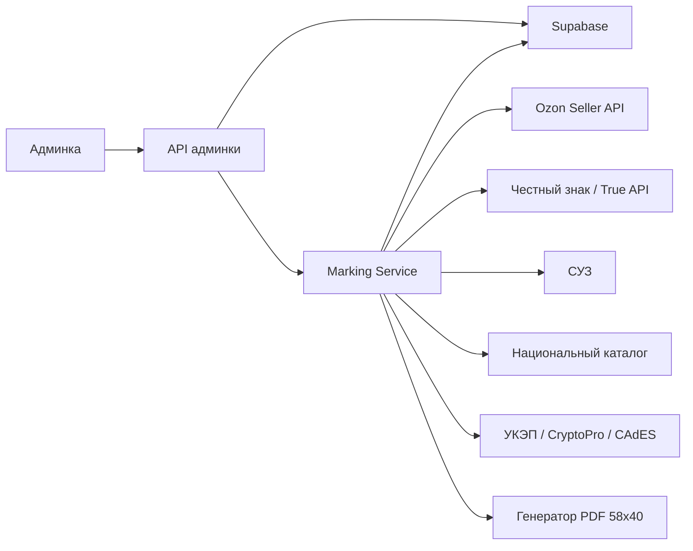
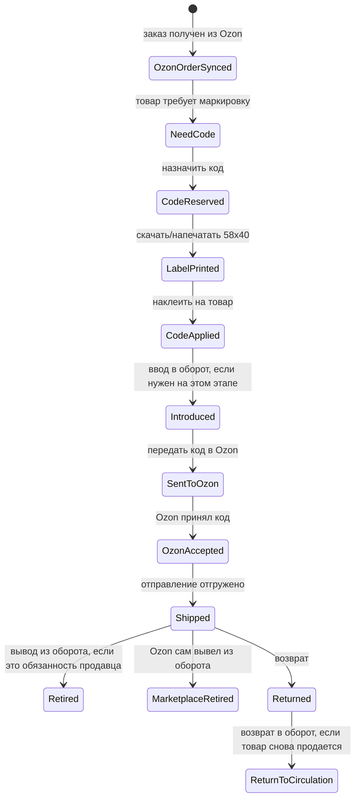

# Интеграция Честного знака для заказов Ozon

Дата: 2026-07-14  
Статус: проектный документ, без реализации в коде

Подробный операционный flow и этапы внедрения описаны отдельно: [FLOW.md](FLOW.md).

## Цель

Сделать в админке удобный раздел для работы с маркировкой товаров легкой промышленности по заказам Ozon:

- видеть заказы Ozon и позиции, которым нужен код маркировки;
- автоматически назначать свободный код маркировки конкретной футболке в заказе;
- скачивать готовую этикетку 58x40 мм со штрихкодом DataMatrix для печати и наклейки на товар;
- передавать код маркировки в Ozon для конкретного товара и отправления;
- контролировать ввод в оборот, передачу кода в Ozon, отгрузку, возвраты и вывод из оборота;
- иметь журнал всех действий, ошибок API и повторных попыток.

## Важные исходные условия

- Продавец зарегистрирован в Национальном каталоге и Честном знаке.
- Есть УКЭП.
- Товары - футболки, то есть товарная группа легкой промышленности.
- У админки уже есть Supabase и каталог товаров.
- У сервера уже есть интеграция с Ozon API или ее можно расширить.
- Точные методы True API, СУЗ и Национального каталога нужно сверять с документацией из личного кабинета Честного знака, потому что часть технической документации доступна только авторизованным участникам оборота.

## Официальные источники, на которые опирается проект

- Честный знак: интеграция учетной системы с системой маркировки по API для легкой промышленности: <https://markirovka.ru/knowledge/tovarnye-gruppy/legkaya-promishlennost/integratsiya-sistemy-markirovki-s-tovarouchetnoy-sistemoy-uchastnika-legprom>
- Честный знак: требования для начала работы, включая УКЭП: <https://markirovka.ru/knowledge/tovarnye-gruppy/legkaya-promishlennost/trebovaniya-dlya-nachala-raboty-v-sisteme-dlya-novykh-subektov-rf-legkaya-promyshlennost>
- Честный знак: добавление товара для заказа кодов маркировки, GTIN: <https://markirovka.ru/knowledge/tovarnye-gruppy/legkaya-promishlennost/kak-dobavit-tovar-opisanie-tovara-v-sistemu-dlya-zakaza-kodov-markirovki-legprom>
- Честный знак: заказ и получение кодов маркировки для легкой промышленности: <https://markirovka.ru/knowledge/tovarnye-gruppy/legkaya-promishlennost/zakaz-i-poluchenie-kodov-markirovki-legprom>
- Честный знак: состав кода маркировки для легкой промышленности: <https://markirovka.ru/knowledge/tovarnye-gruppy/legkaya-promishlennost/sostav-koda-markirovki-legprom>
- Честный знак: требования к DataMatrix, ECC 200: <https://markirovka.ru/knowledge/tovarnye-gruppy/legkaya-promishlennost/kakim-dolzhen-byt-datamatrix-trebovaniya-k-preobrazovaniyu-i-kachestvu-naneseniya-legprom>
- Честный знак: ввод маркированных товаров в оборот: <https://markirovka.ru/knowledge/fast_start/start/vvod-markirovannykh-tovarov-v-oborot-instruktsiya>
- Честный знак: дальнейшие действия после регистрации для розницы и опта, легкая промышленность: <https://markirovka.ru/knowledge/tovarnye-gruppy/legkaya-promishlennost/dalneyshie-deystviya-posle-registratsii-dlya-roznichnykh-i-optovykh-uchastnikov-legkaya-promyshlenno>
- Ozon for dev: изменения методов управления кодами маркировки FBS/rFBS: <https://dev.ozon.ru/news/633-Izmeneniia-v-metodakh-dlia-upravleniia-kodami-markirovki-i-sborkoi-zakazov-dlia-FBS-rFBS/>
- Ozon for dev: FAQ по созданию товаров через API и подготовке к отгрузке: <https://dev.ozon.ru/community/664-FAQ-sozdanie-tovarov-cherez-API-i-podgotovka-k-otgruzke/>

## Ключевая идея

Не делать работу с Честным знаком прямо в браузере или только внутри Next.js API-роутов. Нужен отдельный серверный слой `Marking Service`, который работает рядом с текущим сервером Komui/админки и отвечает за:

- хранение и учет кодов маркировки;
- интеграцию с Честным знаком, СУЗ и Национальным каталогом;
- работу с УКЭП и криптопровайдером;
- генерацию этикеток;
- передачу кодов маркировки в Ozon;
- фоновые проверки статусов и повторные попытки.

Админка должна быть интерфейсом управления, а не местом хранения ключей УКЭП и не местом прямой работы с криптографией.

## Архитектура



### Компоненты

`Admin UI`

- раздел заказов Ozon;
- раздел маркировки;
- ручные действия: назначить код, скачать этикетку, передать в Ozon, проверить статус, вывести из оборота;
- статусы и ошибки по каждой позиции.

`Admin API`

- авторизация пользователя админки;
- проксирование команд в `Marking Service`;
- чтение агрегированных данных из Supabase.

`Marking Service`

- отдельный backend-модуль или сервис;
- имеет доступ к секретам Ozon и Честного знака;
- подписывает документы через УКЭП;
- запускает фоновые задачи;
- обеспечивает идемпотентность действий.

`Supabase`

- хранит товарные связки SKU -> GTIN;
- хранит пул кодов маркировки;
- хранит связь заказа Ozon с кодами;
- хранит журнал событий и статусы документов.

`Signer`

- изолированный модуль для УКЭП;
- лучше держать на сервере, где корректно установлен CryptoPro/CAdES или другой поддерживаемый криптопровайдер;
- приватный ключ не должен попадать в Supabase, frontend, логи или репозиторий.

## Главные сущности в БД

### `marking_gtins`

Связка товара админки, SKU Ozon и GTIN из Национального каталога.

Поля:

- `id`
- `product_id`
- `sku`
- `offer_id`
- `gtin`
- `tnved_code`
- `category`
- `size`
- `color`
- `design_code`
- `national_catalog_card_id`
- `status`
- `created_at`
- `updated_at`

Важно: для маркировки нужно точно понимать, какой GTIN соответствует конкретной модификации товара. Для футболок это обычно отдельная связка на дизайн, цвет и размер.

### `marking_codes`

Пул кодов маркировки.

Поля:

- `id`
- `gtin`
- `full_code_encrypted`
- `identification_code`
- `serial`
- `status`
- `source`
- `suz_order_id`
- `crpt_document_id`
- `assigned_order_id`
- `assigned_order_item_id`
- `assigned_offer_id`
- `printed_at`
- `applied_at`
- `introduced_at`
- `sent_to_ozon_at`
- `retired_at`
- `returned_at`
- `created_at`
- `updated_at`

Статусы:

- `ordered` - код получен или импортирован;
- `printed` - этикетка сформирована или скачана;
- `applied` - код физически нанесен на товар;
- `introduced` - товар введен в оборот;
- `reserved` - код зарезервирован под заказ Ozon;
- `sent_to_ozon` - код передан в Ozon;
- `ozon_accepted` - Ozon принял код;
- `shipped` - отправление отгружено;
- `retired` - код выведен из оборота;
- `returned` - товар вернулся;
- `blocked` - код заблокирован из-за ошибки;
- `void` - код не использовать.

Полный код маркировки содержит криптографическую часть, поэтому хранить его лучше зашифрованным. В открытом виде в таблице можно хранить только технически необходимый минимум: GTIN, серийный номер, статус и последние 4-6 символов для ручной сверки.

### `ozon_postings`

Кэш отправлений Ozon.

Поля:

- `id`
- `posting_number`
- `status`
- `delivery_method`
- `shipment_date`
- `raw_payload`
- `created_at`
- `updated_at`

### `ozon_posting_items`

Позиции внутри отправлений Ozon.

Поля:

- `id`
- `posting_id`
- `posting_number`
- `product_id`
- `offer_id`
- `sku`
- `quantity`
- `requires_marking`
- `gtin`
- `marking_status`
- `raw_payload`
- `created_at`
- `updated_at`

### `ozon_order_item_marking`

Связь конкретной позиции заказа с конкретным кодом маркировки.

Поля:

- `id`
- `posting_item_id`
- `marking_code_id`
- `ozon_exemplar_id`
- `ozon_status`
- `ozon_error`
- `sent_to_ozon_at`
- `created_at`
- `updated_at`

### `crpt_documents`

Все документы, которые отправляются в Честный знак.

Поля:

- `id`
- `type`
- `status`
- `external_document_id`
- `payload_encrypted`
- `signature`
- `error`
- `created_at`
- `sent_at`
- `accepted_at`
- `rejected_at`

Типы:

- заказ кодов;
- ввод в оборот;
- вывод из оборота;
- возврат в оборот;
- корректировка;
- проверка статуса.

### `marking_events`

Журнал аудита.

Поля:

- `id`
- `entity_type`
- `entity_id`
- `event_type`
- `message`
- `payload`
- `actor_user_id`
- `created_at`

Журнал нужен обязательно: маркировка чувствительна к ошибкам, повторной отправке и ручным действиям.

## Основной workflow по заказу Ozon



### Шаг 1. Синхронизация заказов Ozon

Фоновая задача получает новые и необработанные отправления Ozon по API.

Для каждой позиции нужно определить:

- `offer_id`;
- внутренний SKU;
- товар в Supabase;
- нужен ли товару код маркировки;
- какой GTIN соответствует SKU;
- есть ли уже назначенный код.

Если GTIN не найден, позиция получает статус `missing_gtin`, а в админке нужно показать ошибку: "Нужно привязать GTIN".

### Шаг 2. Назначение кода маркировки

Кнопка в админке: `Назначить код`.

Логика:

1. Проверить, что у SKU есть GTIN.
2. Найти свободный код по этому GTIN.
3. Заблокировать код транзакцией, чтобы два заказа не получили один и тот же код.
4. Присвоить код позиции заказа.
5. Записать событие в `marking_events`.

Если свободного кода нет:

- показать кнопку `Заказать коды`;
- либо разрешить временно импортировать коды вручную из файла, выгруженного из Честного знака.

### Шаг 3. Этикетка 58x40 мм

Кнопка в админке: `Скачать этикетку`.

Формат:

- PDF размером 58x40 мм;
- DataMatrix ECC 200;
- человекочитаемый текст: артикул, размер, цвет, номер заказа или отправления;
- при необходимости - короткий хвост кода для ручной сверки;
- поля и размер DataMatrix нужно проверить на реальном принтере этикеток и сканере.

Важно: для DataMatrix нужно кодировать полный код маркировки с корректными служебными разделителями. Нельзя терять GS/FNC1-разделители и нельзя заменять полный код на сокращенный КИ, если для печати требуется полный КМ.

Технически для генерации можно использовать:

- `zint` на сервере;
- `bwip-js`;
- PDF-генератор вроде `pdfkit`;
- отдельный endpoint `GET /api/marking/orders/:posting/items/:item/label.pdf`.

### Шаг 4. Физическое нанесение

После печати сотрудник наклеивает этикетку на футболку.

В админке нужно дать кнопку/чекбокс `Наклеено`, чтобы перевести код в статус `applied`. Это важно, чтобы не считать скачивание PDF фактом нанесения.

### Шаг 5. Ввод в оборот

Для товара, произведенного в РФ, ввод в оборот обычно делает собственник/производитель после нанесения средства идентификации. В реализации нужно сделать отдельный шаг:

- автоматический ввод в оборот после `applied`;
- либо ручная кнопка `Ввести в оборот`;
- либо пакетная операция по нескольким кодам.

Перед реализацией нужно подтвердить точный сценарий в личном кабинете Честного знака:

- какой тип документа нужен для твоего случая;
- какие поля требуются для футболок;
- нужна ли привязка к разрешительной документации;
- какой порядок для товаров, которые уже были произведены до внедрения автоматизации.

### Шаг 6. Передача кода в Ozon

Кнопка в админке: `Передать в Ozon`.

По актуальным публичным материалам Ozon для FBS/rFBS используются методы управления экземплярами:

- `/v6/fbs/posting/product/exemplar/create-or-get` - получить или создать экземпляры;
- `/v6/fbs/posting/product/exemplar/set` - проверить и сохранить данные экземпляров;
- `/v5/fbs/posting/product/exemplar/status` - проверить статус добавления;
- `/v5/fbs/posting/product/exemplar/validate` - валидация кодов маркировки.

Точный payload нужно сверить с текущей документацией Seller API в момент реализации. Старые версии методов Ozon уже устаревали, поэтому нельзя завязываться на старые `/v4` и `/v5`, если Ozon требует `/v6`.

Логика передачи:

1. Получить экземпляры по отправлению.
2. Сопоставить позицию заказа и код маркировки.
3. Отправить код маркировки в Ozon.
4. Сохранить `exemplar_id`, статус и ответ Ozon.
5. Запустить повторную проверку статуса.
6. Если Ozon отклонил код, перевести позицию в `ozon_rejected` и показать причину.

### Шаг 7. Отгрузка

Перед отгрузкой админка должна показывать чеклист по отправлению:

- все позиции требуют маркировку или нет;
- у каждой маркируемой позиции есть код;
- этикетка скачана;
- код отмечен как нанесенный;
- код передан в Ozon;
- Ozon принял код;
- нет ошибок GTIN или статуса Честного знака.

Если что-то не готово, отправление лучше подсвечивать красным и не давать сотруднику случайно пропустить маркировку.

## Вывод из оборота

Это самый важный момент, который нельзя автоматизировать вслепую. Нужно выяснить, кто именно в твоей схеме обязан выводить код из оборота:

- Ozon как маркетплейс/агент после продажи;
- ты как продавец;
- оба процесса частично участвуют, но один из них является юридически значимым.

### Рекомендуемый подход

В системе нужно сделать настройку:

```text
retirement_owner = ozon | seller | manual
```

`ozon`

- после доставки заказа сервис проверяет статус кода в Честном знаке;
- если код уже выведен из оборота, просто фиксируем событие;
- если не выведен, показываем предупреждение, но не создаем дублирующий документ без ручного подтверждения.

`seller`

- после статуса доставки создается документ вывода из оборота в Честном знаке;
- документ подписывается УКЭП;
- статус документа отслеживается до принятия или отклонения.

`manual`

- админка показывает, что код нужно вывести из оборота;
- пользователь сам нажимает кнопку после проверки заказа.

Для первой версии лучше сделать `manual` или `ozon + проверка статуса`, пока не будет точно подтверждена роль Ozon по выводу из оборота в твоем договоре и схеме продаж.

### Возвраты

Нужен отдельный сценарий возврата:

- заказ вернулся;
- физически проверили товар и этикетку;
- код читается;
- товар можно снова продавать;
- если код был выведен из оборота, оформить возврат в оборот;
- если товар испорчен, код остается закрытым, товар не возвращается в продажу.

В админке для возврата нужны статусы:

- `return_pending`;
- `returned_received`;
- `code_readable`;
- `return_to_circulation_required`;
- `returned_to_circulation`;
- `write_off`.

## Раздел в админке

### Страница "Маркировка / Заказы"

Таблица отправлений:

- номер отправления Ozon;
- дата отгрузки;
- статус Ozon;
- количество товаров;
- сколько товаров требует маркировку;
- статус готовности;
- ошибки.

Фильтры:

- новые;
- без GTIN;
- без кода;
- код назначен, но не передан в Ozon;
- Ozon отклонил код;
- готово к отгрузке;
- требуется вывод из оборота;
- возвраты.

### Карточка отправления

Для каждой позиции:

- фото товара;
- название;
- offer_id;
- размер;
- GTIN;
- назначенный код;
- статус кода;
- статус Ozon;
- кнопки действий.

Кнопки:

- `Назначить код`;
- `Скачать 58x40`;
- `Наклеено`;
- `Ввести в оборот`;
- `Передать в Ozon`;
- `Проверить статус`;
- `Вывести из оборота`;
- `Вернуть в оборот`.

### Страница "Пул кодов"

Нужно видеть:

- сколько свободных кодов по каждому GTIN;
- сколько кодов зарезервировано;
- сколько кодов с ошибками;
- минимальный остаток кодов;
- кнопку заказа новых кодов;
- импорт кодов из файла для первого этапа.

### Страница "GTIN"

Нужно управлять связками:

- SKU админки;
- offer_id Ozon;
- размер;
- цвет;
- дизайн;
- GTIN;
- статус карточки в Национальном каталоге.

Если GTIN отсутствует, товар нельзя автоматически маркировать.

## API админки

Черновой набор endpoint-ов:

```text
POST /api/marking/ozon/sync-orders
GET  /api/marking/orders
GET  /api/marking/orders/:postingNumber
POST /api/marking/orders/:postingNumber/items/:itemId/assign-code
POST /api/marking/orders/:postingNumber/items/:itemId/mark-applied
GET  /api/marking/orders/:postingNumber/items/:itemId/label.pdf
POST /api/marking/orders/:postingNumber/send-to-ozon
POST /api/marking/orders/:postingNumber/check-ozon-status
POST /api/marking/codes/order
POST /api/marking/codes/import
GET  /api/marking/codes/pool
POST /api/marking/crpt/introduce
POST /api/marking/crpt/retire
POST /api/marking/crpt/return-to-circulation
```

Все изменяющие endpoint-ы должны быть идемпотентными. Повторное нажатие на кнопку не должно назначать второй код, повторно выводить код из оборота или отправлять в Ozon конфликтующие данные.

## Автоматизация

Фоновые задачи:

- каждые 5-10 минут синхронизировать новые Ozon отправления;
- проверять статусы отправки кодов в Ozon;
- проверять статусы документов Честного знака;
- мониторить минимальный остаток кодов по GTIN;
- после доставки проверять необходимость вывода из оборота;
- отдельно обрабатывать возвраты.

Правила автоматизации лучше сделать настраиваемыми:

- автоматически назначать код при появлении заказа;
- автоматически генерировать этикетку или только по кнопке;
- автоматически передавать код в Ozon после отметки `Наклеено`;
- автоматически вводить в оборот после `Наклеено`;
- автоматически выводить из оборота после доставки.

Для первой версии лучше включать автоматику постепенно. Самый безопасный старт:

1. ручное назначение кода;
2. ручная печать этикетки;
3. ручная отметка `Наклеено`;
4. ручная передача в Ozon;
5. фоновая проверка статусов.

После стабильной работы можно включать автоматическое назначение и передачу.

## Работа с кодами маркировки

### Вариант 1. Первый быстрый этап: импорт кодов вручную

Пока не реализована полная интеграция СУЗ:

1. Заказывать коды в личном кабинете Честного знака.
2. Выгружать их в файл.
3. Загружать файл в админку.
4. Админка раскладывает коды по GTIN.
5. Дальше весь процесс по заказам уже автоматизируется.

Плюс: быстрее запустить.  
Минус: часть работы остается ручной.

### Вариант 2. Полная интеграция СУЗ

Сервис сам:

1. отслеживает остаток свободных кодов;
2. создает заказ кодов по GTIN;
3. получает коды;
4. сохраняет их в пул;
5. запускает печать и дальнейшие документы.

Плюс: почти полная автоматизация.  
Минус: нужно аккуратно реализовать подписание, статусы, ошибки и лимиты.

## Безопасность

Обязательные правила:

- не хранить приватный ключ УКЭП в репозитории;
- не передавать полный код маркировки на frontend без необходимости;
- не писать полный код маркировки в обычные логи;
- шифровать полный код маркировки в БД;
- ограничить доступ к разделу маркировки отдельной ролью админки;
- вести журнал действий пользователя;
- добавлять идемпотентные ключи ко всем внешним операциям;
- хранить ответы Честного знака и Ozon для разбора спорных ситуаций.

## Ошибки и повторные попытки

Типовые ошибки:

- нет GTIN у SKU;
- нет свободных кодов по GTIN;
- код уже назначен другому заказу;
- код не введен в оборот;
- Ozon отклонил код;
- Честный знак отклонил документ;
- подпись УКЭП не сформировалась;
- API временно недоступен;
- заказ отменен после назначения кода.

Для каждой ошибки нужен понятный статус и действие:

- `missing_gtin` -> заполнить GTIN;
- `no_free_codes` -> заказать или импортировать коды;
- `ozon_rejected` -> посмотреть текст ошибки и заменить код;
- `crpt_rejected` -> открыть документ и исправить payload;
- `order_cancelled` -> освободить код, если он еще не напечатан/не введен в оборот, или перевести в отдельный ручной сценарий.

## Этапы реализации

### Этап 0. Юридическое и API-уточнение

Что нужно получить до разработки:

- актуальную документацию True API из личного кабинета Честного знака;
- актуальную документацию СУЗ API;
- актуальную документацию API Национального каталога;
- подтверждение схемы Ozon: FBS, rFBS или FBO;
- подтверждение, кто выводит код из оборота при продаже через Ozon;
- тестовый контур или тестовые данные, если доступны.

Результат этапа: финальная схема статусов и список точных методов.

### Этап 1. Данные и GTIN

Реализовать:

- таблицы `marking_gtins`, `marking_codes`, `ozon_postings`, `ozon_posting_items`, `ozon_order_item_marking`, `crpt_documents`, `marking_events`;
- раздел админки для GTIN;
- импорт GTIN из CSV;
- проверку, что каждый Ozon SKU, требующий маркировку, имеет GTIN.

Результат этапа: админка видит, какие товары готовы к маркировке, а какие нет.

### Этап 2. Пул кодов и этикетка

Реализовать:

- импорт кодов из файла;
- назначение кода позиции заказа;
- генерацию PDF 58x40 мм;
- статусы `reserved`, `printed`, `applied`;
- журнал событий.

Результат этапа: можно вручную назначить код заказу и напечатать этикетку.

### Этап 3. Передача в Ozon

Реализовать:

- получение экземпляров отправления;
- передачу кода маркировки в Ozon;
- проверку статуса;
- обработку ошибок;
- чеклист готовности отправления.

Результат этапа: код не только напечатан, но и передан в Ozon по конкретному заказу.

### Этап 4. Интеграция Честного знака

Реализовать:

- серверную работу с УКЭП;
- создание и отправку документов;
- ввод в оборот;
- проверку статусов;
- хранение подписанных документов и ошибок.

Результат этапа: цикл маркировки закрывается не только в Ozon, но и в Честном знаке.

### Этап 5. СУЗ и автоматический заказ кодов

Реализовать:

- заказ кодов по GTIN;
- получение кодов;
- мониторинг минимального остатка кодов;
- автоматический дозапрос кодов;
- алерты при ошибках.

Результат этапа: не нужно вручную выгружать коды из личного кабинета.

### Этап 6. Вывод из оборота и возвраты

Реализовать:

- настройку `retirement_owner`;
- проверку статуса кода после доставки;
- документ вывода из оборота, если это ответственность продавца;
- сценарий возврата в оборот;
- отдельный журнал возвратов.

Результат этапа: система корректно закрывает жизненный цикл кода.

## Минимальная первая версия

Самый практичный первый релиз:

- GTIN-маппинг для всех футболок;
- импорт кодов маркировки из файла;
- список новых заказов Ozon;
- назначение кода вручную;
- PDF 58x40 мм;
- отметка `Наклеено`;
- передача кода в Ozon;
- проверка статуса Ozon;
- журнал событий.

Что не включать в первый релиз:

- автоматический заказ кодов в СУЗ;
- автоматический ввод в оборот;
- автоматический вывод из оборота;
- автоматическую обработку возвратов.

Такой порядок снижает риск: сначала закрывается ежедневная операционная боль по заказам и этикеткам, потом добавляется более сложная юридически значимая автоматизация.

## Открытые вопросы

Перед реализацией нужно подтвердить:

1. Какая схема продаж Ozon используется для маркируемых футболок: FBS, rFBS или FBO.
2. Кто юридически выводит код из оборота после продажи через Ozon.
3. Есть ли у каждого размера/цвета/дизайна свой GTIN в Национальном каталоге.
4. Нужно ли вводить в оборот коды до передачи в Ozon или достаточно другого статуса по конкретному сценарию.
5. Где будет установлен криптопровайдер для УКЭП.
6. Можно ли использовать тестовый контур Честного знака и Ozon для проверки.
7. Какой принтер этикеток используется и какое реальное разрешение печати.

## Критерии готовности

Интеграция считается готовой, когда:

- новый заказ Ozon появляется в админке;
- по каждой футболке виден GTIN;
- код маркировки назначается без риска дубля;
- этикетка 58x40 мм сканируется корректно;
- код успешно передается в Ozon;
- статус Ozon сохраняется в БД;
- все ошибки видны в админке;
- каждое действие записано в журнал;
- возврат и вывод из оборота не приводят к повторному или ошибочному закрытию кода.
