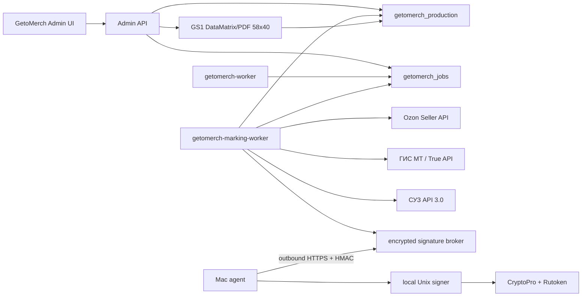

# Честный знак в GetoMerch Admin

Дата актуализации: 14 августа 2026 года.
Статус: этапы 0-13 реализованы; production-блок 2 завершен. Этап 9 прошёл
физическую УКЭП-подпись и auth-only canary в production read-only contour.
В production импортировано 12 реальных КМ, один КМ назначен активному
FBS-заказу и проверен в этикетке 58x40. Первый canary ввода в оборот отклонён
ГИС МТ из-за отсутствующих реквизитов документа соответствия; этот заказ не
считается успешным end-to-end canary. Все внешние write-операции маркировки
снова выключены.

Канонический технический и операционный документ:
[FLOW.md](FLOW.md).

Подробный поэтапный план разработки и production-внедрения:
[IMPLEMENTATION_PLAN.md](IMPLEMENTATION_PLAN.md).

Фактические артефакты завершенных этапов:

- [stage-0/README.md](stage-0/README.md);
- [stage-1/README.md](stage-1/README.md);
- [stage-2/README.md](stage-2/README.md);
- [stage-3/README.md](stage-3/README.md);
- [stage-4/README.md](stage-4/README.md);
- [stage-5/README.md](stage-5/README.md);
- [stage-6/README.md](stage-6/README.md);
- [stage-7/README.md](stage-7/README.md);
- [stage-8/README.md](stage-8/README.md);
- [stage-9/README.md](stage-9/README.md).
- [stage-10/README.md](stage-10/README.md).
- [stage-11/README.md](stage-11/README.md).
- [stage-12/README.md](stage-12/README.md).
- [stage-13/README.md](stage-13/README.md).

## 1. Цель

Добавить в production-админку `admin.komui.ru` управляемый процесс работы с
маркировкой товаров легкой промышленности:

- хранить проверенные связи варианта товара с GTIN;
- отдельно учитывать КМ, физическую единицу товара и назначение этой единицы
  заказу;
- заранее поддерживать пул выпущенных КМ по GTIN: сначала через защищенный
  импорт, позднее через СУЗ API;
- печатать и повторно печатать этикетку 58x40 мм с GS1 DataMatrix;
- назначать один КМ одной физической единице заказа без риска дубля;
- передавать экземпляры в Ozon FBS и проверять итоговый статус;
- оформлять ввод, вывод, возврат в оборот и перемаркировку через ГИС МТ;
- обрабатывать отмены, возвраты и переход FBS-возврата на FBO;
- показывать весь жизненный цикл КМ во вкладке `Честный знак`;
- сохранить архитектурную возможность подключить заказы KOMUI к тому же
  marking core.

## 2. Что является источником истины

Production-источник данных админки с 17 июля 2026 года:

```text
PostgreSQL database: getomerch_production
Application:         /opt/getomerch/current
Web service:         getomerch-admin.service
Background worker:   getomerch-worker.service
Domain:              https://admin.komui.ru
```

Supabase не является рабочей БД и не должен использоваться новым marking
контуром ни для чтения, ни для записи. Он остается только замороженным
архивным источником периода миграции.

Новые бизнес-таблицы создаются forward-only миграциями в `db/migrations` и
получают префикс `merch_marking_`. Фоновые задачи используют существующую
durable queue в приватной схеме `getomerch_jobs`, аудит команд —
`getomerch_audit`.

## 3. Зафиксированные архитектурные решения

1. **КМ и физическая единица не являются одной записью.** Активная связь между
   ними один-к-одному, но история старого и нового КМ сохраняется при
   перемаркировке. Строка заказа с `quantity=3` требует три физических единицы,
   три активных КМ и три экземпляра Ozon.
2. **Маркировка связывается с generic fulfillment item**, а не только с
   `merch_ozon_order_items`. Минимальный fulfillment layer является
   обязательным предварительным этапом.
3. **Ozon FBS и KOMUI используют общий marking core**, но разные source
   adapters.
4. **Ozon FBO не создает fulfillment и не резервирует внутренний склад.** Его
   маркировка относится к поставке товара агенту/Ozon, а не к последующей
   продаже со склада Ozon.
5. **Физическое, внутреннее, CRPT- и Ozon-состояния не объединяются в один
   enum.** `printed`, `in_circulation` и `ozon_accepted` — разные факты.
6. **Полный КМ хранится только зашифрованным.** Он не попадает в frontend JSON,
   URL, обычные логи, события аналитики или нешифрованные backup-артефакты.
7. **PDF не является источником истины.** Он детерминированно строится по
   активной связи физической единицы с КМ, а повторная печать не создает новый
   код.
8. **Все внешние мутации идемпотентны и асинхронны.** HTTP 200/202 от Ozon или
   ГИС МТ не считается финальным принятием; worker опрашивает статус.
9. **После генерации доступной пользователю этикетки КМ автоматически не
   возвращается в свободный пул.** При отмене до генерации PDF код можно
   освободить; после генерации, но до нанесения он уходит в карантин до
   подтверждения уничтожения всех копий; после нанесения КМ остается связан с
   изготовленной физической единицей.
10. **Приватный ключ УКЭП не доступен Next.js и основному worker.** Подпись
    выполняет изолированный foreground signer на Mac через CryptoPro и
    Рутокен; Mac сам подключается к VPS, входящий порт не открывается.

## 4. Зафиксированная модель GetoMerch FBS

Нельзя исходить из того, что для каждой футболки всегда нужно выпустить новый
КМ после получения заказа.

Официальные материалы Честного знака различают как минимум три сценария:

| Сценарий | Базовое действие |
|---|---|
| GetoMerch производит готовую футболку из немаркированной заготовки | собственный GTIN, получение КМ, автоматический отчет СУЗ для `lp`, физическое нанесение и ввод в оборот |
| Куплена уже маркированная футболка, нанесен несущественный принт/вышивка, основные атрибуты не меняются | исходный КМ может сохраняться; новая маркировка не требуется |
| После доработки меняются атрибуты карточки, например артикул, производитель или цвет | старый КМ закрывается по применимому основанию, изделие перемаркируется новым КМ |

Для фактических товаров GetoMerch этот выбор должен быть подтвержден по
карточкам Национального каталога и реальной модели производства. Он определяет
GTIN, тип эмиссии и документы ГИС МТ. РД не блокирует подготовительные этапы
до нанесения КМ, но проверенные вид, номер и дата документа обязательны перед
созданием `LP_INTRODUCE_GOODS`.

Для фактической модели собственного производства GetoMerch основной режим
проекта называется `jit_after_order`: заказ Ozon FBS запускает изготовление
конкретной единицы, а маркировка завершается до передачи товара Ozon.
Это архитектурное и операционное решение проекта. Оно не зависит от переписки
со службой поддержки, а такая переписка не является требованием, evidence,
production gate или источником бизнес-правил интеграции.

Штатная последовательность:

```text
заказ Ozon
  -> резерв выпущенного КМ нужного GTIN
  -> изготовление конкретной физической единицы
  -> печать и нанесение КМ
  -> проверка ранее принятого автоматического отчета СУЗ
  -> LP_INTRODUCE_GOODS
  -> подтверждение ГИС МТ
  -> передача КМ в Ozon и подтверждение Ozon
  -> фактическая передача товара Ozon
```

Готовность этого flow определяется актуальными официальными контрактами
ГИС МТ, СУЗ и Ozon, карточкой НК/GTIN и успешной end-to-end проверкой.
Отсутствие РД и диагностические флаги НК не блокируют readiness, заказ КМ,
назначение, печать и нанесение. Ввод в оборот без проверенных реквизитов РД
блокируется локально до внешней записи.
Интеграция не отменяет фактическое нанесение СИ, принятый ввод в оборот и
принятие экземпляра Ozon до отгрузки.

Остаток `100` на Ozon и постоянное `в наличии` на KOMUI являются коммерческой
настройкой, а не доказательством наличия ста готовых промаркированных изделий.
При `jit_after_order` заранее произведенный маркированный остаток не нужен.
Нужно поддерживать достаточный пул выпущенных КМ по GTIN, материалы и
производственную мощность в пределах срока сборки Ozon. Коммерческий остаток
не синхронизируется автоматически с количеством КМ или готовых единиц.

## 5. Разделение FBS, FBO и KOMUI

### Ozon FBS

- заказ Ozon запускает изготовление и маркировку конкретной единицы;
- система резервирует выпущенный КМ нужного GTIN, но не отправляет его во
  внешние системы до подтвержденного физического нанесения;
- после действия `КМ нанесен` worker оформляет требуемые документы ГИС МТ и
  дожидается принятого ввода в оборот;
- Ozon сообщает, для каких SKU обязательна или возможна передача маркировки;
- после готовности ГИС МТ GetoMerch передает КМ через exemplar API;
- Ozon должен подтвердить проверку экземпляра до отгрузки;
- собственник оформляет дистанционный вывод из оборота после отгрузки со
  склада, не позднее трех рабочих дней после нее и до фактической доставки;
- с 1 марта 2026 года документ также требует КПП и идентификатор места
  осуществления деятельности/ФИАС;
- при невыкупе или возврате после FBS-отгрузки принятый вывод связывается с
  одним документом возврата КМ в оборот;
- если товар возвращается GetoMerch, внутренний остаток восстанавливается
  только при фактической приемке;
- если товар остается у Ozon для FBO, внутреннего прихода нет: после возврата
  КМ в оборот этот же КМ передается Ozon как агенту через применимый УПД/ЭДО;
  дальнейший вывод при FBO-продаже выполняет Ozon.

### Ozon FBO

- FBO-продажа не появляется в операционной очереди GetoMerch;
- товар передается Ozon как агенту через применимый ЭДО/УПД-процесс;
- дальнейший вывод при продаже выполняет маркетплейс в своей роли;
- отдельный FBO supply adapter проектируется позже.

### KOMUI

- сайт и `komui_production` остаются отдельной системой;
- GetoMerch не пишет SQL в БД KOMUI;
- после появления generic fulfillment оплаченный заказ KOMUI получает КМ тем
  же core-процессом;
- режим маркировки для KOMUI задается отдельной channel configuration и
  проверяется по актуальным официальным контрактам соответствующего канала;
- передача статусов выполняется только через защищенный API/события KOMUI.

## 6. Целевая серверная схема



Marking domain остается в этом репозитории. Подпись выполняется локальным
signer на Mac с Рутокеном; Mac сам подключается к зашифрованному broker на VPS.
Приватный ключ и PIN не попадают в web/worker process.

## 7. Планируемые сущности

Core:

```text
merch_marking_trade_items
merch_marking_trade_item_documents
merch_marking_product_profiles
merch_marking_locations
merch_marking_import_batches
merch_marking_import_rows
merch_marking_codes
merch_marking_units
merch_marking_code_bindings
merch_marking_assignments
merch_marking_ozon_submission_batches
merch_marking_ozon_submissions
merch_marking_documents
merch_marking_document_codes
merch_marking_document_confirmations
merch_marking_processes
merch_marking_evidence
merch_marking_events
merch_marking_return_cases
```

После подключения СУЗ:

```text
merch_marking_code_orders
merch_marking_code_order_items
```

Подробные поля, constraints, индексы и state machines описаны в
[FLOW.md](FLOW.md).

## 8. Что появится в интерфейсе

Раздел `Честный знак`:

- `Требуют действия` — единая рабочая очередь;
- `Заказы FBS` — готовность отправлений и экземпляров Ozon;
- `Коды` — пул по GTIN без показа полного КМ;
- `Единицы` — provisional и готовые физические единицы, их КМ, склад и
  физический статус;
- `Товары и GTIN` — readiness вариантов;
- `Документы` — ввод, вывод, возврат и перемаркировка;
- `Возвраты / FBO` — отдельные кейсы переходов;
- `Ошибки` — ручной разбор;
- `История` — движения и аудит.

В карточке заказа действия выполняются на уровне каждой физической единицы.
Для основного `jit_after_order` flow там доступна первичная печать:

```text
Зарезервировать КМ
Скачать КМ 58x40
КМ нанесен
Проверить ГИС МТ
Передать в Ozon
Проверить Ozon
Открыть процесс возврата
```

## 9. Рекомендуемый порядок внедрения

1. Проверить производственную модель, GTIN и актуальные API-контракты из
   личных кабинетов; получить реквизиты применимого РД до ввода в оборот.
2. Подготовить encrypted broker на VPS и outbound-only signer/relay на Mac.
3. Реализовать минимальный generic fulfillment для Ozon FBS.
4. Добавить trade items НК/GTIN, product profiles, реквизиты РД для документа
   ввода в оборот и расхождения с Ozon.
5. Добавить защищенный пул КМ, создаваемые из FBS-заказа физические единицы,
   связь КМ с единицей и этикетку 58x40 без внешних CRPT-мутаций.
6. Реализовать exemplar adapter Ozon под выключенным write feature flag.
7. Подключить signer и True API: статус, ввод, вывод и возврат; затем провести
   совместный Ozon/ГИС МТ canary.
8. Добавить возвраты и контролируемый FBS -> FBO flow.
9. Подключить СУЗ API и автоматический заказ/получение КМ.
10. После периода наблюдения включать безопасную автоматику и KOMUI adapter.

## 10. Что требуется от владельца до первого этапа

- выгрузка карточек Национального каталога и GTIN по каждому размеру/цвету;
- коды ТН ВЭД/ОКПД2; РД можно добавить после настройки профиля и КМ, но до
  первой отправки `LP_INTRODUCE_GOODS`;
- описание происхождения заготовок и фактического производственного процесса;
- актуальные PDF/OpenAPI True API, СУЗ API 3.0 и Национального каталога из ЛК;
- один пример файла с КМ без публикации его содержимого в Git;
- один реальный FBS posting, для которого Ozon требует маркировку;
- пример возврата FBS, оставленного Ozon для FBO;
- тип носителя УКЭП, экспортируемость контейнера и доступный криптопровайдер;
- модель принтера и DPI;
- КПП и идентификатор МОД/ФИАС места отгрузки;
- минимальный резерв КМ по каждому GTIN и фактический срок изготовления,
  достаточный для SLA сборки Ozon.

## 11. Текущий статус реализации

На 14 августа 2026 года:

- этапы 0 и 1 завершены с внешними feature flags off;
- generic fulfillment и append-only source events этапа 2 реализованы;
- marking core, process state machine, evidence и append-only marking events
  этапа 3 реализованы;
- product readiness, проверяемые GTIN profiles, отчет конфликтов и безопасный
  preview/apply backfill этапа 4 реализованы;
- production reconciliation этапа 4 применен к 138 актуальным Ozon-футболкам:
  все 138 profiles verified/enabled/ready, draft/blocked/conflicts равны нулю;
  семь D26/D27 опубликованы, optional-сигнал Ozon учитывается, а terminal
  posting не блокируют актуальный профиль;
- зашифрованный AES-256-GCM пул КМ, HMAC-дедупликация, двухфазный
  streaming-импорт, карантин и TTL-очистка этапа 5 реализованы;
- физические единицы, назначения unit slots, конкурентный резерв КМ,
  отмены/reconciliation и атомарная JIT-операция склада этапа 6 реализованы;
- защищенный генератор GS1 DataMatrix/PDF 58x40, повторная печать того же КМ,
  render events и FBS-действия этапа 7 реализованы;
- revisioned Ozon submission batches, строгий exemplar adapter, durable
  validate/set/status jobs, защита от слепого повторного `set` и вкладка Ozon
  этапа 8 реализованы;
- isolated signer, outbound-only Mac agent, True API auth и read-only проверки
  КМ/документов этапа 9 реализованы;
- revisioned `LP_INTRODUCE_GOODS`, encrypted payload/signature, detached
  CAdES-BES, create/poll jobs, отдельное подтверждение `in_circulation` и
  ручные задачи этапа 10 реализованы;
- server-side shipping gate, явный physical handover, revisioned
  `LK_RECEIPT/DISTANCE`, encrypted submit/poll pipeline, deadline и запрет
  складского отката после передачи этапа 11 реализованы;
- versioned Ozon return cases, `LP_RETURN/REMOTE_SALE_RETURN`, физическая
  приёмка продавцом и FBS -> FBO custody без внутреннего прихода этапа 12
  реализованы;
- per-GTIN forecast, ручные draft/approval, signed SUZ order, безопасное
  получение блоков и выпуск в пул только после успешного `REPORT_UTILIZE`
  этапа 13 реализованы;
- Ozon FBS sync сохраняет нормализованные marking signals и стабильные
  source item keys;
- Ozon FBO не создает fulfillment и не затрагивает внутренний склад;
- в заказах есть read-only диагностика fulfillment и marking requirement;
- раздел `Честный знак` показывает все товары и поддерживает редактирование
  profiles, подтверждение GTIN/evidence, конфликты и backfill;
- migration rehearsal и isolated DB lifecycle tests прошли до production
  deployment;
- миграции `0005`-`0020` применены к `getomerch_production`; hardening
  `0021` подготовлен к deployment с выключенными внешними write-флагами;
- создано 52 внутренних fulfillment для существующих Ozon FBS item; Ozon FBO
  не создает fulfillment и не затрагивает внутренний склад;
- `getomerch-marking-worker.service` и периодическая очистка импортов
  развернуты, а все внешние marking write flags оставлены выключенными;
- после rollout создана и проверена зашифрованная резервная копия с успешной
  off-site загрузкой;
- первый production-пилот СУЗ завершен для GTIN `04628837736075`: заказаны,
  подписаны УКЭП и выданы 5 КМ, автоматически сформированный отчет о нанесении
  обработан успешно `5 из 5`; PDF содержит пять этикеток приблизительно
  `57,86 x 39,86 мм`, все DataMatrix декодируются и уникальны;
- те же 5 КМ прошли штатный preview/apply без дублей и отказов и хранятся в
  защищенном пуле как `available + emitted`; ручной import-флаг после операции
  снова выключен, временные plaintext-файлы удалены;
- для семи актуальных FBS-позиций дополнительно выпущены и импортированы
  7 КМ по шести GTIN: применено 7, дублей и отказов 0;
- один КМ назначен заказу `D16-TSH-PRT-WGRY-XL`, а реальная этикетка
  `getomerch-58x40-v1` повторно декодирована и точно совпала с КМ СУЗ;
- остальные шесть КМ оставлены свободными до внесения фактических заготовок и
  недостающего принта D16 в складской учет;
- этикетка физически напечатана и нанесена, после чего товар передан Ozon;
  реальный `LP_INTRODUCE_GOODS` был подписан УКЭП и отправлен, но отклонён
  из-за отсутствующих реквизитов РД. КМ не получил подтверждённый статус
  `in_circulation` и не был принят Ozon как exemplar, поэтому операция
  оформлена как инцидент и не считается успешным end-to-end canary;
- реальный сертификат и Рутокен проверены через CryptoPro; attached CAdES-BES
  и production True API auth прошли, unified token получался только в памяти
  worker.

Подробный отчет production-блока 2:
[BLOCK_2_PRODUCTION_ROLLOUT_2026-08-10.md](BLOCK_2_PRODUCTION_ROLLOUT_2026-08-10.md).
Фактическая сверка SKU--GTIN этапа 4:
[stage-4/PRODUCTION_RECONCILIATION_2026-08-10.md](stage-4/PRODUCTION_RECONCILIATION_2026-08-10.md).
Фактический выпуск и импорт пяти КМ:
[stage-5/PRODUCTION_PILOT_IMPORT_2026-08-13.md](stage-5/PRODUCTION_PILOT_IMPORT_2026-08-13.md).
Выпуск КМ для актуальных FBS-заказов, JIT-назначение и этикеточный canary:
[stage-7/PRODUCTION_ACTIVE_ORDER_CANARY_2026-08-13.md](stage-7/PRODUCTION_ACTIVE_ORDER_CANARY_2026-08-13.md).
Инцидент первого ввода в оборот и меры hardening:
[stage-10/PRODUCTION_CANARY_2026-08-14.md](stage-10/PRODUCTION_CANARY_2026-08-14.md).

Фактические границы этапа 9, Mac-агента и ввода в оборот приведены в
[stage-9/README.md](stage-9/README.md) и
[stage-9/MAC_AGENT.md](stage-9/MAC_AGENT.md), а также в
[stage-10/README.md](stage-10/README.md) и
[stage-11/README.md](stage-11/README.md) и
[stage-12/README.md](stage-12/README.md) и
[stage-13/README.md](stage-13/README.md). Следующий этап разработки: общий
reconciliation, hardening и поэтапный rollout (этап 14). Production rollout
этапов 10-13 всё ещё требует одного подтверждённого `in_circulation` КМ и
вручную сверенных дистанционного вывода и возврата в оборот; signer auth gate
этапа 9 закрыт.

## 12. Официальные источники

Проверено 22 июля 2026 года:

- [Дистанционная торговля на маркетплейсах: FBO/FBS](https://markirovka.ru/knowledge/tovarnye-gruppy/legkaya-promishlennost/distantsionnaya-torgovlya-na-marketpleysakh-skhemy-fbo-fbs-dbs-legprom)
- [Онлайн-торговля и дистанционный вывод из оборота](https://markirovka.ru/knowledge/tovarnye-gruppy/legkaya-promishlennost/onlayn-torgovlya-internet-magazin-vyvod-iz-oborota-legprom)
- [Возврат товара, отгруженного маркетплейсу](https://markirovka.ru/knowledge/tovarnye-gruppy/legkaya-promishlennost/kak-osushchestvit-vozvrat-tovara-kotoryy-byl-otgruzhen-marketpleysu)
- [Ввод товара в оборот](https://markirovka.ru/knowledge/tovarnye-gruppy/legkaya-promishlennost/vvod-tovara-v-oborot-legprom)
- [Когда нужно вводить товар в оборот](https://markirovka.ru/knowledge/tovarnye-gruppy/legkaya-promishlennost/kogda-nuzhno-vvodit-tovar-v-oborot-legprom)
- [Кастомизация и необходимость перемаркировки](https://markirovka.ru/knowledge/tovarnye-gruppy/legkaya-promishlennost/nuzhna-li-peremarkirovka-pri-izmenenii-kharakteristik-tovara-kastomizatsiya-tovarov-legprom)
- [GTIN и карточки Национального каталога](https://markirovka.ru/knowledge/tovarnye-gruppy/legkaya-promishlennost/skolko-dolzhno-byt-kartochek-tovarov-dlya-neskolkikh-tsvetov-i-razmerov)
- [Заказ и получение КМ](https://markirovka.ru/knowledge/tovarnye-gruppy/legkaya-promishlennost/zakaz-i-poluchenie-kodov-markirovki-legprom)
- [Состав КМ](https://markirovka.ru/knowledge/tovarnye-gruppy/legkaya-promishlennost/sostav-koda-markirovki-legprom)
- [Размеры DataMatrix](https://markirovka.ru/knowledge/tovarnye-gruppy/legkaya-promishlennost/kakovy-minimalnye-i-rekomenduemye-razmery-sredstv-identifikatsii-s-kodom-data-matrix-legprom)
- [Ozon Seller API](https://docs.ozon.ru/api/seller/)
- [Официальные уведомления Ozon Seller API](https://t.me/s/OzonSellerAPI)

Точные endpoint contracts True API, СУЗ и Национального каталога должны быть
зафиксированы по документам из авторизованного ЛК непосредственно перед
реализацией. Публичные статьи не заменяют эти контракты.
