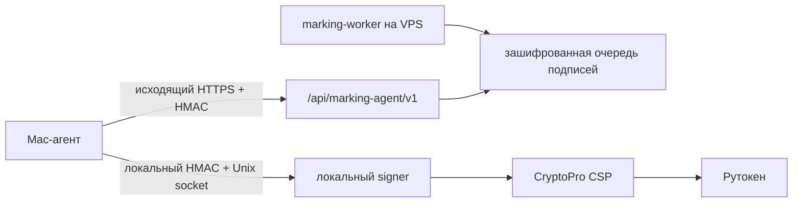

# Mac-агент УКЭП для Рутокена

Дата реализации: 4 августа 2026 года. Production rollout: 10 августа 2026
года. Статус: migration `0014`, credentials, nginx и remote transport
установлены. Heartbeat с реальным Рутокеном проверен. Физическая подпись
ожидает активации действующей лицензии CryptoPro CSP; см.
[PRODUCTION_CANARY_2026-08-10.md](PRODUCTION_CANARY_2026-08-10.md).

## Архитектура



На Mac работают два отдельных foreground-процесса:

1. `marking:signer` не имеет сетевой логики, принимает только локальный Unix
   socket и запускает CryptoPro для одного разрешённого purpose.
2. `marking:mac-agent` сам подключается к `admin.komui.ru`, получает одну
   задачу и передаёт её локальному signer.

Входящий порт на Mac не открывается. Приватный ключ не экспортируется с
Рутокена. PIN не передаётся в Next.js, PostgreSQL, HTTP body, env или журнал.
Если CryptoPro запрашивает PIN, ввод выполняется непосредственно в терминале
локального signer на Mac.
Provider запускает `cryptcp` с `-askpin`; PIN получает сам CryptoPro через
унаследованный terminal stdin и Node.js его не читает.

## Серверный брокер

Migration `0014_marking_remote_signer.sql` добавляет:

- `merch_marking_signing_agents` — безопасную телеметрию агента;
- `merch_marking_agent_nonces` — durable replay protection;
- `merch_marking_signature_requests` — зашифрованные payload и подпись;
- safe views без payload/signature ciphertext;
- узкие функции отдельно для marking-worker и web/agent API.

Payload и подпись шифруются AES-256-GCM application keyring до записи в БД.
Safe views содержат только SHA-256, статусы, время, agent ID и публичные
сведения сертификата. Основные таблицы недоступны роли `getomerch_app`.

HTTP-протокол использует отдельный случайный secret агента, HMAC-SHA256 тела и
метаданных, UUID request ID, timestamp с окном 90 секунд и одноразовый nonce.
Ответ сервера также подписан HMAC. Повтор nonce отвергается PostgreSQL даже
после перезапуска Next.js.

## Первичная подготовка Mac

CryptoPro CSP и сертификат должны быть уже установлены, а Рутокен подключён.
Проверка reader для ARM64 Mac:

```bash
/opt/cprocsp/bin/certmgr -list -store uMy
```

Создать два независимых секрета, не выводя их значения в терминал:

```bash
cd /Users/kadimagomedov/Documents/GetoMerchV3
ops/chestny-znak/init-mac-agent-credentials
```

Будут созданы с режимом `0600`:

```text
~/.config/getomerch-marking/agent-secret
~/.config/getomerch-marking/server-agent-secrets.json
~/.config/getomerch-marking/signer-client-secret
~/.config/getomerch-marking/signer-clients.json
```

`server-agent-secrets.json` предназначен только для установки на VPS. Файл
`agent-secret` остаётся только на Mac. Secret локального signer никогда не
передаётся на VPS.

Заполнить публичные metadata сертификата по шаблону
`ops/chestny-znak/marking-signer-certificate.example.json` и сохранить как:

```text
~/.config/getomerch-marking/certificate.json
```

Thumbprint указывается без пробелов в uppercase. ИНН, срок действия и ГОСТ
2012 должны совпасть с фактическим сертификатом в `uMy`.

Скопировать `ops/chestny-znak/marking-mac-agent.env.example` в защищённый файл
вне Git, заменить `USERNAME`, ИНН и проверить пути. Режим файла `0600`.

## Запуск на Mac

Пока поведение PIN не принято физическим canary, процессы запускаются вручную
в двух терминалах. Это сохраняет интерактивный stdin CryptoPro.

Терминал 1:

```bash
cd /Users/kadimagomedov/Documents/GetoMerchV3
set -a
source "$HOME/.config/getomerch-marking/marking-mac-agent.env"
set +a
npm run marking:signer
```

Терминал 2:

```bash
cd /Users/kadimagomedov/Documents/GetoMerchV3
set -a
source "$HOME/.config/getomerch-marking/marking-mac-agent.env"
set +a
npm run marking:mac-agent
```

Рутокен нужно вставить до операции, для которой требуется новая подпись:
первичной/повторной авторизации ГИС МТ и будущих подписываемых документов.
Пока unified token действителен в памяти worker, read-only вызовы могут не
требовать новой подписи. После перезапуска worker, истечения token или HTTP
401 потребуется новая подпись, поэтому Mac, signer и Рутокен должны быть
доступны.

## Установка серверного credential

Только в отдельное rollout-окно после deploy release и migration `0014`:

```bash
scp -i /Users/kadimagomedov/.ssh/codex_komui_migration_ed25519 \
  "$HOME/.config/getomerch-marking/server-agent-secrets.json" \
  codex-migrate@89.111.152.112:/tmp/marking-agent-secrets.json
```

На VPS:

```bash
sudo install -m 0600 -o root -g root \
  /tmp/marking-agent-secrets.json \
  /etc/getomerch/credentials/marking-agent-secrets.json
sudo rm -f /tmp/marking-agent-secrets.json

sudo install -d -m 0755 /etc/systemd/system/getomerch-admin.service.d
sudo install -m 0644 \
  /opt/getomerch/current/ops/systemd/getomerch-admin-marking-agent.conf \
  /etc/systemd/system/getomerch-admin.service.d/marking-agent.conf
```

Web service также должен уже получать `marking-keyring` через
`getomerch-admin-marking-import.conf`; новый drop-in намеренно не объявляет тот
же credential повторно.

Для marking-worker устанавливается
`getomerch-marking-worker-remote-signer.conf` вместо старого drop-in с
зависимостью от VPS signer. Затем в marking env:

```text
GETOMERCH_MARKING_SIGNER_TRANSPORT=remote
```

Перед включением `CRPT_READ` обязательно повторно запускаются migration verify
и `getomerch-marking-postgres-bootstrap`, чтобы выделенная worker role получила
только три broker-функции create/get/consume.

До запуска агента установить отдельный nginx limit для публичного HMAC
endpoint:

```bash
sudo install -m 0644 \
  /opt/getomerch/current/ops/nginx/getomerch-marking-agent-rate-zone.conf \
  /etc/nginx/conf.d/getomerch-marking-agent-rate-zone.conf
sudo install -m 0644 \
  /opt/getomerch/current/ops/nginx/getomerch-marking-agent-location.conf \
  /etc/nginx/snippets/getomerch-marking-agent-location.conf
```

В HTTPS `server` для `admin.komui.ru`, до общего `location /`, добавить:

```nginx
include /etc/nginx/snippets/getomerch-marking-agent-location.conf;
```

После изменения выполнить `sudo nginx -t` и только затем `sudo systemctl
reload nginx`. Лимит рассчитан на polling раз в две секунды с запасом для
`complete`/`fail`; приложение дополнительно применяет authenticated token
bucket по `agentId`.

## Интерфейс админки

Вкладка `Честный знак -> ГИС МТ` обновляется отдельно каждые 10 секунд и
показывает:

- связь с Mac-агентом и время последнего heartbeat;
- наличие Рутокена;
- доступность Unix signer и состояние PIN;
- срок сертификата и сокращённый thumbprint;
- результат последней авторизации и заявленный срок unified token ГИС МТ;
- pending/leased очередь и ошибки за 24 часа;
- безопасную историю подписи по request ID и сокращённому SHA-256.

Кнопки авторизации и проверки документа блокируются, если remote signer не
готов. Payload, подпись и PIN в API интерфейса не возвращаются.
После рестарта marking-worker token из памяти теряется, поэтому карточка
`Последняя авторизация` не является heartbeat текущего token: оператор должен
повторно нажать `Проверить авторизацию`. Это отличается от статуса Mac-агента,
который вычисляется по живому heartbeat.

## Отказы и восстановление

- **Mac выключен:** задача остаётся `pending`, worker делает bounded retry.
- **Рутокен извлечён:** агент продолжает heartbeat как `token_missing`, но не
  забирает новую задачу.
- **Signer не запущен:** состояние `signer_unavailable`, задача не lease-ится.
- **Нужен PIN:** CryptoPro запрашивает его на Mac; UI показывает
  `Требуется PIN`, пока локальный процесс продолжает heartbeat. На ввод
  отведено до 60 секунд; lease broker составляет 90 секунд.
- **Ответ потерян после подписи:** lease истекает, задача может быть подписана
  повторно; idempotency CRPT остаётся на уровне challenge/document operation.
- **Повтор HTTP:** nonce replay отвергается; агент создаёт новый envelope.
- **Истёк сертификат:** provider и сервер отклоняют результат, CRPT operation
  не продолжается.

## Проверки и rollout gates

```bash
npm run check:marking-mac-agent
npm run check:marking-mac-agent:db
npm run check:marking-security
npx tsc --noEmit
npm run build
```

Состояние production gates:

1. Heartbeat, Рутокен, signer socket, nginx `401/429`, worker restart и offline
   выполнены.
2. Sandbox и production challenge возвращают действующий контракт.
3. Физическая подпись и auth token заблокированы просроченной лицензией CSP.
4. Извлечение Рутокена и ошибочный PIN вручную не автоматизируются: неверные
   попытки могут заблокировать носитель.
5. Status КМ/документа выполняется только с реальным объектом, которого пока
   нет в production.

Никакие CRPT/SUZ write flags этим изменением не включаются.
После ротации `marking-agent-secrets.json` требуется рестарт
`getomerch-admin.service`: credential кэшируется внутри процесса и не
перечитывается на каждом polling-запросе.
